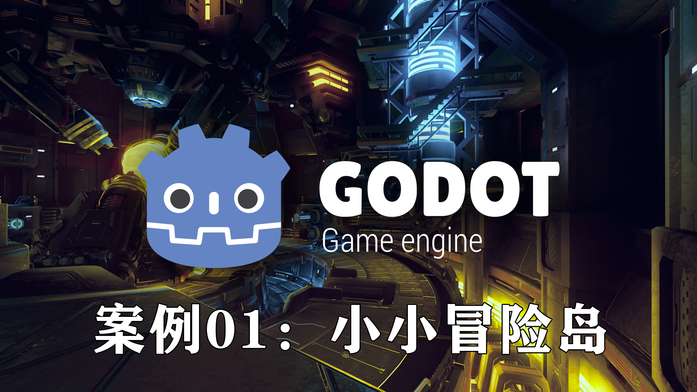

# 案例1：小小冒险岛

本案例为入门级示例，涵盖以下主要知识点：
操作界面、Sprite2D 与序列帧动画、Animation 组件、Tileset 与 TileMap、角色碰撞与控制脚本、基础 UI。

---

## 1\. 界面介绍

> Godot 官网： [https://godotengine.org/zh-cn](https://godotengine.org/zh-cn)


✋ Godot 编辑器是模块化的可视化开发环境，核心围绕“场景（Scene）”与“节点（Node）”。常见区域：

* 顶部工具栏（Top Toolbar）

  * 运行（▶）/ 停止（⏹）
  * 场景管理（新建 / 保存 / 实例化）
  * 编辑模式：2D / 3D / Script / AssetLib
  * 节点添加（+）
* 左侧场景树（Scene Panel）

  * 显示节点层级（Root Node 在顶）
  * 支持拖拽改变父子关系、右键快捷操作
* 右侧检查器（Inspector）

  * 编辑选中节点属性、绑定资源与脚本
  * Node 标签用于信号（Signals）配置
* 中央编辑视图（Viewport）

  * 2D / 3D 可视化编辑：拖拽、缩放、对齐等
* 底部面板（Bottom Panel）

  * Output（输出）、Debugger（调试）、动画/音频/TileMap 编辑工具
* 文件系统面板（FileSystem）

  * 显示项目目录（res://），支持拖入资源并即时使用

🔥 小提示：常用快捷键能显著提升编辑效率（例如 F 聚焦、Ctrl+Z 撤销）。

---

## 2\. 资源导入

> 素材网站： [https://itch.io](https://itch.io)

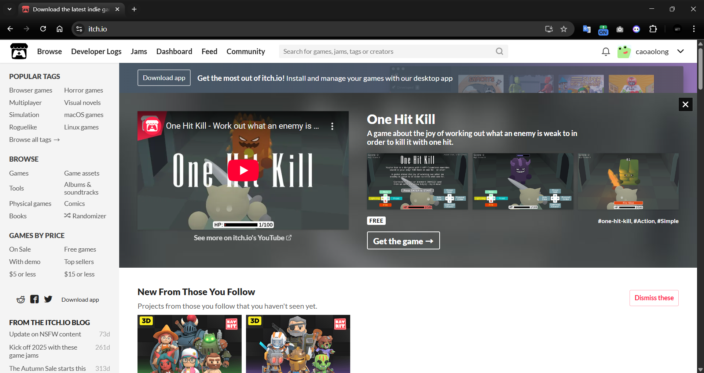

> 资源一旦放入项目目录（res://）会被自动识别并生成 \`\.import\` 配置文件，编辑器会实时同步。常见资源目录结构（推荐）：
>
> ```c#
> res://
>   ├─ scenes/
>   ├─ scripts/
>   ├─ sprites/
>   ├─ sounds/
>   └─ fonts/
> ```

### 2.1. 资源类型

|类型|常见格式|用途示例|
| --------| -------------------| -------------|
|图像|PNG, JPG, TGA, WEBP|精灵、UI|
|音频|WAV, OGG, MP3|音效、BGM|
|模型|GLB, GLTF, OBJ, FBX|3D 模型|
|字体|TTF, OTF|UI 字体|
|脚本|\.gd, \.cs, \.vs|游戏逻辑|
|场景|\.tscn, \.scn|关卡/节点层级|
|纹理图集|\.atlastex|动画帧合图|

### 2.2. 导入方式

1. 直接复制到项目目录（最常用）
2. 在 Godot 的 FileSystem 面板拖放导入
3. 使用 Import 面板：对图像（Compression、Mipmaps、Filter）或 3D（Animation/Materials）进行高级设置，修改后点击 Reimport 生效

> 🚀️ 资源管理要点：
>
> * 替换文件时 Godot 会自动重新导入并保留引用
> * 导出项目时只打包被引用的资源（Project → Export → Resources）

---

## 3\. 精灵图节点


---

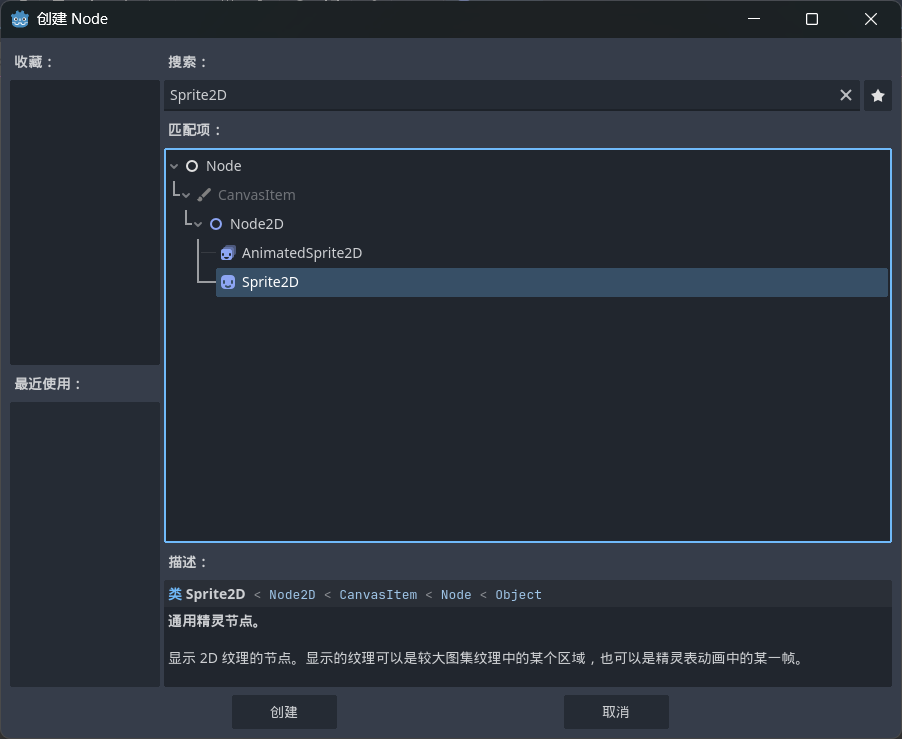

### 3.1. Sprite2D

> 用于显示单张贴图

* 节点属性

  * Texture: 贴图资源
  * Offset: 偏移

    * Centered: 是否将图片中心点设置在图片的中心
    * Offset: 中心点偏移坐标
    * Flip H: 水平翻转
    * Flip V: 垂直翻转
    * Region: 区域
  * Enabled: 是否启用区域模式

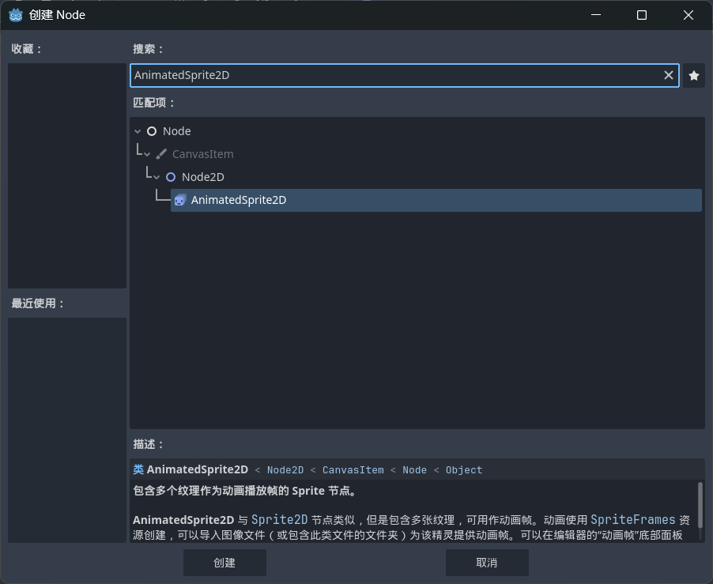

### 3.2. AnimatedSprite2D

> 用于播放序列帧动画

* 节点属性

  * 绑定资源：SpriteFrames（在编辑器中创建）
  * 属性：Animation（选择动画）、Frame（当前帧）、Speed Scale（播放速度缩放）

> 🚀️ 实际播放速度 \= 动画资源每帧 FPS × Speed Scale

### 3.3. 如何由图集制作动画：

1. 在 SpriteFrames 资源中为不同动作创建 Animation（例如 walk、idle、jump）
2. 将帧按顺序添加并设置每帧持续时间（或整体 FPS）
3. 在脚本中通过 play\("walk"\) 切换动画

🔥 小提示：使用大图集（Atlas）可以减少纹理切换，提升性能。

---

‍

## 4\. 创建精灵图素材 🔨

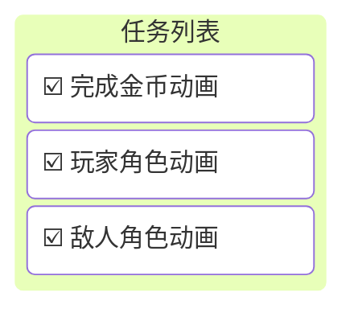

---

## 5\. 瓦片贴图节点

> **TileMapLayer** 是 Godot 4.x 引入的新节点，用于创建基于瓦片（Tile）的 2D 地图层。它是对旧版 TileMap 节点的重新设计，提供了更灵活的多层级管理方式。

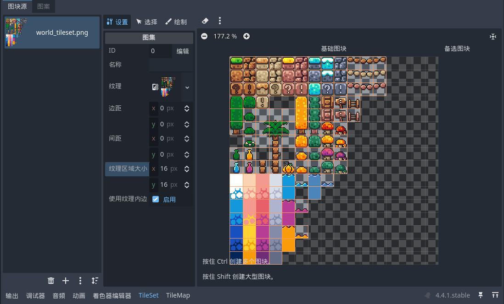

> 🔥 说明：旧的 TileMap 已被替换，现使用 TileMapLayer（或引擎版本可能有不同命名）。

### 5.1. TileMapLayer

* Enabled：启用渲染与碰撞
* Tile Set：瓦片集合（TileSet 资源）

  * Tile Shape（瓦片形状）

    * Suqare（矩形）
    * Isometric（等距菱形）
    * Half-Offset Square（半偏移矩形）
    * Hexagon（六边形）
  * Tile Layout（仅在半偏移时可用）
  * Tile Offset Axis（仅在半偏移时可用）

    * HORIZONTAL：水平
    * VERTICAL：垂直
  * Tile Size（瓦片尺寸）

### 5.2. Tile 设置建议

* 根据美术资源设定 Tile Size，合理使用碰撞形状（Collision）与导航网格（Navigation）以简化角色与敌人交互。

---

## 6. 渲染顺序

### 6.1. 2D场景

|优先级|影响因子|控制属性 / 节点|说明|
| :------: | ---------------| -----------------| ------------------|
|1|Viewport 层级|​`Viewport`​|最外层渲染单元|
|2|Canvas 层级|​`CanvasLayer.layer`​|控制分层渲染|
|3|Z-index|​`Node2D.z_index`​/`z_as_relative`​|控制节点间顺序|
|4|YSort 排序|​`YSort`​节点|按 y 坐标排序|
|5|树中顺序|场景树结构|最后决定绘制先后|
|6|透明度排序|渲染服务器|透明物体延后绘制|

### <span data-type="text" style="color: var(--b3-font-color5);">5.2. 3D场景</span>⛔

|优先级|影响因子|控制属性 / 节点|说明|
| :------: | ---------------------------| --------------------------| ------------------------------------------------------------------------------------|
|**1**|Viewport 层级|​`Viewport`​|每个视口是独立的渲染目标（framebuffer）。父视口在所有子视口渲染完毕后再合成。|
|**2**|相机顺序|​`Camera3D.current`​、<br />`Camera3D.priority`​<br />|当前活动相机决定主视角，若有多个相机，`priority`​高的先渲染。用于多机位、反射、后期等场景。|
|**3**|渲染层 (Render Layer)|`VisualInstance3D.layers`​<br />与<br />`Camera3D.cull_mask`​<br />|控制相机可见对象。只有`(object.layers & camera.cull_mask) ≠ 0`​的物体会被渲染。|
|**4**|材质不透明度阶段|材质（`StandardMaterial3D`​/ Shader）属性`transparency`​|Godot 在渲染时分两大阶段：①**不透明物体（Opaque Pass）** ②**透明物体（Transparency Pass）** 。透明物体总是后绘制。|
|**5**|深度缓冲 (Z-buffer)|GPU 硬件自动控制|不透明物体遵循深度测试：靠近摄像机的像素覆盖远处像素。|
|**6**|透明物体排序|渲染服务器内部排序|对透明物体按**距离摄像机远到近**绘制，以避免混合错误。|
|**7**|渲染优先级（Shader Pass）|材质参数`render_priority`​|Godot 允许自定义 shader pass 优先级，用于强制某些物体在透明阶段中提前或延后绘制。|
|**8**|光照与阴影阶段|光源节点 (`Light3D`​)|所有光照、阴影在主几何阶段后计算。投影物体先于受光物体渲染。|
|**9**|后期特效阶段|​`Environment`​/`WorldEnvironment`​|包含 Bloom、SSAO、SSR、DOF 等后期效果；在所有几何与透明阶段之后执行。|
|**10**|叠加视口 / 屏幕特效|​`SubViewportContainer`​/`CanvasLayer`​|若 3D 场景中嵌入 UI 或 2D 层，会在最后的合成阶段叠加。|

---

## 7\. 物理与碰撞

### 7.1. 核心对象

|类型|作用|是否响应物理|常见用途|
| ------| --------------------------| --------------| ------------------|
|**StaticBody2D**|静态刚体，不会移动|不响应|地面、墙壁等|
|**RigidBody2D**|动态刚体，由物理引擎驱动|响应|可碰撞的箱子等|
|**CharacterBody2D**|受物理约束控制的角色|半响应|玩家或 NPC|
|**Area2D**|区域检测体，用于感知|不响应|触发区、检测范围|

### 7.2. 碰撞行为

|节点|检测方式|典型信号 / 方法|
| ------| ----------------------------------------| -----------------|
|**Area2D**|进入/离开检测，不会发生物理反弹|​`body_entered`​,`area_entered`​|
|**CharacterBody2D**|主动检测<br />需调用 `move_and_collide()`​/`move_and_slide()`​<br />|​`get_last_slide_collision()`​|
|**RigidBody2D**|被动响应，由物理引擎推动并处理碰撞反应|​`_integrate_forces()`​|
|**StaticBody2D**|仅提供静态形状|无碰撞信号|

### 7.3. 碰撞触发条件

|序号|触发条件类别|触发对象类型|触发时机 / 条件描述|
| :----: | --------------------------| --------------| -----------------------------------------------------: |
|**1**|进入区域|​`Area2D`​↔`Body`​|物理帧中检测到某个 `PhysicsBody2D`​ 进入 `Area2D`​ 的碰撞形状范围<br /><br />`body_entered(body: Node)`​<br />|
|**2**|离开区域|​`Area2D`​↔`Body`​|检测到 `PhysicsBody2D`​ 离开 `Area2D`​<br /><br />`body_exited(body: Node)`​<br />|
|**3**|区域进入另一区域|​`Area2D`​↔`Area2D`​|两个区域的形状相交时触发<br /><br />`area_entered(area: Area2D)`​<br />|
|**4**|区域离开另一区域|​`Area2D`​↔`Area2D`​|两个区域分离时触发<br /><br />`area_exited(area: Area2D)`​<br />|
|**5**|区域持续重叠|​`Area2D`​|每个物理帧中仍与另一对象重叠<br /><br />`_physics_process()`​+<br />`get_overlapping_bodies()`​/`get_overlapping_areas()`​<br />|
|**6**|动态物体碰撞（被动）|​`RigidBody2D`​|与其他 `Body`​ 或 `Area`​ 发生物理碰撞<br /><br />`_integrate_forces(state: PhysicsDirectBodyState2D)`​ 或<br /> `body_entered()`​ 信号<br />|
|**7**|动态物体进入区域|​`RigidBody2D`​↔`Area2D`​|进入 `Area2D`​ 时触发<br /><br />`area_entered(area: Area2D)`​<br />|
|**8**|角色移动过程中检测到碰撞|​`CharacterBody2D`​|调用 `move_and_collide()`​ 时检测到碰撞<br /><br />函数返回 `KinematicCollision2D`​ 对象<br />|
|**9**|角色滑动碰撞|​`CharacterBody2D`​|使用 `move_and_slide()`​ 后，与表面接触<br /><br />`get_slide_collision(i)`​/`get_last_slide_collision()`​<br />|
|**10**|射线检测命中|​`Node2D`​/`RayCast2D`​|射线与碰撞形状相交<br /><br />`_process()`​ 中调用 `is_colliding()`​ 或连接信号 `collision_changed()`​<br />|
|**11**|自定义形状检测|任意节点|使用 `PhysicsDirectSpaceState2D`​ 主动检测（射线、点、形状）<br /><br />`intersect_ray()`​/`intersect_shape()`​/`cast_motion()`​<br />|
|**12**|持续接触|​`RigidBody2D`​|物体与另一物体持续接触时，每帧都会触发<br /><br />`contact_monitor = true`​+`body_entered`​/`body_exited`​<br />|
|**13**|静态体被检测命中|​`StaticBody2D`​|被动参与碰撞（不发信号）|
|**14**|3D 对应版本|​`Area3D`​/`Body3D`​/`CharacterBody3D`​|同上机制<br />|

---

### 7.4. CharacterBody2D

> ​`CharacterBody2D`​ 是 **Godot 4.x** 中用于**角色运动与碰撞控制**的物理节点，继承自 `PhysicsBody2D`​。  
> 它是 `KinematicBody2D`​ 的继任者，专为平台游戏、动作游戏等需要精确控制的角色设计。
>
> 主要特点：
>
> * 不直接受物理引擎力（如重力、碰撞反弹）控制；
> * 通过脚本逻辑（如 `velocity`​、`move_and_slide()`​）主动驱动；
> * 自动处理滑动、地面检测、斜坡移动等常见运动问题。

* 常用属性

|属性名|类型|说明|
| --------| --------------| --------------------------------------------------------------------------|
|**velocity**|​`Vector2`​|当前速度（通常在`_physics_process()`​中更新）。常用于水平移动与重力加速度计算。|
|**up_direction**|​`Vector2`​|定义“上方”方向，用于判断角色是否在地面上（默认为`(0, -1)`​）。|
|**floor_max_angle**|​`float`​|能够站立的最大地面倾斜角（默认 45°）。超过此角度将视为墙体。|
|**wall_min_slide_angle**|​`float`​|判断为墙壁滑动的最小角度阈值。|
|**motion_mode**|​`int`​（枚举）|控制移动模式：<br />`MOTION_MODE_GROUNDED`​（默认）适用于平台类角色。<br />`MOTION_MODE_FLOATING`​适用于空中或飞行单位。<br />|
|**platform_on_leave**|​`int`​（枚举）|定义离开移动平台的行为（如保持速度或归零）。|
|**safe_margin**|​`float`​|防止角色因浮点误差嵌入墙体的安全距离（默认 0.08）。|
|**floor_snap_length**|​`float`​|控制角色贴地的吸附距离。常用于防止角色在斜坡或台阶边缘悬空抖动。|
|**slide_on_ceiling**|​`bool`​|角色在天花板接触时是否允许滑动。|
|**max_slides**|​`int`​|一次移动操作允许的最大滑动次数。用于控制复杂碰撞时的计算成本。|

* 常用方法

|方法名|功能|
| --------| ------------------------------------------------|
|​`move_and_slide()`​|根据`velocity`​移动角色，并自动检测地面、墙体和天花板。|
|​`is_on_floor()`​|返回角色是否正接触地面。|
|​`is_on_wall()`​|返回角色是否正贴靠墙壁。|
|​`is_on_ceiling()`​|返回角色是否接触天花板。|

### 7.5. CollisionShape2D

> ​`CollisionShape2D`​ 是物理碰撞检测的“形状定义节点”。  
> 它**不产生碰撞本身**，而是与物理体（如 `CharacterBody2D`​、`RigidBody2D`​、`StaticBody2D`​）**组合使用**来确定碰撞边界。

* 主要属性

|属性名|类型|说明|
| --------| ------------------| ------------------------------------------------------------------|
|**shape**|​`Shape2D`​（资源类型）|定义碰撞区域的几何形状。可选类型包括：`RectangleShape2D`​、`CircleShape2D`​、`CapsuleShape2D`​、`PolygonShape2D`​等。|
|**disabled**|​`bool`​|若为`true`​，则该碰撞形状不参与检测。常用于角色死亡、无敌或切换状态。|
|**one_way_collision**|​`bool`​|启用单向碰撞。例如平台只能从下方穿过，上方才能站立。|
|**one_way_collision_margin**|​`float`​|单向碰撞的检测容差（默认 1.0），用于控制穿透距离。|
|**debug_color**|​`Color`​|编辑器中用于显示形状的调试颜色（仅视觉辅助）。|

* 常用形状

|形状类型|特点|典型用途|
| ----------| ------------------------| ----------------------------|
|**RectangleShape2D**|简单矩形，边长可调|平台、地面、方块|
|**CircleShape2D**|半径可调，旋转无影响|球体、角色头部碰撞|
|**CapsuleShape2D**|上下为圆头的长条形|角色身体碰撞（常用于主角）|
|**PolygonShape2D**|任意多边形，需手动绘制|复杂地形或不规则平台|
|**SegmentShape2D**|一条线段，用于边界|隐形墙或触发区域|

### 7.6. TileMap的物理系统

> TileMap的物理系统由`Physics Layers`​控制，在TileSet编辑器面板中可以设置每个瓦片的碰撞区域和其他碰撞参数。

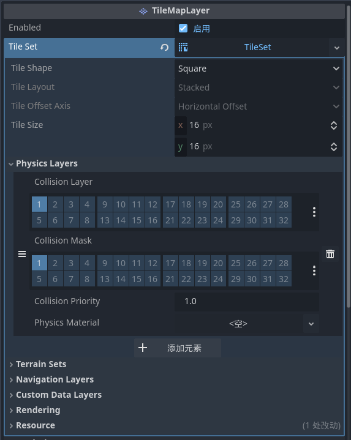​

---

## 8. 编码和调试环境

### 8.1. 准备工作

* 安装 VS Code

  > 前往官方网站下载安装：  
  > 👉 [https://code.visualstudio.com/](https://code.visualstudio.com/)
  >

* 安装扩展

  > Godot Tools: GDScript 智能提示、场景文件跳转
  >

### 8.2. Godot设置

1. 打开 Godot 代码编辑器配置：

    > （菜单栏）编辑器 → 文本编辑器 → 外部
    >
2. 设置以下选项：

|选项|值|
| ------| ---------------------------------|
|**使用外部编辑器**|✅ 打勾启用外部编辑器|
|**可执行文件路径**|输入或浏览到 VS Code 的执行路径|
|**执行参数**|​`{project} --goto {file}:{line}:{col}`​|

### 8.3. 验证配置

1. 在场景中创建一个节点（例如 `Node2D`​）。
2. 点击右侧  **“附加脚本（Attach Script）”**  按钮。
3. 选择语言为 **GDScript**，点击创建。
4. VS Code 将自动打开新建的脚本文件。
5. 若能看到语法高亮与智能提示，即配置成功。

### 8.4. VSCode配置

​`Godot Tools`​插件需要配置`Godot`​的可执行文件目录

> ​`@id:godotTools.editorPath.godot4 @ext:geequlim.godot-tools`​

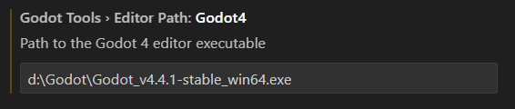

### 8.5. Basic Movement代码

```gdscript
# 继承父类
extends CharacterBody2D

# 移动速度
const SPEED = 300.0
# 跳跃高度
const JUMP_VELOCITY = -400.0

# 物理引擎的回调函数（执行频率由【项目 → 物理 → 通用 → 每秒物理周期数】决定，默认值为 60）
func _physics_process(delta: float) -> void:
	# Add the gravity. 检查是否与地面发生碰撞
	if not is_on_floor():
		# 没有触碰到地面时则一直下落
		velocity += get_gravity() * delta

	# Handle jump. 检测 ui_accept 是否按下（仅检测一次）
	if Input.is_action_just_pressed("ui_accept") and is_on_floor():
		# 将y轴速度设置为跳跃速度（起跳）
		velocity.y = JUMP_VELOCITY

	# Get the input direction and handle the movement/deceleration.
	# As good practice, you should replace UI actions with custom gameplay actions.
	# 获取 ui_left / ui_right 按键状态（ui_right按下时为1，ui_left按下时为-1）
	var direction := Input.get_axis("ui_left", "ui_right")
	if direction:
		# 将x轴速度设置为移动速度（移动）
		velocity.x = direction * SPEED
	else:
		# 将速度设置为0（此处采用了缓慢停止的方式来实现立即停止）
		velocity.x = move_toward(velocity.x, 0, SPEED)

	# 手动检测碰撞
	move_and_slide()
```

---

## 9. 信号和分组

> 在Godot引擎中，**信号(Signals)实际上在Godot中更常称为回调函数或连接的方法** 是一种非常重要的事件驱动编程机制，用于实现节点之间的解耦通信。

### 9.1 信号

> 信号是一种**发布-订阅模式**的实现。当某个特定事件发生时，节点可以发射(emit)一个信号，其他对此感兴趣的节点可以连接(connect)到这个信号并做出响应。

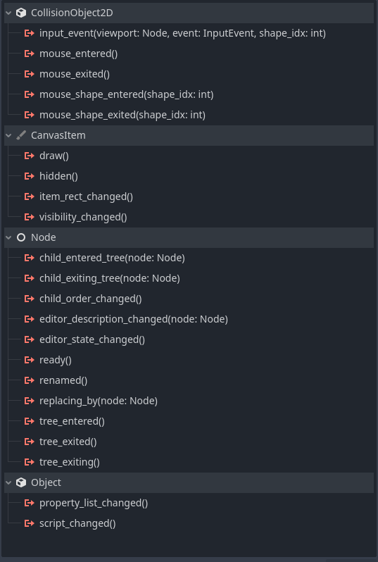​

信号机制的主要优点如下：

* **解耦代码**：发送信号的节点不需要知道谁在监听
* **灵活性**：可以动态添加或移除监听者
* **可维护性**：代码结构更清晰，易于维护

### 9.2. Area2D

> **Area2D**是Godot中用于**检测区域和重叠**的2D节点，它不参与物理模拟，但可以检测其他物体的进入、离开和重叠。这是游戏开发中非常常用的节点。

* 主要用途如下：

  * 🎯 **检测触发区域**（触发器/Trigger）
  * 💥 **伤害区域**（毒雾、火焰等）
  * 🚪 **传送门和交互区域**
  * 🎁 **可拾取物品检测**
  * 👁️ **视野和感知范围**
  * ⚔️ **攻击范围检测**

* Area2D vs 其他碰撞节点

  * **Area2D**: 仅检测，不产生物理碰撞
  * **StaticBody2D**: 静态碰撞体（墙壁、地面）
  * **RigidBody2D**: 动态物理体（受重力影响）
  * **CharacterBody2D**: 角色控制器（自定义运动）
* 信号：

  * ​`area_entered`​：当另一个Area2D进入时触发
  * ​`area_exited`​：当另一个Area2D离开时触发

### 9.3. Raycast2D

> **RayCast2D**是用于发射**射线检测**的节点，可以检测射线路径上的碰撞体。它就像一条"激光笔"，能告诉你射线是否击中了什么物体。

* 主要用途

  * 🎯 **视线检测**（敌人能否看到玩家）
  * 🔫 **枪械射击**（子弹轨迹）
  * 🧱 **地面检测**（角色是否着地）
  * 🚶 **前方障碍检测**（AI寻路）
  * 🖱️ **激光瞄准**（瞄准辅助线）
  * 🪜 **爬梯子检测**（是否接触梯子）
* 最佳实践

  1. ✅ 使用`@onready`​缓存射线引用
  2. ✅ 在`_physics_process`​中进行物理相关检测
  3. ✅ 使用`exclude_parent`​避免自我检测
  4. ✅ 合理设置`collision_mask`​减少不必要检测
  5. ✅ 不需要时禁用射线节省性能
  6. ✅ 使用`force_raycast_update()`​确保即时检测
  7. ❌ 避免过长的射线（影响性能）
  8. ❌ 避免每帧创建/销毁射线
* 示例代码

  ```gdscript
  # 判断射线是否发生碰撞
  if not ray_cast_2d.is_colliding():
          direction *= -1
          ray_cast_2d.position *= -1
  ```

### 9.4. 分组

> 分组(Groups)是Godot中用于**标记和批量管理节点**的强大功能，可以让你快速识别和操作特定类型的节点。

两种分组类型

* **场景分组(Scene Groups)**  - 局部分组

  * 仅存在于**当前场景实例**中
  * 场景被释放后，分组关系消失
  * 最常用的分组方式

* **全局分组(Global Groups)**  - 项目级分组

  * 在**整个项目中定义**
  * 可以添加描述和自定义属性
  * 用于标准化常用分组名称
  * 在项目设置中管理

---

## 10. 创建敌人和金币🔨

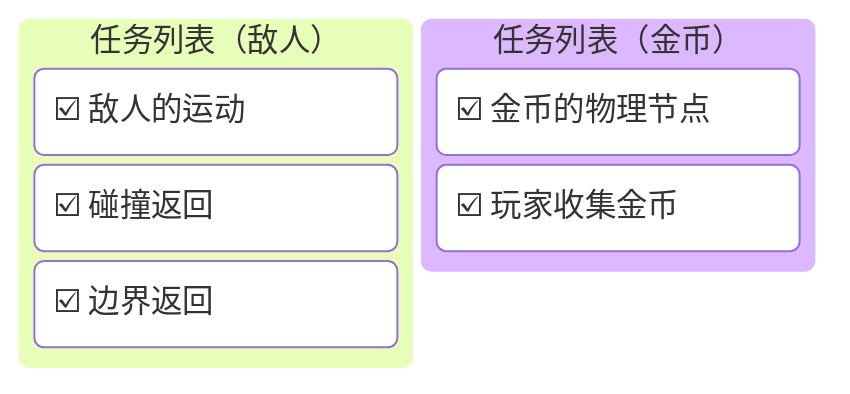

---

### 参考代码🔗

​`file: enemy.gd`​

```gdscript
extends CharacterBody2D

var speed: float = 40.0
var direction: int = 1
var gravity: float = 400.0

# `$`即在当前节点的子节点中找到一个指定的节点并返回其引用对象
@onready var animated_sprite_2d: AnimatedSprite2D = $AnimatedSprite2D
@onready var ray_cast_2d: RayCast2D = $RayCast2D


func _physics_process(delta: float) -> void:
    if not is_on_floor():
        velocity.y += gravity * delta
    else:
        velocity.x = speed * direction

    move_and_slide()

    if not ray_cast_2d.is_colliding() or is_on_wall():
        direction *= -1
        ray_cast_2d.position *= -1
    
    if direction == 1:
        animated_sprite_2d.flip_h = false
    else:
        animated_sprite_2d.flip_h = true

```

---

## 11. 摄像机与视角

### 11.1. 默认视角

> 在 2D 场景中不创建任何 `Camera2D`​节点时，看到的其实是 **游戏窗口本身**。
>
> 游戏窗口等同于一个取景框，任何没有 `Camera2D`​节点的场景，其根节点（通常是 `Node2D`​或 `CanvasLayer`​）都会自动、完整地渲染在这个窗口取景框内。

* 这一设计符合Godot的核心设计理念，即**易用性和快速上手**。

* 默认视角所显示的区域为从（0，0）坐标到（height，width）的矩形。

### 11.2. Camera2D

> 摄像机相当于是玩家的眼睛，它决定了玩家可以看到什么。

* 主要属性

  * Offset: 相对于中心点的偏移量
  * Anchor Mode: 

    * Fixed Top Left: 摄像机的左上角锁定在原点位置
    * Drag Center: 摄像机的位置会同时兼顾水平/垂直偏移和屏幕大小
  * Ignore Rotation: 是否锁定旋转
  * Enabled: 是否启用
  * Zoom: 视角缩放
  * Process Callback: 摄像机的处理回调函数
  * Limit: 视角限制

    * Left: 左侧
    * Top: 上边缘
    * Right: 右侧
    * Bottom: 下边缘
    * Smoothed: 到达边缘时是否平滑停止
  * Position Sommthed:

    * Enabled: 是否启用平滑移动
  * Rotation Smoothed: 

    * Enabled: 是否启用平滑旋转
  * <u>Drag: 拖动属性（暂时不讲）</u>
  * Editor: 设置摄像机在编辑器中的显示

    * Draw Screen: 显示相机画面的矩形
    * Draw Limits: 显示限制矩形
    * Draw Drag Margin: 显示拖动边缘矩形

> 💡小技巧：将摄像机设置为角色的子物体可以让视角跟随玩家移动

### 11.3 多摄像机

> 当场景中有多个摄像机时，一般情况下在同一时间内只有一个是有效的。
>
> 但是在某些特殊的应用场景中，会有多个摄像机同时工作（比如小地图、分屏等）。

在Godot中有多个摄像机同时存在时可通过以下方式控制主摄像机：

* 场景树层级

  * 当多个摄像机属于父子关系时，最顶级的摄像机有效。
  * 当多个摄像机属于同级关系时，先添加的有效。
* 通过属性控制

  * 可以通过`Enabled`​属性控制摄像机是否有效

---

## 12. 刚体和物理材质

### 12.1. CollisionObject2D

* Disable Mode: 它决定了当对象被“禁用（disabled）”时，**物理引擎如何处理它的碰撞体（collision shapes）** 。

  |枚举值|常量名|行为描述|
  | --------| --------| --------------------------------------------------------------------------------------------|
  |**0**|​`DISABLE_MODE_REMOVE`​|从物理世界中完全移除所有碰撞形状。对象将不再参与碰撞，也不再被检测到。性能最高。|
  |**1**|​`DISABLE_MODE_MAKE_STATIC`​|将对象临时变为静态物体（StaticBody2D），保留其碰撞形状但不再移动或响应力。|
  |**2**|​`DISABLE_MODE_KEEP_ACTIVE`​|保留对象在物理世界中的完整状态，即使被禁用也继续参与碰撞检测。通常不建议使用，会浪费性能。|

### 12.2. RigidBody2D

* Mass: 物体质量
* Physical Material Override: 物理材质
* Gravity Scale: 重力系数

  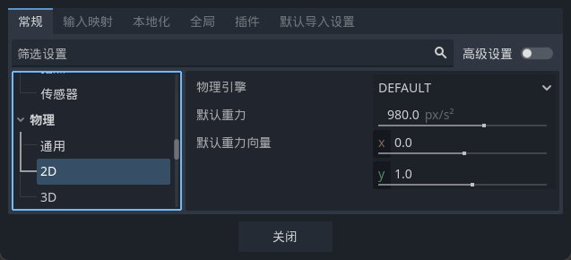

  * 重力值由`项目 → 项目设置 → 物理 → 2D/3D → 默认重力`​设置
  * 重力方向由`项目 → 项目设置 → 物理 → 2D/3D → 默认重力向量`​设置
* Mass Distribution: 质量分布

  * Center of Mass Mode: 重心位置
  * Interia: 转动惯量：决定物体旋转所需要施加的力的最小值
* Deactivation: 失活

  * Sleeping: 如果为True，则物体不会移动也不受力的影响，直到被唤醒
  * Can Sleep: 决定物体是否可以切换到Sleeping状态
  * Lock Rotation: 如果为True，则物体受力时不发生旋转
  * Freeze: 如果为True，则物体不再施加力（包括重力）
* ~~Solver: 求解器（暂不讲解）~~
* Linear: 线性

  * Velocity: 移动速度
  * Damp Mode: 线性阻尼模式

    > 线性阻尼本质上是一个速度衰减系数，值越大，减速越快；值越小，物体滑行越久；值为0时，物体将无限滑动（在忽略摩擦的情况下）。
    >
  * Damp: 阻尼值

    * Combine: 将刚体的阻尼与全局阻尼叠加
    * Replace: 完全忽略全局或 Area/Area2D 阻尼，只使用本刚体的阻尼
* Angular: 角

  * Velocity: 旋转角速度
  * Damp Mode: 线性阻尼模式

    > 线性阻尼本质上是一个速度衰减系数，值越大，减速越快；值越小，物体滑行越久；值为0时，物体将无限滑动（在忽略摩擦的情况下）。
    >
  * Damp: 阻尼值

    * Combine: 将刚体的阻尼与全局阻尼叠加
    * Replace: 完全忽略全局或 Area/Area2D 阻尼，只使用本刚体的阻尼
* Constant Forces: 恒力

  * Force: 恒力值（用于移动）
  * Torque: 恒转力（用于旋转）

### 12.3. 物理材质

* Friction: 摩擦系数（摩擦力）
* Rough: 粗糙度

  * True: 摩擦行为是平滑且可预测的。物体会均匀滑动。
  * False: 摩擦力会有轻微随机变化，物体滑动时会出现轻微的抖动、不规则停顿或非线性滑动现象。
* Bounce: 弹力系数（控制碰撞后的弹性）
* Absorbent: 控制碰撞时能量的吸收行为

  * True:

    * 碰撞是“正常”的弹性/非弹性反应；
    * 碰撞双方按质量与速度计算动量交换；
    * Bounce控制反弹程度；
    * 物体不会额外吸收对方的动量。
  * False:

    * 该物体在碰撞中 **吸收更多动能**；
    * 使得对方的反弹被“抑制”；
    * 在多物体接触中（例如堆叠），会减少震动或“抖动”；
    * 常用于需要“稳定堆叠”或“能量吸收表面”的对象。

## 13. 创建梯子和玩家动画🔨

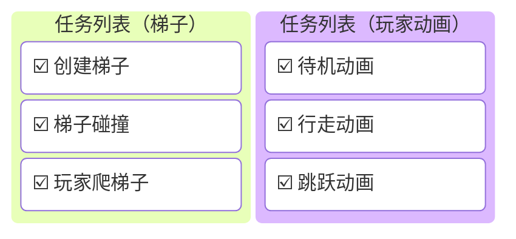

### 参考代码🔗

​`file: player.gd`​

```gdscript
extends CharacterBody2D


const SPEED = 100.0
const JUMP_VELOCITY = -300.0

var is_on_ladder: bool = false
var fruit_count: int = 0

@onready var animated_sprite_2d: AnimatedSprite2D = $AnimatedSprite2D

func _physics_process(delta: float) -> void:
	var direction := Input.get_vector("ui_left", "ui_right", "ui_up", "ui_down")
	velocity.x = direction.x * SPEED
	if is_on_floor():
		if direction.x != 0:
			animated_sprite_2d.play("walk")
		else:
			animated_sprite_2d.play("idle")
	else if is_on_ladder:
			velocity.y = direction.y * SPEED
	else:
		# 如果没有在梯子上则一直下落
		velocity += get_gravity() * delta

	if Input.is_action_just_pressed("ui_accept") and is_on_floor():
		velocity.y = JUMP_VELOCITY
		animated_sprite_2d.play("jump")

	if velocity.x != 0:
		animated_sprite_2d.flip_h = velocity.x < 0

	move_and_slide()

func _on_hit_box_area_entered(area: Area2D) -> void:
	if area.is_in_group("Ladders"):
		is_on_ladder = true

func _on_hit_box_area_exited(area:Area2D) -> void:
	if area.is_in_group("Ladders"):
		is_on_ladder = false
```

## 14. 游戏UI系统

### 14.1. Godot 的 UI 框架

> 所有 UI 节点都继承自 Control。

UI 的特点：

* 基于 像素坐标 而非世界坐标。

* 自动参与 布局与缩放。

* 支持 主题（Theme） 与 样式（StyleBox）。
* 受父级容器自动控制尺寸与位置。

### 14.2. 常用UI节点

* 文本类

  |节点名|功能|常用属性|
  | --------| -------------------| -------------------------------|
  |**Label**|显示静态文本|text、autowrap、align|
  |**RichTextLabel**|支持富文本、BBCode<sup>(BBCode（Bulletin Board Code）是一种轻量级的标记语言，主要用于在论坛、博客和其他在线平台上格式化文本。  参考网站：https://www.bbcode.org/how-to-use-bbcode-a-complete-guide.php)</sup> 格式|bbcode_enabled、scroll_active|
  |**LineEdit**|单行输入框|placeholder_text、editable|
  |**TextEdit**|多行文本编辑器|text、wrap_mode|
* 按钮类

  |节点名|功能|特点|
  | --------| -----------------------| ------------------------------|
  |**Button**|普通按钮|可连接信号 `pressed()`​|
  |**TextureButton**|使用图片按钮|normal/pressed/hover texture|
  |**CheckBox**|复选框|toggle 模式|
  |**CheckButton**|切换按钮（可按下）|类似 Switch|
  |**OptionButton**|下拉菜单按钮|可添加多个选项|
  |**MenuButton**|打开 PopupMenu 的按钮|可创建复杂菜单结构|
* 图形类

  |节点名|功能|常用用途|
  | --------| --------------| --------------------|
  |**TextureRect**|显示一张图片|背景图、图标|
  |**NinePatchRect**|可拉伸图片|用于按钮、面板边框|
  |**ProgressBar**|显示进度|加载条、血条等|
* 容器类

  |容器类型|布局方式|
  | ----------| ----------------------|
  |**HBoxContainer**|水平排列子节点|
  |**VBoxContainer**|垂直排列子节点|
  |**GridContainer**|网格排列|
  |**MarginContainer**|带有外边距的容器|
  |**CenterContainer**|居中对齐子控件|
  |**ScrollContainer**|支持滚动条|
  |**PanelContainer**|可显示背景面板的容器|

### 14.3. 锚点

> 在 Godot 的 UI（Control）系统里，锚点决定控件相对于父控件的位置参考点。锚点用 相对比例（0.0–1.0） 表示父控件的边界：
>
> * 0.0 表示父控件的左/上边界
>
> * 1.0 表示父控件的右/下边界
>
> * 中间值例如 0.5 表示父控件中间

每个 Control 有 4 个锚点：

* anchor_left
* anchor_top
* anchor_right
* anchor_bottom

分别对应控件左、上、右、下的参考比例。锚点与像素偏移量（margin/offset）一起决定控件最终在屏幕上的矩形（位置与大小）。

### 14.4. CanvasLayer

> 当场景中需要`2D/3D`​场景和`UI`​场景同时存在时，CanvasLayer组件可提供一个独立的画布层，并且具有以下特点：
>
> * 允许创建多个独立的 2D 渲染层；
> * 控制哪些节点随摄像机移动；
> * 让 UI、前景、背景、特效分层显示；
> * 实现 HUD（固定在屏幕上的界面）。

* 渲染层级

|层级|控制方式|说明|
| ---------| ------------| -------------------------------------|
|Canvas|​`CanvasLayer`​节点|每个 Canvas 独立渲染空间|
|Layer|​`CanvasLayer.layer`​属性|Canvas 的层次顺序（数字越大越靠前）|
|Z Index|各节点的`z_index`​|Canvas 内部的前后顺序|

## 15. 创建游戏UI🔨

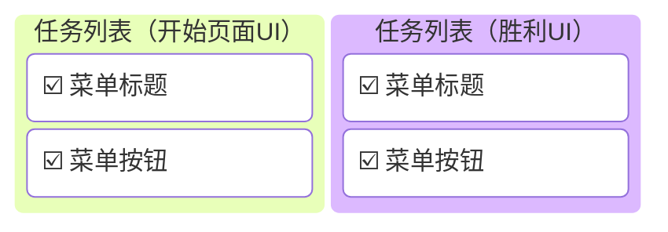

‍
