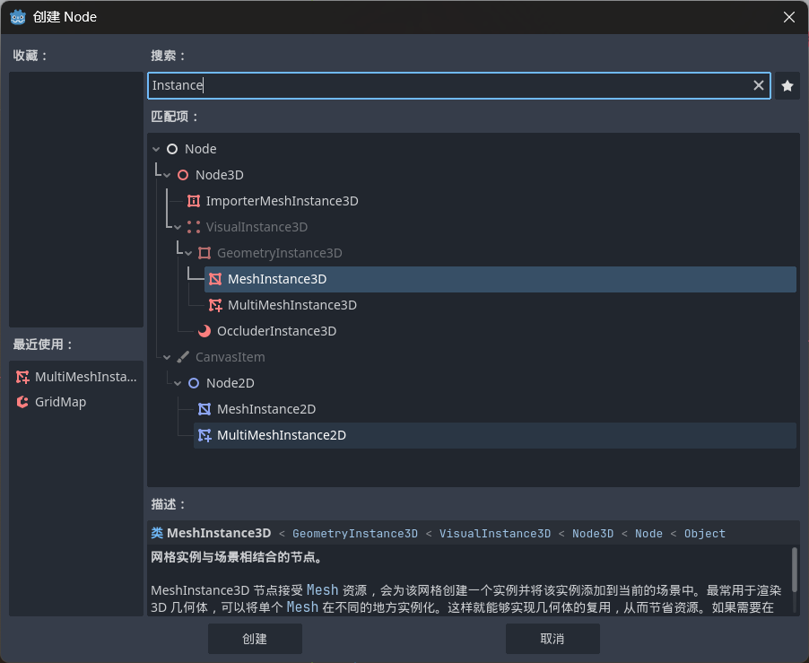

# 案例2：守卫城堡

本案例为入门级示例，涵盖以下主要知识点：
3D场景相关节点、路径节点、碰撞检测、基础算法。

---

## 1. 3D物体节点

### Node3D

> Node3D 是 Godot 4 中所有 3D 空间节点的基础节点。

#### 常用属性

| 属性               | 类型          | 说明   |
| ---------------- | ----------- | ---- |
| position         | Vector3     | 本地位置 |
| global_position  | Vector3     | 世界位置 |
| rotation         | Vector3     | 弧度旋转 |
| rotation_degrees | Vector3     | 角度旋转 |
| scale            | Vector3     | 缩放   |
| transform        | Transform3D | 本地变换 |
| global_transform | Transform3D | 世界变换 |

#### 常用方法

| 方法                   | 作用      |
| -------------------- | ------- |
| look_at(target, up)  | 朝向某个目标  |
| translate(offset)    | 位移      |
| rotate(axis, angle)  | 旋转      |
| to_global(local_pos) | 本地转世界坐标 |
| to_local(global_pos) | 世界转本地坐标 |

### MeshInstance3D

> MeshInstance3D 是 Godot 中用于显示 3D 网格（Mesh）的基础节点。

#### 适用场景

+ 🧱 单个物体
+ 🎮 角色模型
+ 🧍 NPC
+ 🚗 载具
+ 🏠 独立建筑

#### 属性/方法

+ MeshInstance3D属性

| 属性                     | 类型       | 说明      |
| ---------------------- | -------- | ------- |
| mesh                   | Mesh     | 当前显示的网格 |
| material_override      | Material | 覆盖材质    |
| cast_shadow            | 枚举       | 阴影设置    |
| visibility_range_begin | float    | 可见距离起始  |
| visibility_range_end   | float    | 可见距离结束  |

+ 常用方法

| 方法                              | 作用       |
| ------------------------------- | -------- |
| set_surface_override_material() | 覆盖某个表面材质 |
| create_trimesh_collision()      | 自动生成碰撞   |
| create_convex_collision()       | 创建凸包碰撞   |

### MultiMeshInstance3D

> MultiMeshInstance3D 用于一次性渲染大量相同的 3D 网格实例。

#### 适用场景

+ 🌲 大量树木
+ 🌾 草地
+ 🏙 重复建筑
+ 🔫 子弹 / 弹幕
+ 🪨 石头、装饰物

#### 属性/函数

+ MultiMeshInstance3D属性

| 属性        | 类型        | 说明     |
| --------- | --------- | ------ |
| multimesh | MultiMesh | 实例数据资源 |

+ MultiMesh 常用属性

| 属性                     | 类型   | 说明         |
| ---------------------- | ---- | ---------- |
| mesh                   | Mesh | 所有实例共享的网格  |
| instance_count         | int  | 实例数量       |
| visible_instance_count | int  | 可见实例数量     |
| transform_format       | 枚举   | 变换格式（默认3D） |
| color_format           | 枚举   | 是否支持每实例颜色  |
| custom_data_format     | 枚举   | 是否支持自定义数据  |

+ 常用方法

| 方法                             | 作用           |
| ------------------------------ | ------------ |
| set_instance_transform(i, t)   | 设置第 i 个实例的变换 |
| get_instance_transform(i)      | 获取变换         |
| set_instance_color(i, c)       | 设置实例颜色       |
| set_instance_custom_data(i, d) | 设置自定义数据      |

### CSGBox3D

> CSGBox3D 是用于创建立方体几何体的 CSG（Constructive Solid Geometry，构造实体几何）节点。
> 核心特点：
> + 快速生成一个可见的盒状模型
> + 支持布尔运算（合并、减去、交集）
> + 适合原型设计与关卡快速搭建
> + 自带碰撞（可选）

#### 适用场景

+ 🧱 快速搭建关卡结构

+ 🏠 原型开发（墙体、地面、房间）

+ 🧪 布尔建模（挖洞、切割）

+ 编辑阶段快速可视化

#### 属性/函数

+ 常用属性

| 属性   | 类型      | 说明        |
| ---- | ------- | --------- |
| size | Vector3 | 盒体尺寸（长宽高） |
| operation     | 枚举       | 布尔运算类型 |
| use_collision | bool     | 是否生成碰撞 |
| material      | Material | 材质     |

---

## 2. 3D场景搭建

### 1.资源下载

[kenney.nl - Tower Defense Kit](https://kenney.nl/assets/tower-defense-kit)

### 2.GridMap

> GridMap 是用于在三维网格中批量放置模块化模型的节点，常用于搭建关卡或体素风格场景。
> 核心特点：
> + 按网格单元放置物体（类似 3D 瓦片地图）
> + 使用 MeshLibrary 统一管理可用模型
> + 编辑器中可直接“刷”模型
> + 支持碰撞与性能优化

#### 使用场景

> + 🧱 模块化关卡（地板、墙体、道路）
> + 🧊 体素或方块风格游戏
> + 🏙 城市或迷宫生成
> + 🏰 地牢、建筑快速搭建

#### 属性/函数

+ 常用属性

| 属性              | 类型          | 说明       |
| --------------- | ----------- | -------- |
| mesh_library    | MeshLibrary | 可用模型库    |
| cell_size       | Vector3     | 每个网格单元大小 |
| cell_scale      | float       | 单元缩放比例   |
| collision_layer | int         | 碰撞层      |
| collision_mask  | int         | 碰撞检测层    |

---