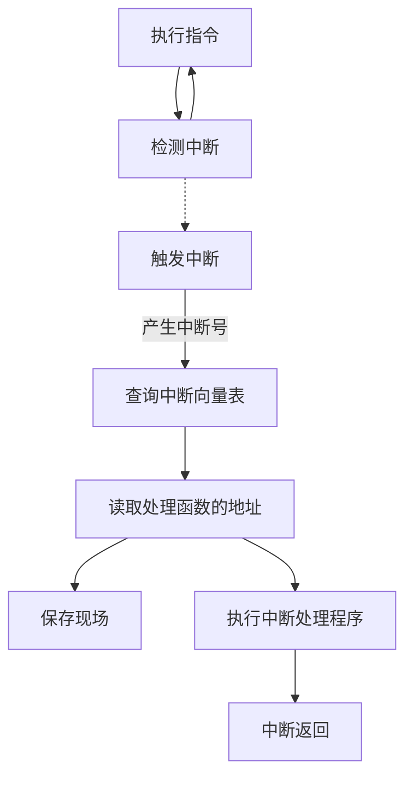

1. 题目：中断

2. 什么是中断

> 中断是计算机系统中的一种机制，它可以打断正在执行的程序，转而执行其他的程序或处理事件。中断可以由硬件或软件触发，例如外部设备的输入、时钟信号等。通过中断机制，计算机可以实现多任务处理、响应外部事件等功能。

3. 中断的作用

    + 优点：
      + 提高多道程序环境下CPU的效率
      + 提高系统响应速度
      + 作为系统调用的实现方式
        + `0x80`：系统调用的中断向量号
    + 缺点：
      + 多线程环境下产生安全问题

4. 中断分类

    + 内中断：由当前指令引发的中断
      + 陷阱/异常：由应用程序主动触发（除零错误、越界访问、非法指令等）
      + 故障：由错误条件引发（内存读写错误、硬件故障）
      + 终止：由致命错误引发（硬件故障、操作系统崩溃）
    + 外中断：由外部硬件设备触发的中断

5. 中断机制

6. 中断相关：
   1. `ret`和`iret`指令
   2. 锁的机制
   3. Linux系统调用

7. 实战：手写脚本语言解释器（Java）
   1. 脚本解析程序
   2. 简单虚拟机