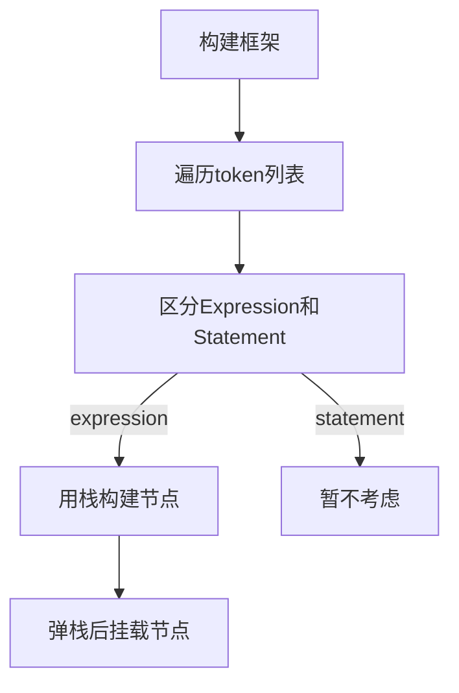

1. 题目：表达式的运算优先级

2. 优先级列表

   1. 一元运算符（从右到左）：
      - ++（后缀递增）
      - --（后缀递减）
      - +（一元正号）
      - -（一元负号）
      - !（逻辑非）
      - ~（位非）

   2. 算术运算符：
      - *（乘法）
      - /（除法）
      - %（取余）

   3. 加法和减法运算符：
      - +（加法）
      - -（减法）

   4. 移位运算符：
      - <<（左移）
      - `>>`（带符号右移）
      - `>>>`（无符号右移）

   5. 关系运算符：
      - <（小于）
      - <=（小于等于）
      - `>`（大于）
      - `>=`（大于等于）
      - instanceof（类型比较）

   6. 相等运算符：
      - ==（相等）
      - !=（不相等）

   7. 位与运算符：
      - &（按位与）

   8. 位异或运算符：
      - ^（按位异或）

   9. 位或运算符：
      - |（按位或）

   10. 逻辑与运算符：
       - &&（逻辑与）

   11. 逻辑或运算符：
       - ||（逻辑或）

   12. 三元条件运算符：
       - ? :（条件运算符）

   13. 赋值运算符（从右到左）：
       - =（赋值）
       - +=（加后赋值）
       - -=（减后赋值）
       - *=（乘后赋值）
       - /=（除后赋值）
       - %=（取余后赋值）
       - <<=（左移后赋值）
       - `>>=`（带符号右移后赋值）
       - `>>>=`（无符号右移后赋值）
       - &=（按位与后赋值）
       - ^=（按位异或后赋值）
       - |=（按位或后赋值）

3. 运算符特征
   1. 运算符
   2. 解析顺序
   3. 运算元素个数
   4. 优先级

4. 结构定义

```c
enum 
{
    OPERATOR_PRECEDENCE_LEFT_TO_RIGHT,
    OPERATOR_PRECEDENCE_RIGHT_TO_LEFT
};

typedef struct {
    // 运算符
    const char *operator;
    // 解析顺序
    int order;
    // 优先级
    int precedence;
    // 运算元素个数
    int ec;
} operator_precedence;
```

5. 操作函数实现

+ 比较符号运算优先级

```c
static bool operator_is_prioritized(const char *op1, const char *op2)
{
    operator_precedence *opp1 = NULL, *opp2 = NULL, *entry = NULL;
    for (int i = 0; i < OPERATOR_SIZE; i ++) {
        if (opp1 && opp2)
            break;
        entry = &op_precedence[i];
        if (SEQ(entry->operator, op1)) {
            opp1 = &op_precedence[i];
            continue;
        } else if (SEQ(entry->operator, op2)) {
            opp2 = &op_precedence[i];
            continue;
        }
    }

    if (!opp1 || !opp2)
        return false;
    
    return opp1->precedence < opp2->precedence;
}
```

+ 获取运算符结构体

```c
static operator_precedence *operator_get_precedence(const char *op)
{
    operator_precedence *opp = NULL;
    for (int i = 0; i < OPERATOR_SIZE; i ++) {
        if (SEQ(op_precedence[i].operator, op)) {
            opp = &op_precedence[i];
            break;
        }
    }
    return opp;
}
```

6. 表达式节点构建思路

