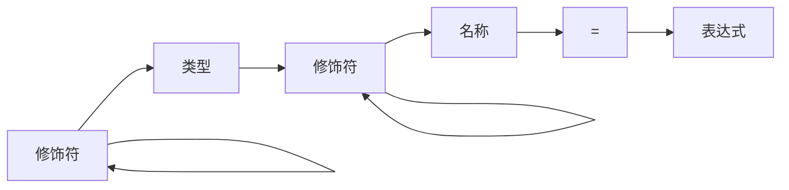

1. 题目：变量声明解析



2. 声明语法的开始标志

+ 声明修饰关键字
+ 数据类型关键字

3. 代码实现

```c
int parse_daclare(struct vector *statement) 
{
    datatype *dtype = datatype_create();
    node *n = vector_peek_no_increment(statement);
    while (n && n->type) {
        if (n->type == NODE_TYPE_DELIMITER) {
            vector_peek_pop(statement);
            break;
        }
        switch (n->value.sval.ttype) {
            case TOKEN_TYPE_KEYWORD:
                datatype_parse_flags(n, dtype) || datatype_parse_type(n, dtype);
                break;
            case TOKEN_TYPE_IDENTIFIER:
                datatype_set_name(n, dtype);
                break;
            default:
                datatype_parse_array(n, dtype);
                break;
        }
        vector_peek_pop(statement);
        n = vector_peek_no_increment(statement);
    }
    node_create(&(node){ .type = NODE_TYPE_STATEMENT_DECLARE, .value.pval = dtype });
    return JAVAC_PARSE_OK;
}
```

4. 表达式挂载

```c
static void attach_expression_to_declare(struct vector *exps, struct vector *stats)
{
    vector_save(stats);
    
    vector_set_peek_pointer_end(stats);
    node **pn = NULL, *n = NULL;
    while (true) {
        n = vector_peek(stats);
        if (n->type & NODE_TYPE_STATEMENT_DECLARE) {
            pn = &n;
            break;
        }
    }
    if (!vector_empty(exps)) {
        ((datatype*)(*pn)->value.pval)->var.value = vector_back(exps);
        vector_pop(exps);
    }

    vector_restore(stats);
}
```