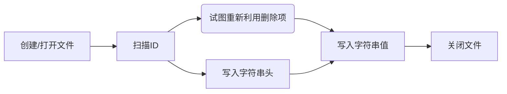
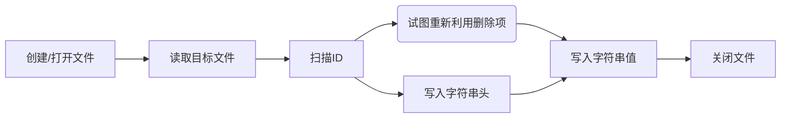
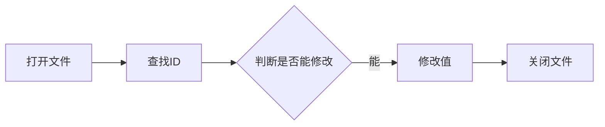

1. 题目：手写文本数据库


2. 字符串项数据结构

| 含义 | 占位 | 长度 | 值 |
|:---:|:---:|:---:|:---:|
| 识别码 | 0 - 7 | 1byte | 固定值`0xCA` |
| 字符串ID | 8 - 15 | 1byte | 记录字符串的ID，用于`GET`、`SET`和`DEL` |
| 编码类型 | 16 - 17 | 2bits | UTF-8(`0b00`)、UTF-16(`0b01`)、GBK(`0b10`)、ASCII(`0b11`) |
| 文本类型 | 18 - 19 | 2bits | 中文(`0b01`)、英文(`0b10`)、中英文(`0b11`) |
| 是否加密 | 20 | 1bit | 字符串是否被加密 |
| 是否引用 | 21 | 1bit | 判断当前字符串是否为引用类型 |
| 是否删除 | 22 | 1bit | 字符串是否被删除 |
| *保留* | 23 | 1bit | 保留空间 |
| 字符串排序 | 24-31 | 1byte | 记录字符串排序的ID |
| 字符串长度 | 32-47 | 2bytes | 记录对应编码的字符串占用的字节数 |
| *保留* | 48-63 | 2bytes | 保留空间 |

```shell
+---+---+---+---+
| H | V | H | V |
+---+---+---+---+
```

3. 字符串项结构定义

```c
typedef unsigned char uchar;
typedef unsigned int uint;

#define STR_MAGIC               (0xCA)

#define STR_ENCODER_UTF8        0b00
#define STR_ENCODER_UTF16       0b01
#define STR_ENCODER_GBK         0b10
#define STR_ENCODER_ASCII       0b11

#define STR_CATEGORY_CHN        0b01
#define STR_CATEGORY_ENG        0b10
#define STR_CATEGORY_BOTH       0b11

#define STR_STATE_CRYPT         0b001
#define STR_STATE_REF           0b010
#define STR_STATE_DEL           0b100

typedef struct {
    uchar magic;
    uchar id;
    uchar encoder:2;
    uchar category:2;
    uchar crypted:1;
    uchar referenced:1;
    uchar deleted:1;
    // 保留
    uchar:1;
    uchar order;
    uint length:16;
    // 保留
    uint:16;
} __attribute__((packed)) str_entry_t;
```

4. 功能函数实现思路

+ 添加字符串



+ 获取字符串


+ 从文件添加字符串



+ 删除字符串


+ 修改字符串


1. IPv4地址转换的遗留问题

    + 为什么使用`int`保存最大值为255的数据？