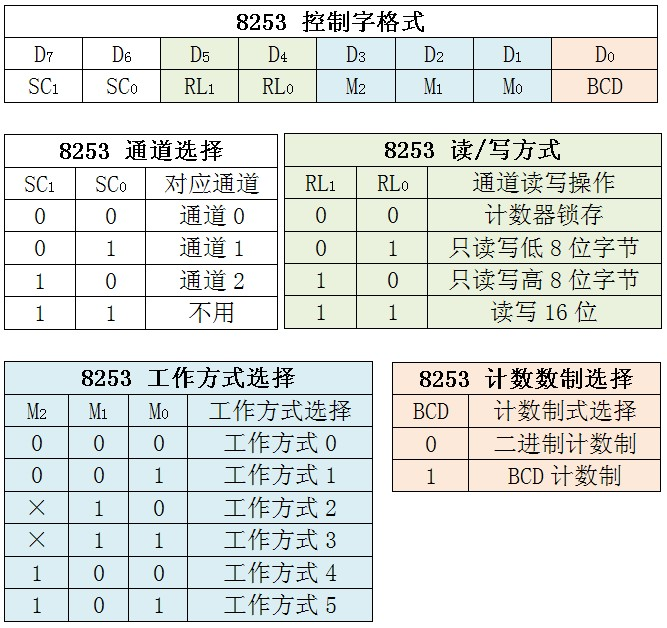

### 时钟中断

#### 8253芯片

8253芯片是可编程计数器/定时器。这种芯片外形引脚都是兼容性的。8253内部有三个计数器，分别称为计数器0、计数器1和计数器2，他们的结构完全相同。

#### 端口映射

| I/O port | Usage |
|:---:|:---:|
| 0x40 | Channel 0 data port (read/write) |
| 0x41 | Channel 1 data port (read/write) |
| 0x42 | Channel 2 data port (read/write) |
| 0x43 | Mode/Command register (write only, a read is ignored) |

#### 工作模式

+ Mode 0 – Interrupt On Terminal Count
+ Mode 1 – Hardware Re-triggerable One-shot
+ Mode 2 – Rate Generator
+ Mode 3 – Square Wave Generator
+ Mode 4 – Software Triggered Strobe
+ Mode 5 – Hardware Triggered Strobe

### 参考链接
[OSDEV - PIT](https://wiki.osdev.org/Programmable_Interval_Timer)