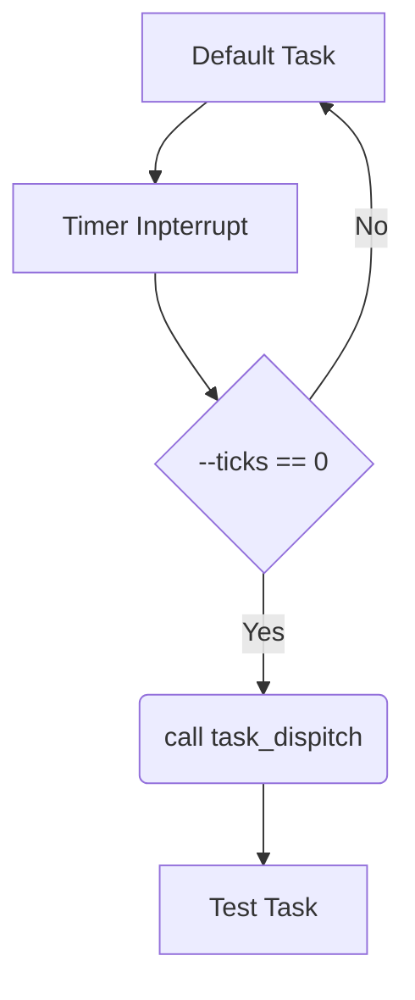
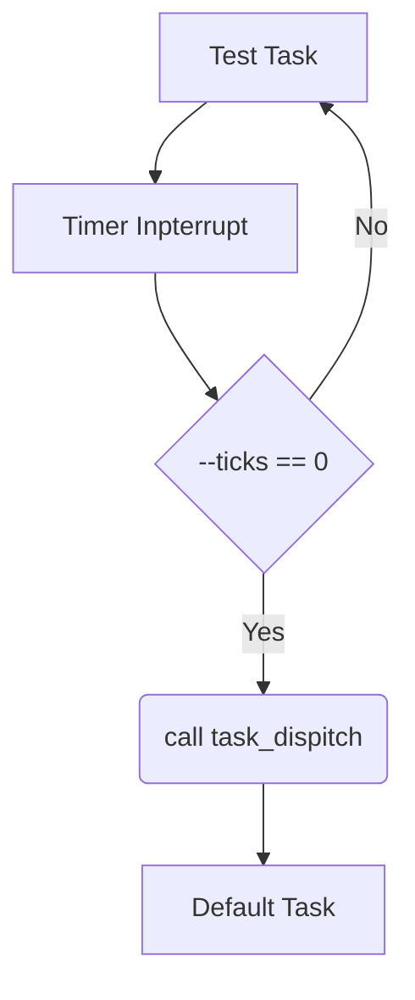

## 时间片轮询

### Default Task → Test Task

### Test Task → Default Task

---

时间片轮询是一种常见的任务调度方法，特别是在多任务操作系统中，用于实现任务之间的公平调度。它的任务切换方式可以分为以下几个部分进行描述：

---

### **基本原理**
- 时间片轮询通过为每个任务分配固定的时间片来运行任务。
- 每个任务在自己的时间片内运行，时间片到期后，任务会被暂停，调度程序将切换到下一个任务。
- 如果一个任务在其时间片内完成，则立即切换到下一个任务。

---

### **任务切换过程**
1. **时间片的到期检测**  
   - 使用硬件定时器（如系统时钟）产生定时中断，周期性地通知操作系统检查当前任务的时间片是否用完。
   
2. **保存当前任务上下文**  
   - 在切换任务之前，调度程序需要保存当前任务的上下文信息，包括：
     - CPU寄存器的值（如程序计数器、栈指针等）
     - 当前任务的状态（运行态、就绪态等）
     - 任务控制块（Task Control Block, TCB）中的其他信息
   - 这些数据通常会保存到任务的专用内存区域。

3. **选择下一个任务**  
   - 调度程序从就绪任务队列中选择下一个要运行的任务。
   - 轮询方式按照任务的顺序循环选择，确保所有任务都能公平地分配到CPU时间。

4. **加载新任务上下文**  
   - 从选中任务的上下文信息中恢复CPU寄存器值、栈指针等。
   - 设置程序计数器跳转到新任务的运行位置。

5. **恢复执行**  
   - 调度程序将控制权交给新任务，继续执行新任务的代码。

---

### **优点**
- **公平性**：每个任务都能获得相同的CPU时间，不会被长期占用资源。
- **简单性**：调度算法简单，易于实现。

### **缺点**
- **实时性不足**：由于时间片固定，可能导致高优先级任务等待时间较长，无法满足严格的实时要求。
- **时间片分配问题**：如果时间片太短，频繁切换会增加系统开销；时间片太长，则无法实现真正的并发。

---

### **适用场景**
- 适用于需要公平对待任务的场景，如桌面操作系统和交互式应用。
- 不适用于对响应时间要求极高的实时系统，通常需要结合优先级调度等策略。

时间片轮询是现代操作系统中经典的调度机制，虽然简单，但在一些特定场景下仍然被广泛使用。