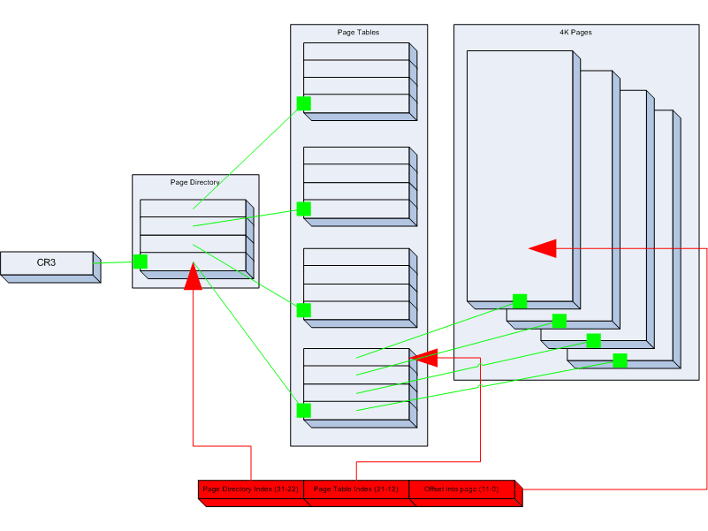
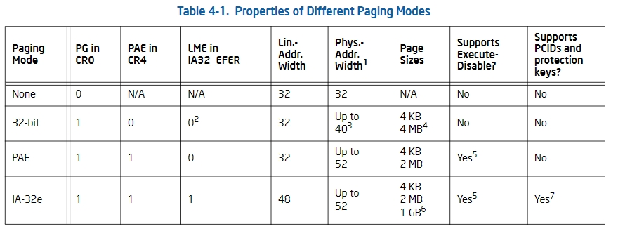
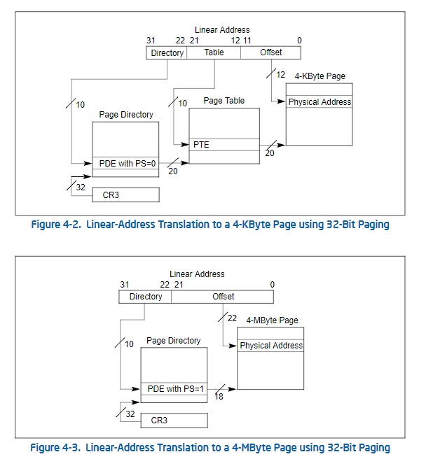

## 内存分页

### 分页模式

+ If CR0.PG = 1 and CR4.PAE = 0, 32-bit paging is used. 

+ If CR0.PG = 1, CR4.PAE = 1, and IA32_EFER.LME = 0, PAE paging is used. 

+ If CR0.PG = 1, CR4.PAE = 1, and IA32_EFER.LME = 1, IA-32e paging is used.

### 分页相关寄存器

+ The WP and PG flags in control register CR0 (bit 16 and bit 31, respectively).

+ The PSE, PAE, PGE, PCIDE, SMEP, SMAP, and PKE flags in control register CR4 (bit 4, bit 5, bit 7, bit 17, bit 20, 
bit 21, and bit 22, respectively).

+ The LME and NXE flags in the IA32_EFER MSR (bit 8 and bit 11, respectively).

+ The AC flag in the EFLAGS register (bit 18).

---

#### **CR4寄存器的结构和功能**
CR4寄存器有32位，每一位的功能是用来启用或禁用特定的硬件特性。以下是CR4寄存器各个比特位的详细介绍（以32位寄存器为基础，逐位介绍）：

| 位   | 名称                   | 功能描述                                                           |
|------|------------------------|--------------------------------------------------------------------|
| **0**  | **VME (Virtual Mode Extension)**  | 如果启用，支持虚拟8086模式扩展，允许虚拟化实模式和保护模式。           |
| **1**  | **PVI (Protected Mode Virtual Interrupts)**  | 启用保护模式下的虚拟中断功能。                                     |
| **2**  | **TSD (Time Stamp Disable)**  | 禁用时间戳计数器。                                                   |
| **3**  | **DE (Debugging Extensions)**  | 启用调试扩展，支持硬件调试功能。                                      |
| **4**  | **PSE (Page Size Extensions)**  | 启用页面大小扩展，允许使用4MB大小的页，通常用于支持大页映射。        |
| **5**  | **PAE (Physical Address Extension)** | 启用物理地址扩展（PAE），支持32位操作系统使用超过4GB的物理内存。    |
| **6**  | **MCE (Machine Check Exception)** | 启用机器检查异常，用于报告硬件故障。                                 |
| **7**  | **PGE (Page Global Enable)** | 启用全局页功能，使得对某些页表项的修改不影响系统的全局映射。         |
| **8**  | **OSFXSR (Operating System FXSAVE/FXRSTOR)** | 启用操作系统对SSE扩展指令集的支持。                                 |
| **9**  | **MXCSR (MXCSR Save/Restore)**  | 启用SSE指令集的状态保存和恢复功能。                                  |
| **10** | **VMXE (Virtual Machine Extensions)**  | 启用虚拟化扩展，支持Intel VT-x虚拟化技术。                           |
| **11** | **SMXE (Safer Mode Extensions)**  | 启用安全模式扩展（仅用于支持Intel SGX技术的硬件）。                 |
| **12** | **UMIP (User-Mode Instruction Prevention)**  | 启用用户模式指令预防，防止用户模式进程执行某些特权指令。              |
| **13** | **LA57 (Linear Address 57-bit)**  | 启用长地址扩展，支持5级页表机制，允许在x86架构上寻址超过4GB的内存空间。 |
| **14** | **VM (Virtual Mode Flag)** | 启用虚拟模式，允许创建虚拟机（仅在支持硬件虚拟化的CPU上有效）。        |
| **15** | **SMAP (Supervisor Mode Access Prevention)** | 启用内核模式访问预防，用于防止内核在用户空间执行代码时访问用户空间的内存。 |

#### 1. **VME（Virtual Mode Extensions）**
- **VME** 位用于启用虚拟8086模式扩展。虚拟8086模式是一种将实模式程序运行在保护模式下的机制，操作系统可以通过扩展保护模式来模拟虚拟机（每个虚拟机相当于一个虚拟CPU）。这个特性对于老旧的程序在现代操作系统中运行非常有用。

#### 2. **PVI（Protected Mode Virtual Interrupts）**
- **PVI** 位在启用时，允许在保护模式下处理虚拟中断。在虚拟8086模式下，CPU可以将一个虚拟机的中断处理程序与实际中断隔离开来，防止不同虚拟机之间的中断干扰。

#### 3. **TSD（Time Stamp Disable）**
- **TSD** 位用于禁用时间戳计数器（TSC）。操作系统可以通过读取时间戳计数器来获得高精度的时间信息。此位被设置时，CPU不允许访问时间戳计数器。这一特性在多处理器系统中用于同步时间戳计数器。

#### 4. **DE（Debugging Extensions）**
- **DE** 位启用硬件调试扩展。启用此位后，CPU可以生成硬件断点，允许更强大的调试能力，特别是对进入保护模式后的程序进行调试。

#### 5. **PSE（Page Size Extension）**
- **PSE** 位启用页面大小扩展功能。该特性允许使用更大的页（通常是4MB的页，而不是默认的4KB页）。这对于一些需要大量内存的应用程序，如数据库、虚拟化和内存密集型任务，特别有用。4MB页可以减少页表的数量，提高内存访问效率。

#### 6. **PAE（Physical Address Extension）**
- **PAE** 位启用物理地址扩展功能。32位系统默认支持最多4GB的物理内存，而PAE扩展使得32位操作系统可以寻址超过4GB的内存。开启PAE后，操作系统可以访问更大的物理内存空间（例如，8GB、16GB等）。PAE通过引入32位的物理地址扩展，实现了超过4GB内存的寻址。

#### 7. **MCE（Machine Check Exception）**
- **MCE** 位启用机器检查异常。开启此位后，当系统遇到硬件错误时，CPU会触发机器检查异常。操作系统可以捕获该异常并执行适当的错误处理。MCE特性用于监测硬件故障，尤其是在数据完整性和高可靠性应用中。

#### 8. **PGE（Page Global Enable）**
- **PGE** 位启用全局页功能。通过设置此位，操作系统可以使页表中的一些条目成为全局页。全局页条目是指这些页在进程切换时不会被修改或重新加载，因此可以减少进程切换时的性能开销。该特性通常用于共享内存区域或执行共享代码的场景。

#### 9. **OSFXSR（Operating System FXSAVE/FXRSTOR）**
- **OSFXSR** 位启用操作系统对SSE（Streaming SIMD Extensions）状态的保存和恢复功能。当启用此位时，操作系统可以使用 `FXSAVE` 和 `FXRSTOR` 指令保存和恢复SSE寄存器的状态。这对于高性能计算（如多媒体应用、加密运算等）中的并行计算至关重要。

#### 10. **MXCSR (MXCSR Save/Restore)**
- **MXCSR** 位启用SSE指令集的状态保存和恢复功能。通过启用该功能，操作系统可以在任务切换时保存和恢复浮点操作的状态（包括SSE寄存器）。

#### 11. **VMXE（Virtual Machine Extensions）**
- **VMXE** 位启用虚拟化扩展（如Intel VT-x）。当此位启用时，硬件支持虚拟化，并允许操作系统创建和管理虚拟机（VM）。虚拟化扩展提供了硬件级的支持，可以在同一台物理机器上运行多个虚拟机。

#### 12. **SMXE（Safer Mode Extensions）**
- **SMXE** 位启用安全模式扩展，这个扩展主要是为支持Intel SGX（Software Guard Extensions）技术的硬件而设计的。Intel SGX允许创建受保护的执行环境，保护敏感数据和代码。

#### 13. **UMIP（User-Mode Instruction Prevention）**
- **UMIP** 位启用用户模式指令预防。此位用于防止用户模式进程执行特权指令。如果用户模式程序尝试执行特权指令（如 `HLT`），将会触发异常。

#### 14. **LA57（Linear Address 57-bit）**
- **LA57** 位启用57位线性地址，允许使用5级页表机制（5-level paging），从而支持超过4GB的物理内存。该特性通常在更高的硬件和操作系统版本中启用，以支持大规模的内存寻址。

#### 15. **VM（Virtual Mode Flag）**
- **VM** 位启用虚拟模式，在虚拟化平台上尤为重要。它允许在同一台物理CPU上执行多个虚拟CPU实例。

#### 16. **SMAP（Supervisor Mode Access Prevention）**
- **SMAP** 位启用内核模式访问用户空间内存的预防，防止内核代码访问用户空间的内存数据，增强系统的安全性。

---

### 32-bit 分页模式

`32-bit`分页模式提供了两种分页的方式

+ **4-KByte**

这种模式是标准的分页方式，每个页的大小为4KB。它通常用于现代操作系统的内存管理，提供细粒度的内存分配。4-KByte分页机制可以高效地映射大量的虚拟地址空间。

+ 4-MByte

这种模式通常称为大页（Large Page）或巨页（Huge Page）。每个页的大小为4MB（即2^22字节），适用于需要大量连续内存空间的应用，如数据库、大型计算或图形处理。

| 特性              | 4-KByte分页               | 4-MByte分页               |
|------------------|--------------------------|--------------------------|
| **页大小**         | 4KB                       | 4MB                       |
| **虚拟地址空间**    | 32位体系结构支持4GB虚拟空间 | 32位体系结构支持4GB虚拟空间 |
| **页表级别**        | 两级（页目录+页表）       | 单级（仅需页目录）        |
| **访问速度**        | 相对较慢，需两次查找      | 较快，通常一次查找        |
| **内存利用率**      | 高（细粒度分配）          | 低（大块分配，可能有碎片） |
| **适用场景**        | 普遍应用，尤其是内存需求较小的场景 | 大型应用，如数据库、高性能计算 |

> 接下来的课程我们会从简单（4-MByte Mode）到困难（4-KByte Mode）来实现内存分页

