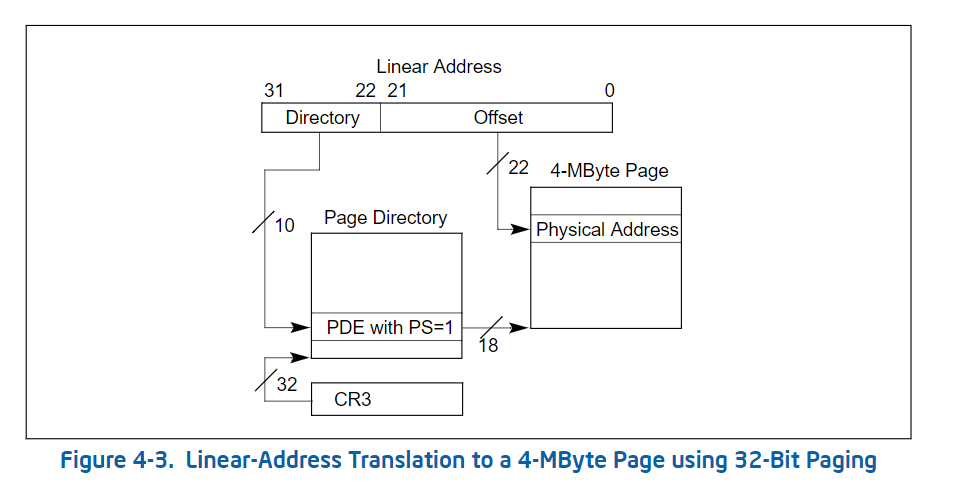
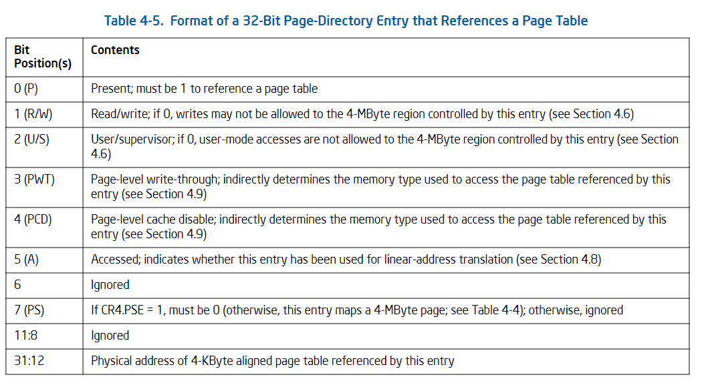

## 32-Bit Paging 4-MByte Mode



### PDE



```c
typedef union pde_t
{
    uint32_t v;
    struct {
        // 在内存中
        uint32_t present: 1;
        // 0 只读 1 可读可写
        uint32_t write: 1;
        // 1 所有人 0 超级用户 DPL < 3
        uint32_t user: 1;
        // page write through 1 直写模式，0 回写模式
        uint32_t pwt: 1;
        // page cache disable 禁止该页缓冲
        uint32_t pcd: 1;
        // 被访问过，用于统计使用频率
        uint32_t accessed: 1;
        // 是否是脏页
        uint32_t dirty: 1;
        // 确定当前PDE指向的是一个页表还是一个大页
        uint32_t ps: 1;
        // 是否是全局页
        uint32_t global: 1;
        uint32_t : 3;
        // 确定当前PDE指向的是一个页表还是一个大页
        uint32_t pat: 1;
        // 页索引
        uint32_t index: 20;
    };
} pde_t;
```

### 开启4M分页

内存规划

```shell
+--------+
| Paging |
+--------+ <-- 0xFFFFF
|  EBDA  |
+--------+ <-- 0x80000
| Bitmap |
+--------+
| Kernel |
+--------+ <-- 0x10000
| Loader |
+--------+ <-- 0x08000
|  BOOT  |
+--------+ <-- 0x07C00
|  ....  |
+--------+ <-- 0x00000
```

**注: pde的存储地址需要进行4K内存对齐**

```c
static void enable_paging()
{
    static uint32_t page_dir[1024] __attribute__((aligned(PAGE_SIZE))) = {
        [0] = PDE_P | PDE_W | PDE_PS | 0
    };
    write_cr4(read_cr4() | CR4_PSE);
    write_cr3((uint32_t)page_dir);
    write_cr0(read_cr0() | CR0_PG);
}
```

*注: 实模式使用的内存使用4M分页, 开启分页机制后需要将1MB以内的内存按照物理内存地址进行映射, 这样才能保证物理地址和虚拟地址的一致性*