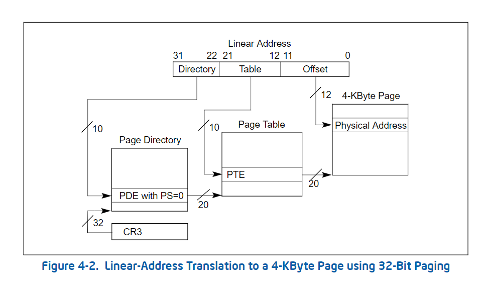
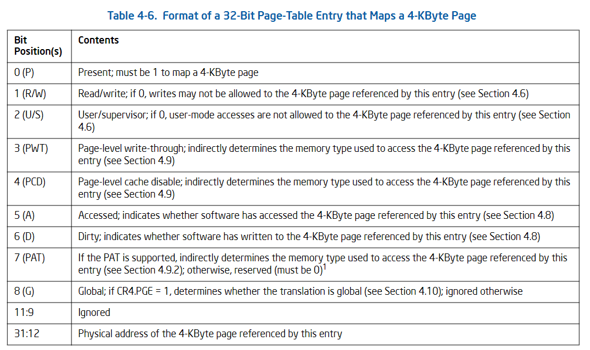

## 32-Bit Paging 4-KByte Mode



### PDE


```c
typedef union pde_t
{
    uint32_t v;
    struct {
        // 在内存中
        uint32_t present: 1;
        // 0 只读 1 可读可写
        uint32_t write: 1;
        // 1 所有人 0 超级用户 DPL < 3
        uint32_t user: 1;
        // page write through 1 直写模式，0 回写模式
        uint32_t pwt: 1;
        // page cache disable 禁止该页缓冲
        uint32_t pcd: 1;
        // 被访问过，用于统计使用频率
        uint32_t accessed: 1;
        uint32_t : 1;
        // 确定当前PDE指向的是一个页表还是一个大页
        uint32_t ps: 1;
        uint32_t : 4;
        // 页索引
        uint32_t index: 20;
    };
} pde_t;
```

### PTE



```c
typedef union pte_t
{
    uint32_t v;
    struct {
        // 在内存中
        uint32_t present: 1;
        // 0 只读 1 可读可写
        uint32_t write: 1;
        // 1 所有人 0 超级用户 DPL < 3
        uint32_t user: 1;
        // page write through 1 直写模式，0 回写模式
        uint32_t pwt: 1;
        // page cache disable 禁止该页缓冲
        uint32_t pcd: 1;
        // 被访问过，用于统计使用频率
        uint32_t accessed: 1;
        // 脏页，表示该页缓冲被写过
        uint32_t dirty: 1;
        // page attribute table 页大小 4K/4M
        uint32_t pat: 1;
        // 全局，所有进程都用到了，该页不刷新缓冲
        uint32_t global: 1;
        uint32_t : 3;
        // 页索引
        uint32_t index: 20;
    };
} pte_t;
```

**注: 4K/4M分页可以共存**

### ELF段介绍

在计算机科学中，`.bss`、`.data`、`.rodata` 和 `.text` 是可执行文件或内存布局中的几个重要段名，它们被用来存储不同类型的程序数据。这些段的作用如下：

| 段名       | 存储内容                        | 是否可修改 | 是否初始化 | 是否占用文件空间 |
|------------|--------------------------------|------------|------------|------------------|
| `.bss`     | 未初始化的全局/静态变量         | 是         | 否         | 否               |
| `.data`    | 已初始化的全局/静态变量         | 是         | 是         | 是               |
| `.rodata`  | 只读数据（如字符串常量）         | 否         | 是         | 是               |
| `.text`    | 程序的机器指令（代码）           | 否         | -          | 是               |

### 1. **`.bss` (Block Started by Symbol) 段**
- **功能**：用于存储未初始化的全局变量或静态变量。
- **特点**：
  - 不占用实际文件空间，只有程序运行时才分配内存。
  - 初始值通常为零。
  - 优化程序大小，因为未初始化的数据无需在可执行文件中存储。
- **例子**：
  ```c
  int globalVar; // 未初始化，放在 .bss
  static int staticVar; // 未初始化，放在 .bss
  ```

### 2. **`.data` 段**
- **功能**：用于存储初始化的全局变量或静态变量。
- **特点**：
  - 数据在程序启动前已初始化，运行时可以被修改。
  - 占用可执行文件空间，因为初始值需要存储。
- **例子**：
  ```c
  int globalVar = 10; // 初始化为10，放在 .data
  static int staticVar = 5; // 初始化为5，放在 .data
  ```

### 3. **`.rodata` (Read-Only Data) 段**
- **功能**：存储只读数据，如字符串常量或其他只读的全局变量。
- **特点**：
  - 通常映射为只读内存，防止运行时修改。
  - 数据在程序运行期间是固定的。
- **例子**：
  ```c
  const char* msg = "Hello, World!"; // 字符串常量存储在 .rodata
  const int constantValue = 42; // 只读常量存储在 .rodata
  ```

### 4. **`.text` 段**
- **功能**：存储程序的机器指令（代码）。
- **特点**：
  - 只读，通常映射到只读内存。
  - 包含函数的二进制代码和指令。
- **例子**：
  ```c
  void foo() {
      // 函数代码被编译为机器指令，放在 .text 段
  }
  ```

### 开启4K分页

内核页读写权限规划

```shell
+---------+
|  Bitmap |     R/W
+---------+
|  Kernel |     R/W
+---------+
|  .bss   |     R/W
+---------+
|  .data  |     R/W
+---------+
| .rodata |     R
+---------+
|  .text  |     R
+---------+
|  Stack  |     R/w
+---------+
```