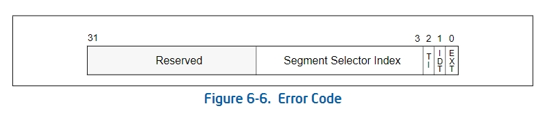
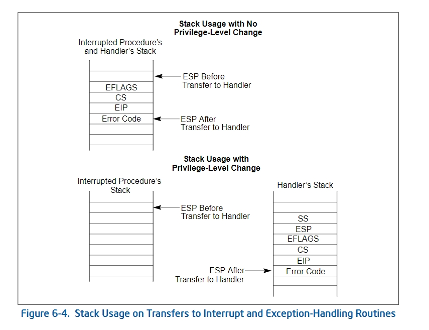
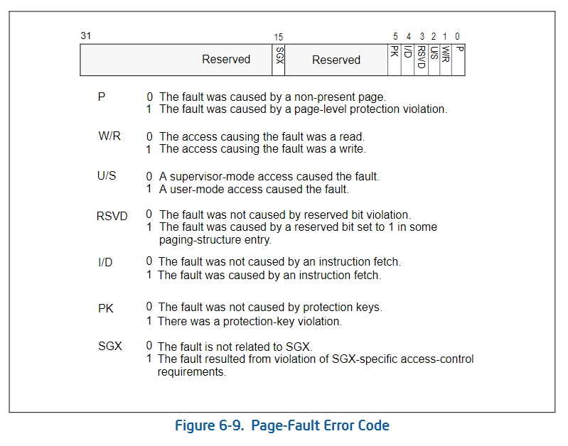

## 异常处理

该图显示了 x86 处理器在异常发生时生成的错误码格式。错误码是一个 32 位的值，用于描述导致异常的具体原因和相关上下文信息。以下是每个字段的详细说明：

---

### **字段解释**
1. **Segment Selector Index (段选择子索引)**
   - **位范围**: [15:3]
   - 描述引发错误的段选择子的索引部分。
   - 如果异常与段相关（如段保护错误），此部分用于标识有问题的段选择子。

2. **T (Table Indicator)**
   - **位置**: 第 2 位
   - 描述选择子来源的描述符表：
     - **0**：全局描述符表 (GDT)。
     - **1**：本地描述符表 (LDT)。

3. **I (IDT Flag)**
   - **位置**: 第 1 位
   - 指示错误是否与中断描述符表 (IDT) 项相关：
     - **0**：错误与段描述符（GDT 或 LDT）相关。
     - **1**：错误与中断描述符表 (IDT) 项相关。

4. **EXT (External Event Flag)**
   - **位置**: 第 0 位
   - 指示异常是由外部事件（如硬件中断或总线错误）导致的：
     - **0**：异常是由处理器指令引发的（内部错误）。
     - **1**：异常是由外部事件引发的（外部错误）。

5. **Reserved (保留)**
   - **位范围**: [31:16]
   - 当前保留为 0，可能供未来处理器扩展使用。

---

### 异常处理函数和特权级

---

### 一般性保护异常(#GP)

`#GP`（通用保护异常）是x86架构中一种异常，用于捕获特权级别、段访问、内存操作等各种保护违规情况。`#GP`是保护模式下的重要机制，用于确保系统的稳定性和安全性。

当CPU检测到以下问题时，会触发`#GP`异常：

1. **段选择器错误**  
2. **特权级别违规**  
3. **非法内存访问**  
4. **非法指令执行**  
5. **其他保护机制违规**  

---

### 触发`#GP`的常见原因

#### 1. **段选择器非法**
`#GP` 会在访问无效的段选择器时触发，比如：

- 段选择器超出 GDT 或 LDT 的范围。
- 访问未定义或未初始化的段描述符。
- 尝试加载无效的段选择器到段寄存器（`CS`, `DS`, `ES`, `SS`, 等）。

#### 2. **特权级别违规**
- 当前特权级别（CPL）低于访问段描述符所需的特权级别（DPL）。
- 不匹配的特权级别会触发 `#GP`。

#### 3. **堆栈段问题**
- 在特权级别切换时，堆栈段（`SS`）的特权级别必须匹配。
- 如果堆栈指针（`ESP`）或段描述符无效，会触发 `#GP`。

#### 4. **非法内存访问**
- 访问受保护的内存地址或超出段的限制。
- 尝试写入只读段或执行不可执行段。

#### 5. **非法指令**
- 执行特权指令时，如果当前特权级别不够（如在用户模式执行`LGDT`或`HLT`指令），会触发 `#GP`。

#### 错误码

错误码（`ErrorCode`）提供了有关异常原因的额外信息。格式如下：

| 位数 | 描述                                    |
|------|-----------------------------------------|
| 0    | 外部事件标志：1 表示外部事件触发。         |
| 1-2  | 保留位，通常为 0。                       |
| 3-15 | 选择器索引（指向 GDT 或 LDT 的描述符）。   |

---

### 缺页异常(#PF)

在 x86 和 x86-64 架构中，当处理器检测到页故障（#PF）时，会生成一个错误码，该错误码提供有关页故障的具体原因和上下文信息。以下是图中每个字段的详细解释：

---

#### **页故障错误码结构**
页故障错误码是一个 32 位值，最低 6 位有特定含义，其余位保留供将来使用：

| 位   | 字段   | 描述                                                                                  |
|------|--------|---------------------------------------------------------------------------------------|
| 0    | P      | **页面存在标志**：表示页故障的原因是页面不存在还是页面保护违规。                       |
| 1    | W/R    | **读/写标志**：表示引发页故障的访问是读操作还是写操作。                                |
| 2    | U/S    | **用户/超级模式标志**：表示访问是由用户模式还是特权模式引发的。                        |
| 3    | RSVD   | **保留位违规标志**：指示页表项中保留位是否被非法设置为 1。                             |
| 4    | I/D    | **指令/数据访问标志**：表示页故障是否由指令取值引起。                                 |
| 5    | PK     | **保护密钥违规标志**：指示是否由于保护密钥 (Protection Key) 引起页故障。               |
| 6    | SGX    | **SGX 特定访问控制标志**：指示页故障是否由 SGX（软件保护扩展）访问控制违反引起。       |
| 7-31 | Reserved | **保留位**：未定义，当前保留供将来扩展，处理器会将这些位设置为 0。                  |

---

#### **字段详细说明**

1. **P (Presence)**
   - **0**：页故障是由于访问了不存在的页面（页面未加载到内存中）。
   - **1**：页故障是由于页面存在，但发生了访问保护违规（如读写权限错误）。

2. **W/R (Write/Read)**
   - **0**：引发页故障的访问是读取操作。
   - **1**：引发页故障的访问是写入操作。
   - **注**：此标志在某些处理器的特定访问模式下可能无意义。

3. **U/S (User/Supervisor)**
   - **0**：故障由超级模式（内核模式）访问引发。
   - **1**：故障由用户模式访问引发。

4. **RSVD (Reserved Bit Violation)**
   - **0**：页故障不是由于页表项中的保留位被非法设置引发的。
   - **1**：页故障是由于页表项的保留位被非法设置为 1 引发的（例如，使用了非法的页表结构）。

5. **I/D (Instruction/Data)**
   - **0**：页故障不是由于指令取值引发的。
   - **1**：页故障是由于指令取值（如指令预取）引发的。

6. **PK (Protection Key Violation)**
   - **0**：页故障不是由于保护密钥机制引发的。
   - **1**：页故障是由于保护密钥违规（如访问未授权页面）引发的。
   - **注**：保护密钥是一种扩展机制，用于实现更精细的内存访问控制。

7. **SGX (Software Guard Extensions Violation)**
   - **0**：页故障与 SGX 无关。
   - **1**：页故障是由于 SGX 访问控制要求的违规引发的。
   - **注**：SGX 是一种硬件扩展，用于创建安全加密的执行环境。

---

### CR2寄存器

在 x86 和 x86-64 架构中，当发生缺页异常（#PF，Page Fault）时，处理器会将引发异常的线性地址存储到 **CR2 寄存器** 中。以下是 CR2 寄存器在缺页异常中的作用：

---

#### **CR2 寄存器的作用**
CR2 是一个专用控制寄存器，用于存储导致缺页异常的线性地址（线性地址即分页机制中未经过物理地址转换的地址）。它的作用包括：

1. **标识引发缺页异常的地址**
   - 当处理器检测到缺页异常时，CR2 中会保存发生错误的线性地址，供操作系统进一步处理。
   - 该地址可能是一个访问非法内存区域的地址，或者是由于页面未加载而触发的地址。

2. **协助操作系统处理缺页异常**
   - 操作系统的缺页异常处理程序可以读取 CR2 的值，获取需要修复的页面地址。
   - 处理程序根据 CR2 的地址：
     - 判断该地址是否属于合法的虚拟地址空间。
     - 如果合法，则加载对应的页面（例如从磁盘加载到内存）。
     - 如果非法，可能会终止进程或产生其他错误响应。

3. **调试和错误诊断**
   - 在调试内存管理问题时，CR2 的值可用于快速定位访问失败的内存地址。
   - CR2 与页故障错误码结合使用，可提供完整的故障信息。