## 光标控制



---

```c
typedef struct cursor_ctrl_t {
    // 本次输入的字符数
    uint16_t total;
    // 光标所在位置
    uint16_t current;
    // 功能按键启用位
    uint8_t can_backspace:1;
    uint8_t can_left:1;
    uint8_t can_right:1;
} cursor_ctrl_t;
```

当执行`tty_write_char()`时让`total`和`current`同时向后移动

---

### `can_backspace = true`
+ `current > 0`

### `can_left = true`
+ `current > 0`

### `can_right = true`
+ `current < total`