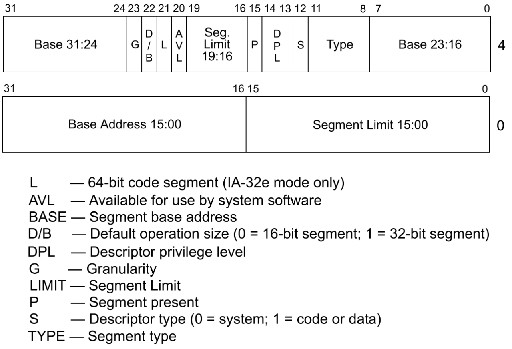

### A20地址线

A20地址线是计算机系统中的一个重要概念，尤其是在早期的x86架构中。A20地址线用于扩展系统的地址空间，使得处理器能够访问超过1MB的内存。

> 在8086和80286等早期处理器中，地址线的数量限制了可寻址的内存空间。在这些处理器中，最多只能寻址1MB的内存（2^20 = 1,048,576字节）。A20地址线的引入，使得后来的处理器（如80386及以后的处理器）能够寻址更大的内存空间。

### 段描述符

段描述符是位于GDT（ Global Descriptor Table, GDT ）或LDT（ Local Descriptor Table, GDT ）中8字节大小的表项，用来描述内存段的属性。给处理器提供一个段的位置、界限、访问特权级等信息

+ 低32位
    + 第 0~15 位用来存储段的段界限前 0～15 位。段界限表示段边界的扩展最值，即最大扩展到多少或最小扩展到多少。
    + 第 16～31 位用来存储段基址 0～15 位。
+ 高32位
    + 第 0～7 位是段基址的 16～23 位。
    + 第 8~11 位是 type 字段，共 4 位，用来指定本描述符的类型。type 字段和 S 字段配合使用。
    + 第 12 位是 S 字段。
        + S为 0 时表示系统段，
        + S 为 1 时表示数据段。
        > 凡是硬件运行要用到的东西都可称之为系统，凡是软件（代码，数据，栈）需要的东西都称为数据。

    + 第 13～14 位是 DPL（Descriptor Privilege Level） 字段，即描述符特权级。2位能表示 4 种特权级，数字越小，特权级越大。
    + 第 15 位是 P （Present） 字段，即段是否存在。如果段存在于内存中，P 为 1，否则 P 为 0。
    + 第 16～19 位是段界限的第 16～19 位。
    + 第 20 位为 AVL 字段，
    + 第 21 位为 L 字段，用来设置是否是 64 位代码段。L 为 1 表示 64 位代码段，否则表示 32位代码段。
    + 第 22 位是 D/B 字段，用来指示有效地址（段内偏移地址）及操作数的大小。
    + 第 23 位是 G 字段，Granularity，粒度，用来指定段界限的单位大小。
    + 第 24～31 位是段基址的第 24～31 位。

#### 平坦模式

平坦模式（Flat Mode）是一种内存管理方式，主要用于简化程序的地址空间管理。在平坦模式下，整个地址空间被视为一个连续的线性地址空间，而不再进行分段管理。

### 全局描述符

全局描述符表（ Global Descriptor Table, GDT ）是保护模式下内存段的登记表。全局描述符表 GDT 相当于是描述符的数组，数组中的每个元素都是 8 字节的描述符。可以用选择子中提供的下标在 GDT 中索引描述符。

> 全局描述符表存放在内存中，需要用专门的寄存器（GDTR，GDT Register）指向它(GDT )后，CPU 才知道它的位置。GDTR 是个 48 位的寄存器，专门用来存储 GDT 的内存地址及大小。其中前`16位`是 GDT 以字节为单位的界限值，所以这 16 位相当于GDT 的字节大小减 1。后`32位`是 GDT 的起始地址。由于 GDT 的大小是 16 位，每个描述符大小是8字节，故，GDT中最多可容纳的描述符数量是65536/8=8192个，即 GDT 中可容纳 8192 个段或门。

> Global Descriptor Table

| 字节偏移量 | 名称 | 含义 |
|:---:|:---:|:---:|
| 0-15 | GDTLimit | GDT界限 |
| 4-7 | GDTStartAddr | GDT内存其实地址 |