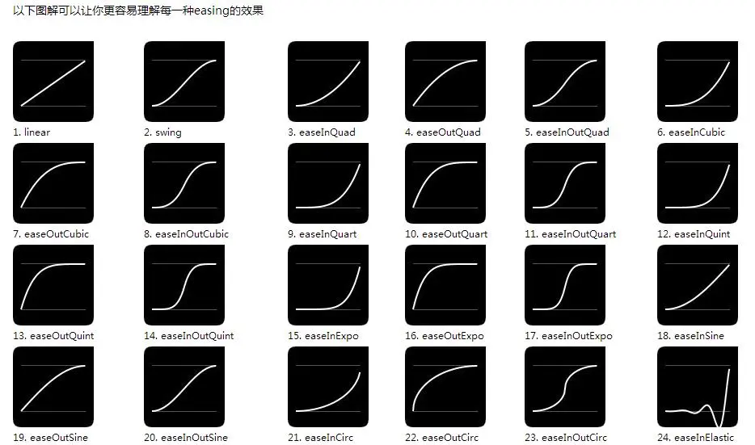

## 曲线函数



---

### 函数表达式

以下是图中所有缓动（easing）函数的数学表达式：

1. **Linear**:  
   \[
   f(t) = t
   \]

2. **Swing** (通常指 easeInOutQuad):  
   \[
   f(t) =
   \begin{cases} 
   2t^2, & t < 0.5 \\
   1 - (-2t + 2)^2 / 2, & t \geq 0.5
   \end{cases}
   \]

3. **easeInQuad**:  
   \[
   f(t) = t^2
   \]

4. **easeOutQuad**:  
   \[
   f(t) = 1 - (1 - t)^2
   \]

5. **easeInOutQuad**:  
   \[
   f(t) =
   \begin{cases} 
   2t^2, & t < 0.5 \\
   1 - (-2t + 2)^2 / 2, & t \geq 0.5
   \end{cases}
   \]

6. **easeInCubic**:  
   \[
   f(t) = t^3
   \]

7. **easeOutCubic**:  
   \[
   f(t) = 1 - (1 - t)^3
   \]

8. **easeInOutCubic**:  
   \[
   f(t) =
   \begin{cases} 
   4t^3, & t < 0.5 \\
   1 - (-2t + 2)^3 / 2, & t \geq 0.5
   \end{cases}
   \]

9. **easeInQuart**:  
   \[
   f(t) = t^4
   \]

10. **easeOutQuart**:  
   \[
   f(t) = 1 - (1 - t)^4
   \]

11. **easeInOutQuart**:  
   \[
   f(t) =
   \begin{cases} 
   8t^4, & t < 0.5 \\
   1 - (-2t + 2)^4 / 2, & t \geq 0.5
   \end{cases}
   \]

12. **easeInQuint**:  
   \[
   f(t) = t^5
   \]

13. **easeOutQuint**:  
   \[
   f(t) = 1 - (1 - t)^5
   \]

14. **easeInOutQuint**:  
   \[
   f(t) =
   \begin{cases} 
   16t^5, & t < 0.5 \\
   1 - (-2t + 2)^5 / 2, & t \geq 0.5
   \end{cases}
   \]

15. **easeInExpo**:  
   \[
   f(t) =
   \begin{cases} 
   0, & t = 0 \\
   2^{10(t - 1)}, & t > 0
   \end{cases}
   \]

16. **easeOutExpo**:  
   \[
   f(t) =
   \begin{cases} 
   1, & t = 1 \\
   1 - 2^{-10t}, & t < 1
   \end{cases}
   \]

17. **easeInOutExpo**:  
   \[
   f(t) =
   \begin{cases} 
   0, & t = 0 \\
   1, & t = 1 \\
   2^{10(2t - 1)} / 2, & t < 0.5 \\
   (2 - 2^{-10(2t - 1)}) / 2, & t \geq 0.5
   \end{cases}
   \]

18. **easeInSine**:  
   \[
   f(t) = 1 - \cos\left(\frac{t \pi}{2}\right)
   \]

19. **easeOutSine**:  
   \[
   f(t) = \sin\left(\frac{t \pi}{2}\right)
   \]

20. **easeInOutSine**:  
   \[
   f(t) = \frac{1 - \cos(t \pi)}{2}
   \]

21. **easeInCirc**:  
   \[
   f(t) = 1 - \sqrt{1 - t^2}
   \]

22. **easeOutCirc**:  
   \[
   f(t) = \sqrt{1 - (t - 1)^2}
   \]

23. **easeInOutCirc**:  
   \[
   f(t) =
   \begin{cases} 
   (1 - \sqrt{1 - (2t)^2}) / 2, & t < 0.5 \\
   (\sqrt{1 - (-2t + 2)^2} + 1) / 2, & t \geq 0.5
   \end{cases}
   \]

24. **easeInElastic**:  
   \[
   f(t) =
   \begin{cases} 
   0, & t = 0 \\
   1, & t = 1 \\
   -2^{10(t - 1)} \sin\left((t - 1.1) \cdot 10 \pi\right), & \text{otherwise}
   \end{cases}
   \]

这些缓动函数在动画、游戏和UI设计中广泛应用，可以控制运动的加速和减速模式，使动画更加自然流畅。

### Unity3D API

`Vector3.Lerp` 函数是 Unity 中用于线性插值的一个非常有用的工具。它可以在两个三维点之间计算一个中间点，以实现平滑的过渡效果。下面是对 `Vector3.Lerp` 函数的详细介绍。

### Vector3.Lerp

#### 函数签名

```csharp
public static Vector3 Lerp(Vector3 a, Vector3 b, float t);
```

#### 参数说明

- **`Vector3 a`**：起始点（起始位置）。
- **`Vector3 b`**：结束点（目标位置）。
- **`float t`**：插值因子，通常在 0 到 1 之间。

#### 返回值

- 返回一个新的 `Vector3`，表示在 `a` 和 `b` 之间的插值结果。

#### 插值计算

`Vector3.Lerp` 的计算公式为：

\[
\text{result} = (1 - t) \cdot \text{a} + t \cdot \text{b}
\]

- 当 `t = 0` 时，返回 `a`。
- 当 `t = 1` 时，返回 `b`。
- 当 `0 < t < 1` 时，返回 `a` 和 `b` 之间的一个点。
- 当 `t < 0` 或 `t > 1` 时，结果会在 `a` 和 `b` 的延伸方向上。

---

### Vector3.Distance

`Vector3.Distance` 是 Unity 中用于计算两个三维点之间距离的静态函数。它的定义如下：

### 函数签名

```csharp
public static float Distance(Vector3 a, Vector3 b);
```

### 参数说明

- **`Vector3 a`**：第一个点的坐标。
- **`Vector3 b`**：第二个点的坐标。

### 返回值

- 返回一个浮点数，表示点 `a` 和点 `b` 之间的直线距离。

### 计算方法

- `Vector3.Distance` 使用欧几里得距离公式进行计算，公式为：

\[
\text{distance} = \sqrt{(b.x - a.x)^2 + (b.y - a.y)^2 + (b.z - a.z)^2}
\]

---

### Mathf.Clamp01

`Mathf.Clamp01` 是 Unity 中的一个静态函数，用于限制一个值在 0 和 1 之间。它的定义如下：

#### 函数签名

```csharp
public static float Clamp01(float value);
```

#### 参数说明

- **`value`**：要限制的浮点数值。

#### 返回值

- 返回一个浮点数，确保其值在 0 和 1 之间：
  - 如果 `value` 小于 0，返回 0。
  - 如果 `value` 大于 1，返回 1。
  - 如果 `value` 在 0 和 1 之间，返回 `value` 本身。