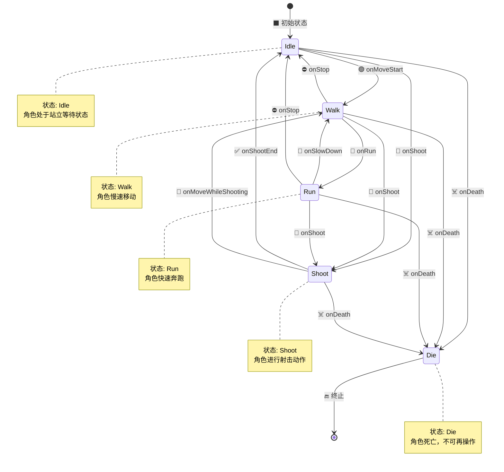

## 状态机

状态机（State Machine） 是一种建模系统行为的方法，用来描述一个系统在不同“状态”之间的转换过程。它常用于程序设计、通信协议、游戏开发、驱动程序等场景。

$$ S=s_1,s_2,...,s_n, I=i_1,i_2,...,i_m $$
$$ s_l=f(s_k,i_j),s \in S, i \in I $$

---

一个FPS游戏角色的状态转换图

---

### 🧠 核心概念
#### 1.状态（State）
系统在某一时刻所处的情形，比如“等待”、“运行”、“暂停”、“错误”等。

#### 2.事件（Event）
触发状态改变的东西，比如用户点击、收到数据、定时器超时。

#### 3.转换（Transition）
从一个状态跳转到另一个状态。每次跳转都有个“从状态”→“到状态”，通常伴随一个事件。

#### 4.初始状态（Initial State）
状态机开始运行时所在的状态。

#### 5.终止状态（Final State）（可选）
运行结束时的状态。

### 🧰 应用场景
+ 嵌入式系统（按键、设备状态控制）

+ 游戏开发（角色状态、AI行为）

+ 协议设计（TCP协议状态转移）

+ 图形界面交互（按钮状态、窗口状态）