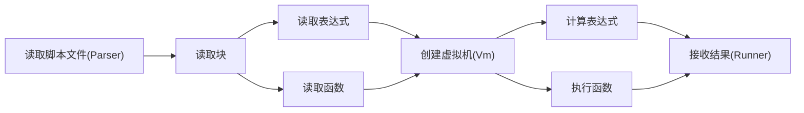
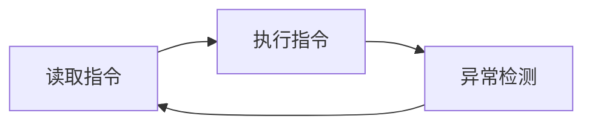

1. 题目：手写脚本解释器1
   1. 实现数据结构定义
   2. 实现示例脚本的解析

示例脚本

```shell
int a = 10
int b = 20
int c = a + b
print(c)
```

2. 数据结构

+ 实体类
```java
// 表达式
class Expression
{
    // 表达式类型
    private ExpressionType type;
    // 表达式接收结果中变量名或函数名
    private String name;
    // 表达式的运算值
    private Object value;
    // 表达式运算结果类型
    private DataType dataType;
}

// 函数
class Function
{
    // 函数名称
    private String name;
    // 函数参数个数下限
    private Integer nArgs;
    // 函数参数类型列表
    private DataType[] argTypes;
    // 函数返回值类型
    private DataType retType;
}

// 块
class Block 
{
    // 该块是否立即执行
    private boolean shortly;
    // 局部变量表
    private final Map<String, Object> variables;
    // 子块列表
    private final List<Block> subBlocks;
    // 表达式列表
    private List<Expression> expressions;
}
```
+ 框架类
```java
// 解析器
class Parser
{
    // 根块为立即执行的块
    private final Block root = new Block(true);
    // 构造函数
    public CalangParser (String filepath) {
        // TODO:...
    }
    // 解析函数
    public void parse() {
        // TODO:...
    }
}

// 解释器
class Runner
{
    // 指令列表
    private List<Integer> commands;
    // 虚拟机
    private final CalangVm vm;
    // 常量池
    private final List<Object> constants;
    // 构造函数
    public CalangRunner(CalangVm vm) {
        this.vm = vm;
        constants = new LinkedList<>();
        commands = new LinkedList<>();
    }
}

// 虚拟机
class Vm
{
    // 通用寄存器
    private int eax, ebx, ecx, edx;
    // eip寄存器
    private int eip;
    // 栈寄存器
    private int ebp, esp;
    // 标志寄存器
    private int eflags;
    // 栈空间
    private Stack<Integer> stack;
    // 堆空间
    private ArrayList<Object> heap;

    // TODO: 各种指令的函数实现
}
```
---
3. 设计思路



4. 指令规划

```shell
0        7        15       23       31
+--------+--------+--------+--------+
|  CMD   |  IVAL  |  REG1  |  REG2  |
+--------+--------+--------+--------+

CMD:    指令机器码
IVAL:   局部变量表索引
REG1:   操作寄存器1
REG2:   操作寄存器2
```

5. 指令执行过程

