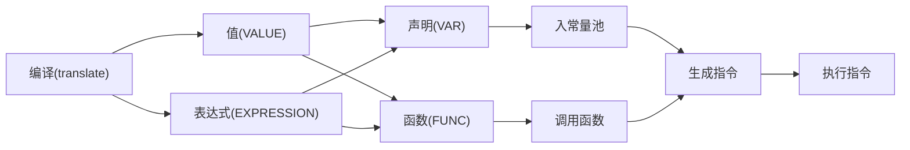

1. 题目：手写脚本解释器2
   1. 中缀表达式计算
   2. 表达式计算框架

[前缀中缀后缀表达式求值](https://blog.csdn.net/chengqiuming/article/details/114441652)

2. 中缀表达式
   + 操作数
     + 直接入栈
   + 符号
     + 栈空时或左括号则直接入栈
     + 右括号直接弹栈直到弹到左括号为止
     + 新符号优先级高则可以入栈，否则出栈计算

> 50 - 3 * 10 - ( 3 + 4 )

```shell
操作数栈        符号栈
+-----+        +-----+
|     |        |     |
+-----+        +-----+
|     |        |     |
+-----+        +-----+
|     |        |     |
+-----+        +-----+
|     |        |     |
+-----+        +-----+
```

3. 表达式计算框架

