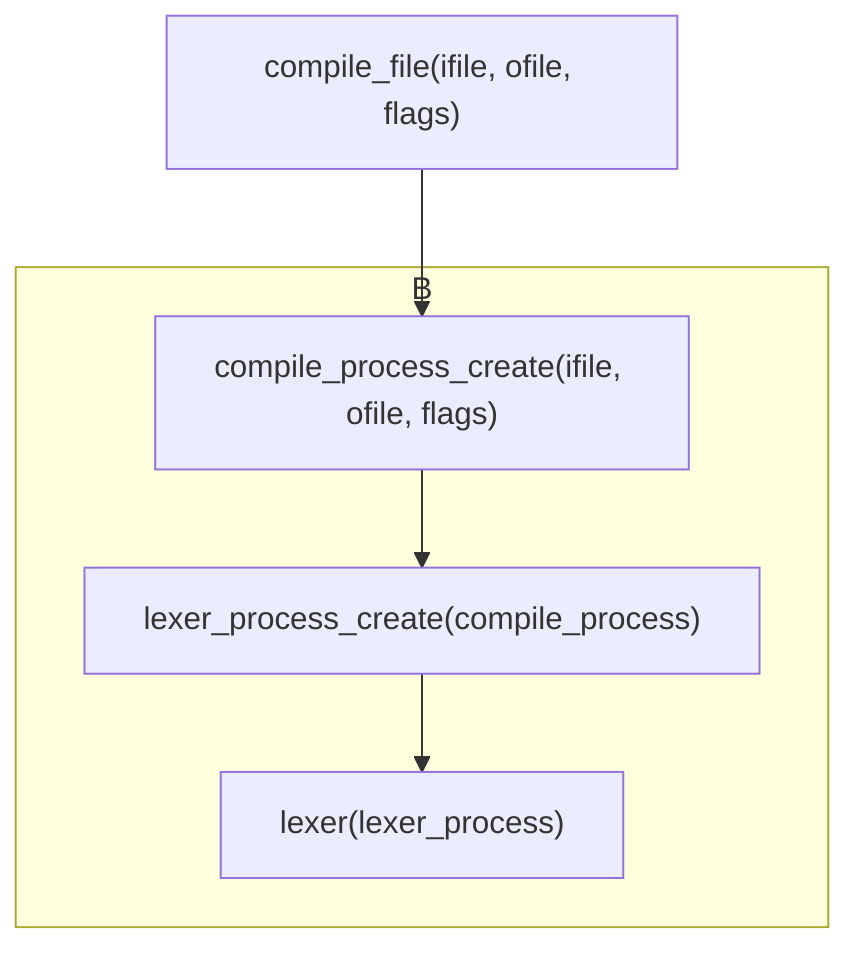

1. 题目：构建词法解析框架

[Javac Github Repository](https://github.com/caoaolong/javac.git)

2. 工程目录结构
```shell
javac
├── HelloWorld.class    输出文件
├── HelloWorld.java     待编译文件
├── Makefile            构建脚本
├── include             头文件目录
│   ├── helpers
│   │   ├── buffer.h
│   │   └── vector.h
│   ├── javac.h
│   ├── lexer.h
│   └── process.h
├── main.c
└── src                 原码目录
    ├── helpers
    │   ├── buffer.c
    │   └── vector.c
    ├── javac.c
    ├── lexer.c
    └── process.c
```

3. 数据结构

+ 编译过程

```c
typedef struct {
    int line;
    int col;
    const char *filename;
} position;

typedef struct {

    struct {
        FILE *ifp;
        const char *path;
    } ifile;
    FILE *ofp;
    int flags;

    position pos;

} compile_process;
```

+ 词法解析过程
```c
typedef struct lexer_process_t lexer_process;

struct lexer_process_t {
    position pos;
    compile_process *compiler;
    char (*next)(lexer_process *process);
    char (*peek)(lexer_process *process);
    void (*push)(lexer_process *process, char c);
};
```

4. 实现过程

