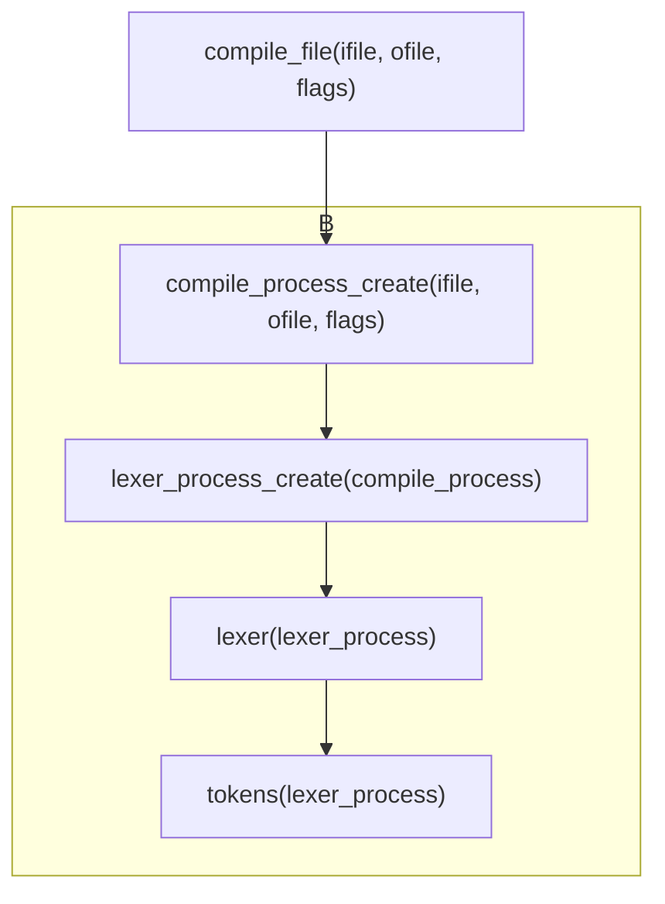
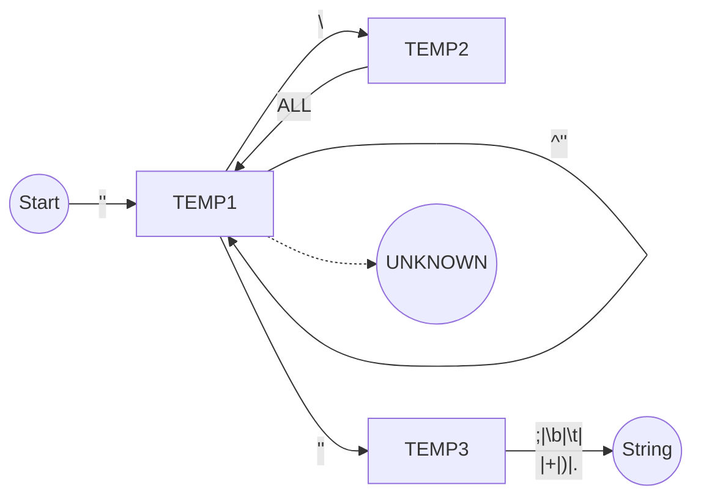

1. 题目：字符串状态机
   1. 生成token
   2. 处理关键字和字符串

2. 数据结构修改

```c
struct lexer_process_t {
    position pos;
    compile_process *compiler;
    struct vector *tokens;
    char (*next)(lexer_process *process);
    char (*peek)(lexer_process *process);
    void (*push)(lexer_process *process, char c);
};

typedef struct {
    int type;
    int flags;
    position pos;
    union {
        char cval;
        const char *sval;
        unsigned int inum;
        unsigned long lnum;
        unsigned long long llnum;
        void *any;
    };
} token;
```

3. 词法解析框架修改



4. 字符串状态机

+ 字符串处理
