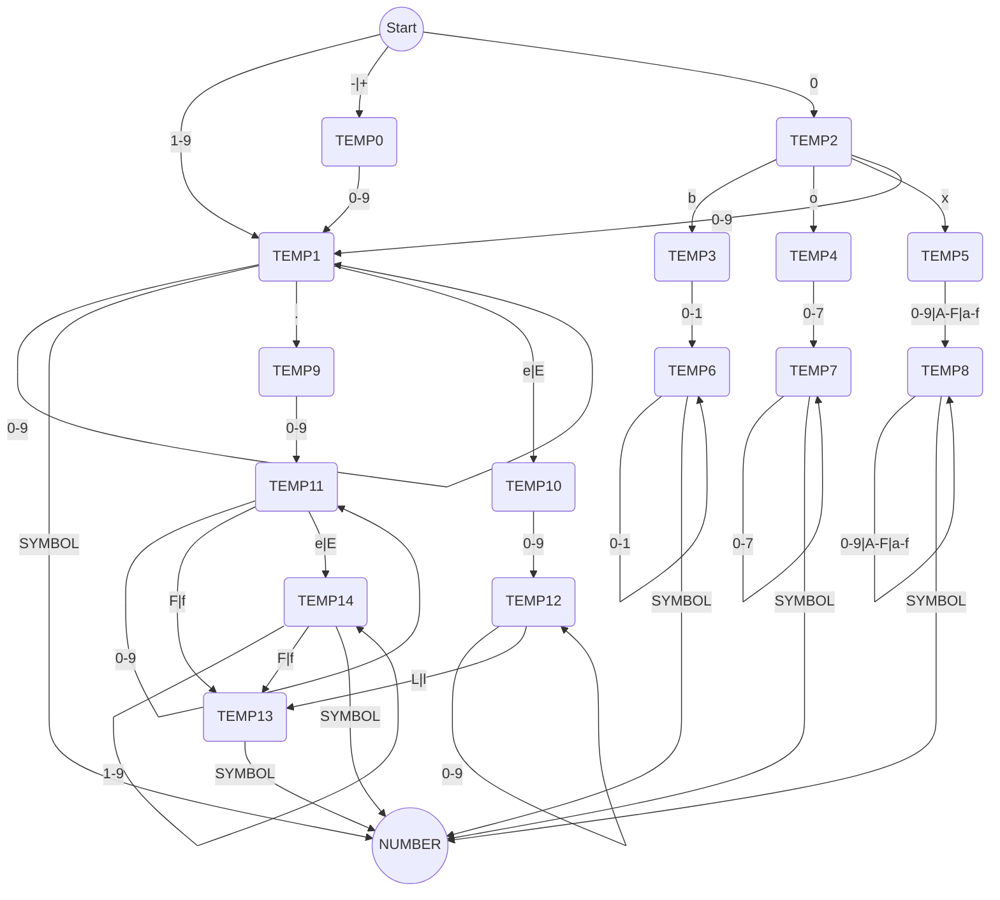
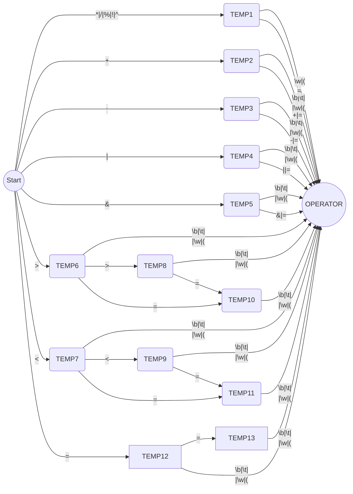

1. 题目：数字和运算符
   1. 数字状态机
   2. 运算符

2. 数字状态机


```mermaid
graph TB;
S((Start))
A((NUMBER))
T0(TEMP0)
T1(TEMP1)
T2(TEMP2)
T3(TEMP3)
T4(TEMP4)
T5(TEMP5)
T6(TEMP6)
T7(TEMP7)
T8(TEMP8)
T9(TEMP9)
T10(TEMP10)
T11(TEMP11)
T12(TEMP12)
T13(TEMP13)
T14(TEMP14)
S -- "1-9" --> T1 -- "0-9" --> T1 -- "SYMBOL" --> A
S -- "-|+" --> T0 -- "0-9" --> T1
T1 -- "." --> T9 -- "0-9" --> T11
T1 -- "e|E" --> T10 -- "0-9" --> T12
T11 -- "0-9" --> T11 -- "F|f" --> T13
T11 -- "e|E" --> T14 -- "1-9" --> T14 -- "F|f" --> T13
T14 -- "SYMBOL" --> A
T12 -- "0-9" --> T12 -- "L|l" --> T13
T13 -- "SYMBOL" --> A
S -- "0" --> T2 -- "b" --> T3 -- "0-1" --> T6 -- "0-1" --> T6 -- "SYMBOL" --> A
T2 -- "o" --> T4 -- "0-7" --> T7 -- "0-7" --> T7 -- "SYMBOL" --> A
T2 -- "x" --> T5 -- "0-9|A-F|a-f" --> T8 -- "0-9|A-F|a-f" --> T8 -- "SYMBOL" --> A
T2 -- "0-9" --> T1
```

3. 运算符

```shell
单个运算符
+ - * / %
| & ^ ~
> < =

复合运算符
+= -= *= /= %= |= &= >>= <<= ^= >= <= !=
|| &&
++ -- ==
```


```mermaid
graph LR;
S((Start))
T1(TEMP1)
T2(TEMP2)
T3(TEMP3)
T4(TEMP4)
T5(TEMP5)
T6(TEMP6)
T7(TEMP7)
T8(TEMP8)
T9(TEMP9)
T10(TEMP10)
T11(TEMP11)
A((OPERATOR))
S -- "*|/|%|!|^" --> T1 -- "\w|(" --> A
S -- "+" --> T2 -- "\b|\t|\n|\w|(" --> A
S -- "-" --> T3 -- "\b|\t|\n|\w|(" --> A
S -- "|" --> T4 -- "\b|\t|\n|\w|(" --> A
S -- "&" --> T5 -- "\b|\t|\n|\w|(" --> A
S -- ">" --> T6 -- "\b|\t|\n|\w|(" --> A
T6 -- ">" --> T8 -- "\b|\t|\n|\w|(" --> A
T6 -- "=" --> T10
T8 -- "=" --> T10 -- "\b|\t|\n|\w|(" --> A
S -- "<" --> T7 -- "\b|\t|\n|\w|(" --> A
T7 -- "<" --> T9 -- "\b|\t|\n|\w|(" --> A
T7 -- "=" --> T11
T9 -- "=" --> T11 -- "\b|\t|\n|\w|(" --> A
T1 -- "=" --> A
T2 -- "+|=" --> A
T3 -- "-|=" --> A
T4 -- "||=" --> A
T5 -- "&|=" --> A
S -- "=" --> TEMP12 -- "=" --> TEMP13 -- "\b|\t|\n|\w|(" --> A
TEMP12 -- "\b|\t|\n|\w|(" --> A
```