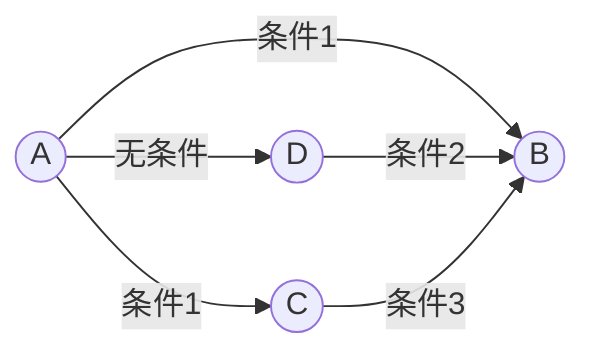
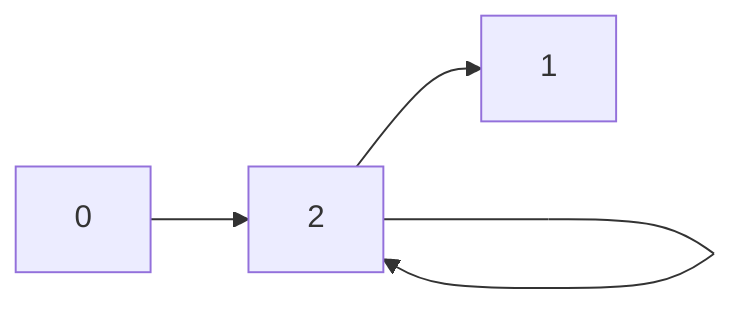
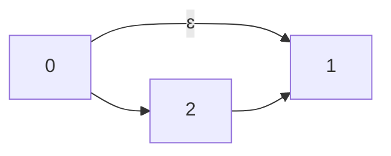
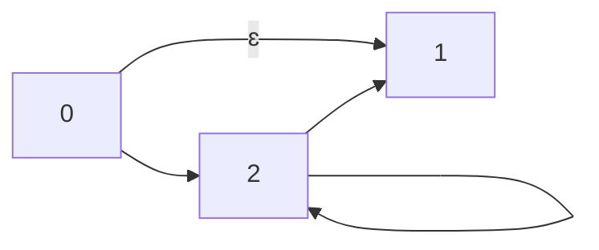
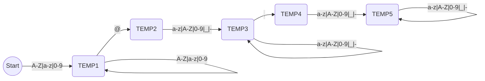

1. 无限状态机和正则表达式



2. 什么是无限状态机

无限状态机（Infinite State Machine，简称ISM）是一种计算机科学中的抽象概念，用于描述具有无限数量状态的系统。相对于有限状态机（Finite State Machine，简称FSM）只有有限数量的状态。ISM通常用于建模具有无限状态空间的系统，例如操作系统、网络协议和游戏引擎等。ISM的状态转换可以是非确定性的，这意味着在某些情况下，一个状态可以转换到多个不同的状态。

3. 无限状态机的特点
   1. 新状态不唯一
   2. 可以自动转换

4. 正则表达式案例

+ `.+`的状态机



+ `.?`的状态机



+ `.*`的状态机



```mermaid
graph LR;

```

```shell
// 邮箱正则表达式
^[A-Za-z0-9]+@[a-zA-Z0-9_-]+(.[a-zA-Z0-9_-]+)+$
```

+ 有限状态机

