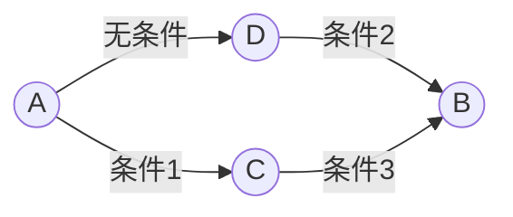
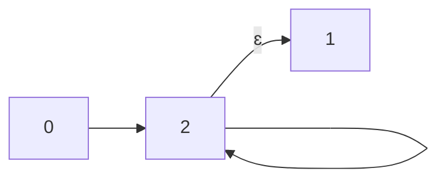
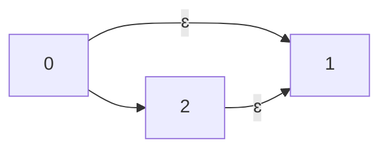
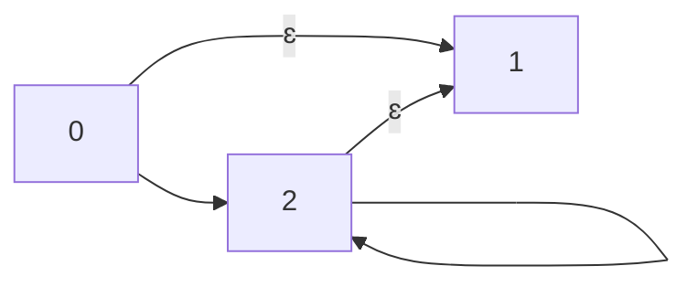
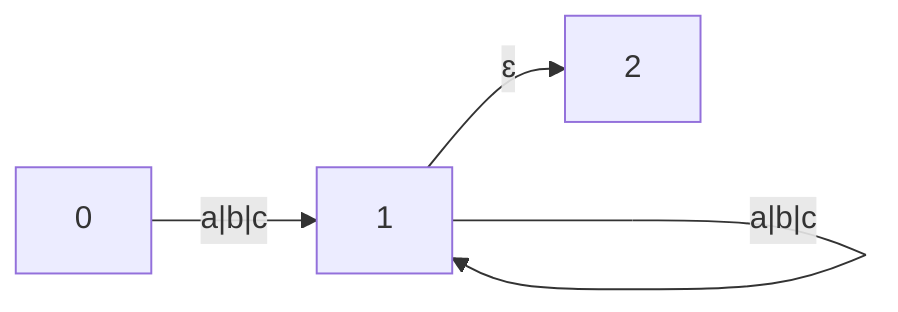
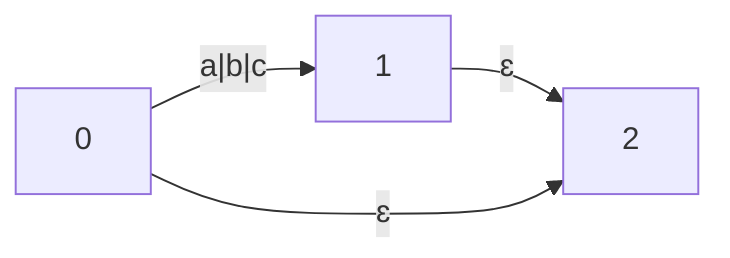
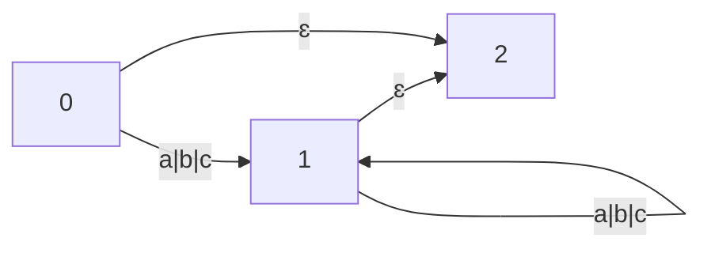

1. 无限状态机和正则表达式



2. 什么是无限状态机

无限状态机（Infinite State Machine，简称ISM）是一种计算机科学中的抽象概念，用于描述具有无限数量状态的系统。相对于有限状态机（Finite State Machine，简称FSM）只有有限数量的状态。ISM通常用于建模具有无限状态空间的系统，例如操作系统、网络协议和游戏引擎等。ISM的状态转换可以是非确定性的，这意味着在某些情况下，一个状态可以转换到多个不同的状态。

3. 无限状态机的特点
   1. 新状态不唯一
   2. 可以自动转换

4. 正则表达式案例

+ `.+`的状态机



+ `.?`的状态机



+ `.*`的状态机



```mermaid
graph LR;
```

5. 实战

+ `[abc]+`


+ `[abc]?`


+ `[abc]*`


+ 代码

```java
import java.util.LinkedList;
import java.util.List;

class Node {
    int state;
    List<Edge> edges;

    public static Node NULL = new Node(-1);

    public Node(int state) {
        this.state = state;
    }

    public void setEdges(List<Edge> edges) {
        this.edges = edges;
    }

    public Node next(Character value) {
        Node node = Node.NULL;
        if (edges == null)
            return node;
        for (Edge edge : edges) {
            if (edge.type == 0 && edge.values.contains(value)) {
                node = edge.end;
                return node;
            }
        }
        for (Edge edge : edges) {
            if (edge.type == 1) {
                node = edge.end;
                return node;
            }
        }
        return node;
    }
}

class Edge {
    // 0: 值类型；1：自动类型
    int type;
    List<Character> values;
    // 指向的节点
    Node start, end;

    public Edge(Node start, Node end, int type, List<Character> values) {
        this.start = start;
        this.end = end;
        this.type = type;
        this.values = values;
    }
}

public class Regexp {

    public static void test1(String str) {
        // [abc]+
        Node n0 = new Node(0);
        Node n1 = new Node(1);
        Node n2 = new Node(2);
        Edge e01 = new Edge(n0, n1, 0, new LinkedList<Character>(){{
            add('a'); add('b'); add('c');
        }});
        Edge e11 = new Edge(n1, n1, 0, new LinkedList<Character>(){{
            add('a'); add('b'); add('c');
        }});
        Edge e12 = new Edge(n1, n2, 1, null);
        n0.setEdges(new LinkedList<Edge>(){{add(e01);}});
        n1.setEdges(new LinkedList<Edge>(){{add(e12); add(e11);}});

        Node node = n0;
        for (char c : str.toCharArray()) {
            node = node.next(c);
        }
        System.out.println(node.next(null).state);
    }

    public static void test2(String str) {
        // [abc]?
        Node n0 = new Node(0);
        Node n1 = new Node(1);
        Node n2 = new Node(2);
        Edge e01 = new Edge(n0, n1, 0, new LinkedList<Character>(){{
            add('a'); add('b'); add('c');
        }});
        Edge e02 = new Edge(n0, n2, 1, null);
        Edge e12 = new Edge(n1, n2, 1, null);
        n0.setEdges(new LinkedList<Edge>(){{add(e01); add(e02);}});
        n1.setEdges(new LinkedList<Edge>(){{add(e12);}});

        Node node = n0;
        for (char c : str.toCharArray()) {
            node = node.next(c);
        }
        System.out.println(node.next(null).state);
    }

    public static void test3(String str) {
        // [abc]*
        Node n0 = new Node(0);
        Node n1 = new Node(1);
        Node n2 = new Node(2);
        Edge e01 = new Edge(n0, n1, 0, new LinkedList<Character>(){{
            add('a'); add('b'); add('c');
        }});
        Edge e11 = new Edge(n1, n1, 0, new LinkedList<Character>(){{
            add('a'); add('b'); add('c');
        }});
        Edge e02 = new Edge(n0, n2, 1, null);
        Edge e12 = new Edge(n1, n2, 1, null);
        n0.setEdges(new LinkedList<Edge>(){{add(e01); add(e02);}});
        n1.setEdges(new LinkedList<Edge>(){{add(e12); add(e11);}});

        Node node = n0;
        for (char c : str.toCharArray()) {
            node = node.next(c);
        }
        System.out.println(node.next(null).state);
    }
}
```