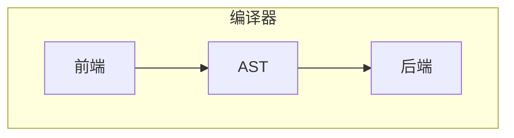
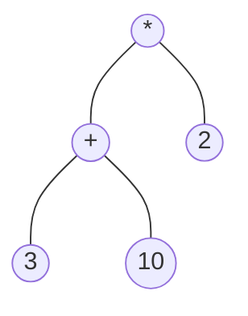
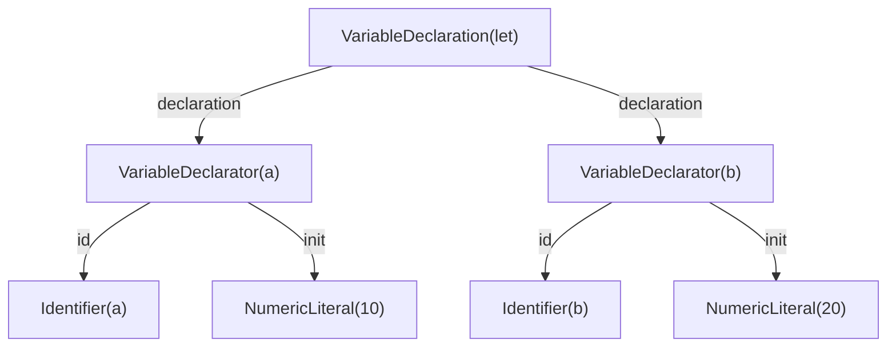

1. 题目：抽象语法树
---


2. `DFA&NFA`和`FSM&ISM`
   1. `DFA&NFA`
      1. DFA：确定性有限状态自动机
         + 其转移函数对于每个状态和输入符号只有一个确定的转移
      2. NFA：非确定性有限状态自动机
         + 每个状态可以有多个可能的转移
      3. 都是有限状态自动机的不同类型，**用于识别正则语言**
      4. **DFA和NFA都属于FSM**
   2. `FSM&ISM`
      1. FSM：有限状态机
         + 用于表示具有有限数量状态的系统
      2. ISM：无限状态机
         + 可以处理无限数量的状态
         + 经典案例：***TCP协议栈的实现***
      3. ISM是一种特定类型的FSM，它可以处理无限数量的状态
      4. **FSM和ISM之间的主要区别在于状态数量是否有限**
---

3. 抽象语法树

抽象语法树（Abstract Syntax Tree，AST）是程序代码抽象语法结构的树状表现形式。它是编译器在将源代码转换为可执行代码的过程中所建立的一种数据结构，用于描述程序代码的语法结构。AST可以帮助开发人员更好地理解程序代码，同时也可以用于代码分析、优化和转换等操作。



4. 分类：
   1. Expression: 通常表示一个计算过程或一个值，例如变量、函数调用、算术运算等，它们通常会返回一个值。在AST中，表达式节点通常也会包含子节点，用于表示其具体的计算过程或值。
   2. Statement: 通常表示一些操作或行为，例如赋值、条件判断、循环等，它们通常不会返回任何值。在AST中，语句节点通常会包含子节点，用于表示其具体的实现方式。

[AST实验工具：AST Explorer](https://astexplorer.net/)

---
1. Expression(表达式)

> 2 * (3 + 10)



```json
{
   "type": "BinaryExpression",
   "start": 8,
   "end": 20,
   "left": {
      "type": "NumericLiteral",
      "start": 8,
      "end": 9,
      "value": 2
   },
   "operator": "*",
   "right": {
      "type": "BinaryExpression",
      "start": 13,
      "end": 19,
      "left": {
         "type": "NumericLiteral",
         "start": 13,
         "end": 14,
         "value": 3
      },
      "operator": "+",
      "right": {
         "type": "NumericLiteral",
         "start": 17,
         "end": 19,
         "value": 10
      }
   }
}
```

+ 如何构建用于识别Expression的AST？
---
6. Statement(语句)

> let a = 10, b = 20



```json
{
   "type": "VariableDeclaration",
   "start": 0,
   "end": 18,
   "declarations": [
      {
         "type": "VariableDeclarator",
         "start": 4,
         "end": 10,
         "id": {
            "type": "Identifier",
            "start": 4,
            "end": 5,
            "name": "a"
         },
         "init": {
            "type": "NumericLiteral",
            "start": 8,
            "end": 10,
            "value": 10
         }
      },
      {
         "type": "VariableDeclarator",
         "start": 12,
         "end": 18,
         "id": {
            "type": "Identifier",
            "start": 12,
            "end": 13,
            "name": "b"
         },
         "init": {
            "type": "NumericLiteral",
            "start": 16,
            "end": 18,
            "value": 20
         }
      }
   ],
   "kind": "let"
}
```

+ 如何构建基于Statement的AST？
