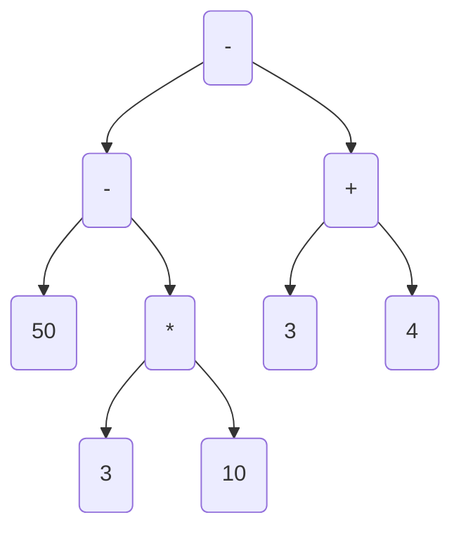
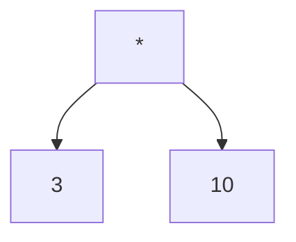
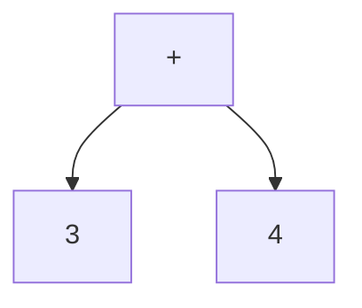
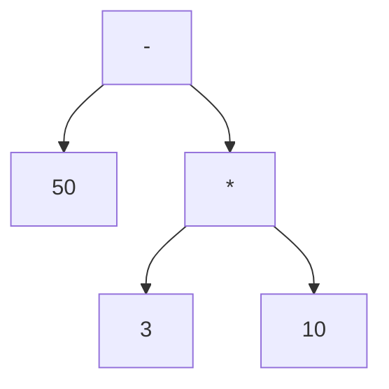
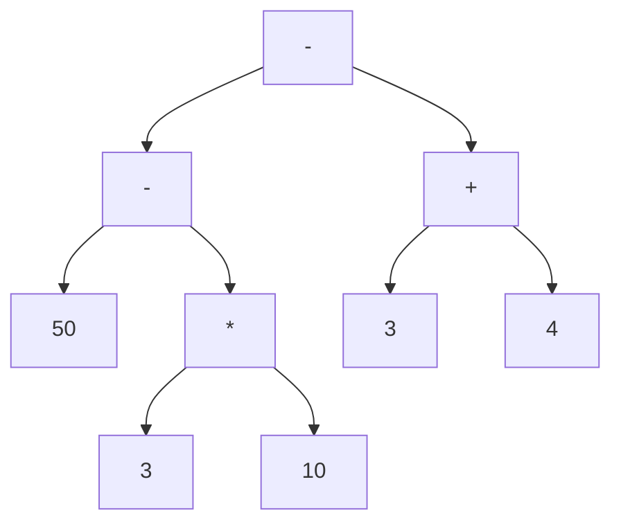

1. 题目：用栈构建表达式节点

> 50 - 3 * 10 - ( 3 + 4 )



2. 栈的应用

栈是一种常见的数据结构，它遵循先进后出（Last In, First Out，LIFO）的原则。栈的经典应用非常广泛，以下是其中一些常见的应用：

1. 表达式求值：在编程语言解释器和计算器中，可以使用栈来解析和计算数学表达式，包括中缀表达式转换为后缀表达式，然后再通过栈进行后缀表达式的求值。

2. 函数调用：在程序执行时，函数调用和返回的过程可以通过栈来管理。每当调用一个函数，就将函数的返回地址和局部变量等信息推入栈中，当函数执行完成后，再从栈中弹出这些信息，恢复调用函数的上下文。

3. 递归算法：递归算法本质上也是一种函数的嵌套调用，而栈可以用来跟踪递归函数的调用和返回过程。

4. 括号匹配：在编程中，经常需要检查表达式中的括号是否匹配。通过使用栈，可以有效地检测括号的匹配情况。

5. 浏览器的前进后退功能：在浏览器中，可以使用两个栈来实现前进和后退功能，一个栈用于存储浏览历史，另一个栈用于存储后退时导航的历史。

6. 撤销操作：在许多应用程序中，例如文本编辑器和图像处理软件，可以使用栈来实现撤销操作，将每一步操作存储在栈中，撤销时从栈中弹出最后一步操作。

7. 系统调用：在操作系统中，系统调用时会将当前进程的状态信息保存在内核栈中，然后在系统调用结束后再从栈中恢复进程状态。

8. 实现历史记录功能：类似于撤销操作，可以使用栈来实现应用程序的历史记录功能，以便用户可以查看之前的操作历史。

这只是栈在实际应用中的一小部分例子，栈作为一种简单而强大的数据结构，可以在很多情况下提供有效的解决方案。

3. 回顾中缀表达式计算
   + 操作数
     + 直接入栈
   + 符号
     + 栈空时或左括号则直接入栈
     + 右括号直接弹栈直到弹到左括号为止
     + 新符号优先级高则可以入栈，否则出栈连接节点后再入栈

4. 构建过程

---
> 50 - 3 * 10 - ( 3 + 4 )

+ `3 * 10`



+ `3 + 4`



+ `50 - 3 * 10`



+ `50 - 3 * 10 - (3 + 4)`


---

1. 代码实现

+ Node.class

```java
package club.calong;

public class Node {
        int type;
        String value;
        String operator;
        Node left, right;

        public Node(int type, String value, String operator) {
            this.type = type;
            this.value = value;
            this.operator = operator;
        }

    @Override
    public String toString() {
        return "Node{" +
                "type=" + type +
                ", value='" + value + '\'' +
                ", operator='" + operator + '\'' +
                ", left=" + left +
                ", right=" + right +
                '}';
    }
}
```

+ Test.java

```java
package club.calong;

import java.util.*;

/**
 * 50 - 3 * 10 - ( 3 + 4 )
 * 50 - 30 - ( 3 + 4 )
 * 50 - 30 - 7
 */

public class ExpressionNode {

    public static void main(String[] args) {

        String expression = "50 - 3 * 10 - ( 3 + 4 )";
        String[] entries = expression.split(" ");
        Stack<Node> numbers = new Stack<>(), symbols = new Stack<>();
        for (String entry : entries) {
            switch (entry) {
                case "+":
                case "-":
                case "*":
                case "/":
                case "%":
                case "(":
                case ")":
                    pushSymbol(numbers, symbols, new Node(0, null, entry));
                    break;
                default:
                    numbers.push(new Node(1, entry, null));
                    break;
            }
        }

        while (!symbols.isEmpty()) {
            calc(numbers, symbols.pop());
        }
        Node root = numbers.pop();
        System.out.println(root);
    }

    public static void pushSymbol(Stack<Node> numbers, Stack<Node> symbols, Node entry) {

        // 左括号直接入栈
        // 栈为空则直接入栈
        if (symbols.isEmpty() || entry.operator.equals("(")) {
            symbols.push(entry);
        } else if (entry.operator.equals(")")) {
            Node symbol;
            while (!(symbol = symbols.pop()).operator.equals("(")) {
                calc(numbers, symbol);
            }
        } else {// 新符号优先级高则可以入栈，否则出栈计算
            if (symbolOrder.get(entry.operator) > symbolOrder.get(symbols.peek().operator)) {
                symbols.push(entry);
            } else {
                Node symbol = symbols.pop();
                calc(numbers, symbol);
                pushSymbol(numbers, symbols, entry);
            }
        }
    }

    public static void calc(Stack<Node> numbers, Node symbol) {

        if (numbers.size() > 1) {
            symbol.right = numbers.pop();
            symbol.left = numbers.pop();
            numbers.push(symbol);
        }
    }

    private static final Map<String, Integer> symbolOrder = new HashMap<String, Integer>(){{
        put("+", 1); put("-", 1);
        put("*", 2); put("/", 2); put("%", 2);
        put("(", 0); put(")", 3);
    }};
}
```