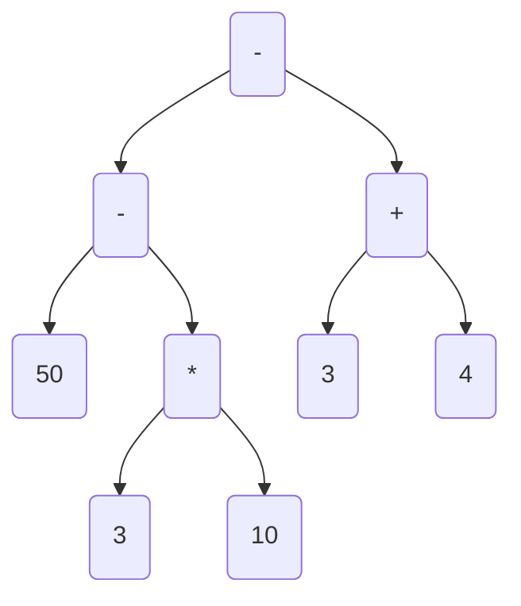
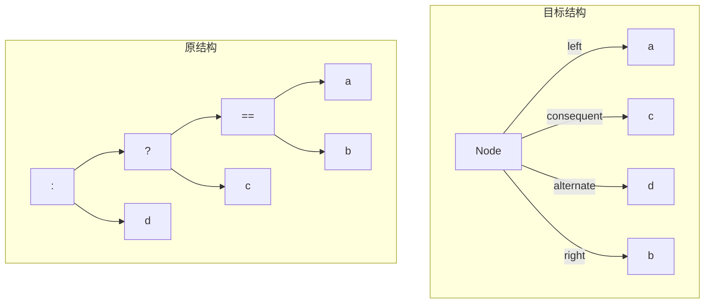

1. 题目：表达式解析

+ 一般表达式

> 50 - 3 * 10 - ( 3 + 4 )

```mermaid
graph TB;
A(50)
B(3)
C(10)
D(3)
E(4)
F("-")
G("*")
H("-")
K("+")
G --> B
G --> C
K --> D
K --> E
H --> A
H --> G
F --> H
F --> K
```

+ 三目运算

> int i = a == b ? c : d;

```mermaid
graph TB;
subgraph 目标结构
  A2["a"]
  B2["b"]
  C2["c"]
  D2["d"]
  N["Node"] -- "left" --> A2
  N["Node"] -- "consequent" --> C2
  N["Node"] -- "alternate" --> D2
  N["Node"] -- "right" --> B2
  end
subgraph 原结构
  A[":"]
  B["?"]
  C["=="]
  A1["a"]
  B1["b"]
  C1["c"]
  D1["d"]
  A --> B
  A --> D1
  B --> C
  B --> C1
  C --> A1
  C --> B1
  end
```