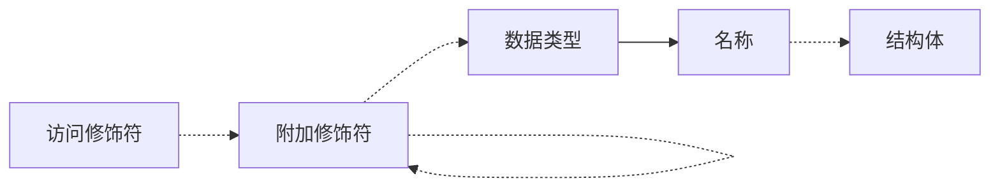

1. 题目：变量声明语法

2. 变量访问权限修饰符

    + `public`: 公共权限
    + `protected`: 受限权限
    + `private`: 私有权限

3. 变量附加修饰符

    + `static`: 标记为静态变量
    + `final`: 标记为常量
    + `volatile`: 用于保证多线程环境下变量的可见性
    + `transient`: 用于标记不参与序列化
    + `abstract`: 抽象类
    + `[]`: 标记为数组

4. 变量的基本数据类型

    + `byte`: 1byte
    + `char`: 2bytes
    + `int`: 4bytes
    + `long`: 8bytes
    + `float`: 4bytes
    + `double`: 8bytes
    + `boolean`: 通常为1byte

5. 变量的复数据类型

    + `class`: 类
    + `interface`: 接口
    + `enum`: 枚举
    + `@interface`: 注解

6. 变量声明的抽象语法



7. 描述变量的结构体

```c
typedef struct variable_t {
    // 变量类型
    int type;
    // 用于记录变量的修饰符
    int flags;
    // 变量所占空间
    int size;
    // 变量名称
    const char *name;
    // 结构体 / 值
    struct node_t *value;
} variable;
```