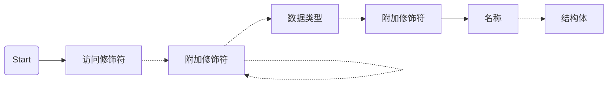
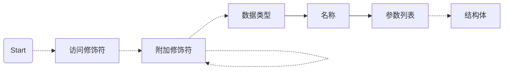

1. 题目：声明语法框架

2. 访问权限修饰符

    + `public`: 公共权限
    + `protected`: 受限权限
    + `private`: 私有权限

3. 附加修饰符

    + `static`: 标记为静态变量
    + `final`: 标记为常量
    + `volatile`: 用于保证多线程环境下变量的可见性
    + `transient`: 用于标记不参与序列化
    + `abstract`: 抽象类
    + `extends`: 标记继承
    + `implements`: 标记实现
    + `[]`: 标记为数组
    + `<>`: 标记泛型

4. 基本数据类型

    + `void`: 0
    + `byte`: 1byte
    + `char`: 2bytes
    + `int`: 4bytes
    + `long`: 8bytes
    + `float`: 4bytes
    + `double`: 8bytes
    + `boolean`: 通常为1byte

5. 复杂数据类型

    + `class`: 类
    + `interface`: 接口
    + `enum`: 枚举
    + `@interface`: 注解

6. 声明的抽象语法

+ 变量

```mermaid
graph LR;
A["访问修饰符"]
B["附加修饰符"]
C["数据类型"]
D["名称"]
E["值"]

S(Start) --> A -.-> B -.-> B -.-> C --> D -.-> = -.-> E
```

+ 类&接口&枚举&注解



+ 函数



7. 描述变量的结构体

```c
typedef struct datatype_t {
    // 修饰符
    int flags;
    // 数据类型
    int type;
    // 所占空间
    int size;
    // 名称
    const char *name;
    union {
        // 变量
        struct {
            // 值节点
            struct node_t *value;
        } var;
        // 类&接口&枚举&注解
        struct {
            // 结构体节点；继承节点
            struct node_t *body, *extends;
            // 接口节点列表
            struct vector* implements;
        } cls;
        struct {
            // 函数体节点
            struct node_t *body;
        } func;
    };
} datatype;
```