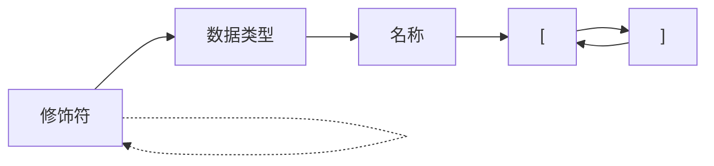
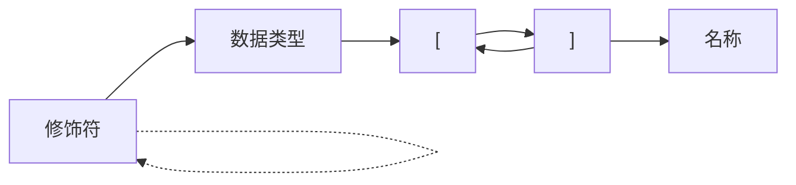

1. 题目：数组声明解析

2. 代码结构整理

    1. 简化`datatype`数据结构，扩充`node`数据结构
    2. 合并`vector_expression`和`vector_statement`

3. 数组特征

    + 数据类型
    + 维度
    + 维度值

> 所占内存大小 = 数据类型所占内存大小 * 各个维度的乘积

```c
struct {
    // 维度数
    size_t dim;
    // 数据类型
    struct node_t *type;
    // 各个维度的值
    struct vector *values;
} array;
```

4. 数组的声明格式





5. 数组的赋值格式

```mermaid
graph LR;
= --> new --> 数据类型 --> A["["] --> 表达式 --> B["]"] --> A
B --> C[";/,"]
```