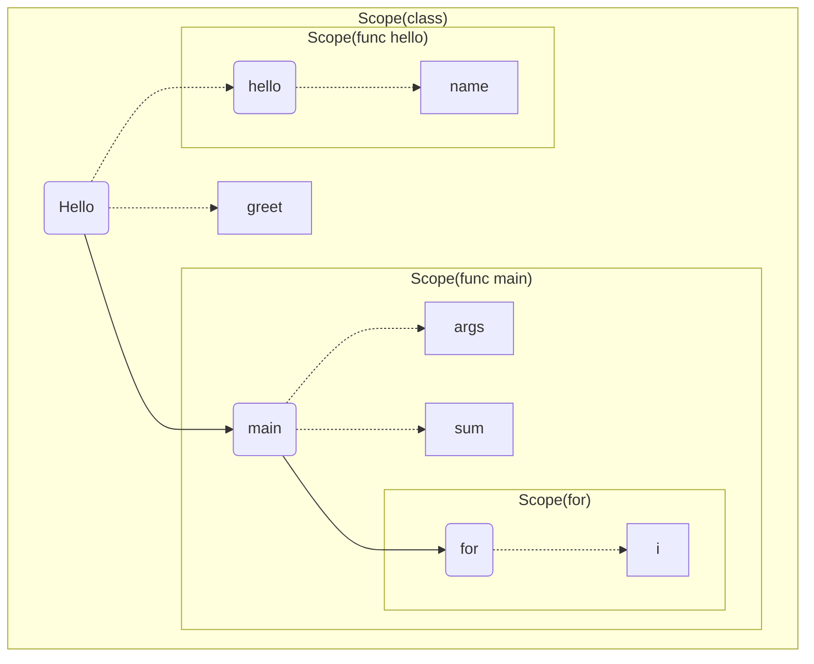

1. 题目：编译原理之域（Scope）

2. 域（Scope）的理解

```java
public class Hello {

    private String greet = "Hello";

    public static void main (String[] args) {
        int sum = 0;
        for (int i = 1; i <= 100; i++) {
            sum += i;
        }
    }

    public void hello (String name) {
        System.out.println(greet + "," + name);
    }
}
```



+ 相邻的Scope没有访问权限
+ 子Scope可以逐级向上访问所有父Scope

3. 栈在域（Scope）中的应用

```c
typedef struct scope_t {
    // 父级Scope
    struct scope_t *parent;
    // 变量表
    struct vector *variables;
    ...
} scope;
```


