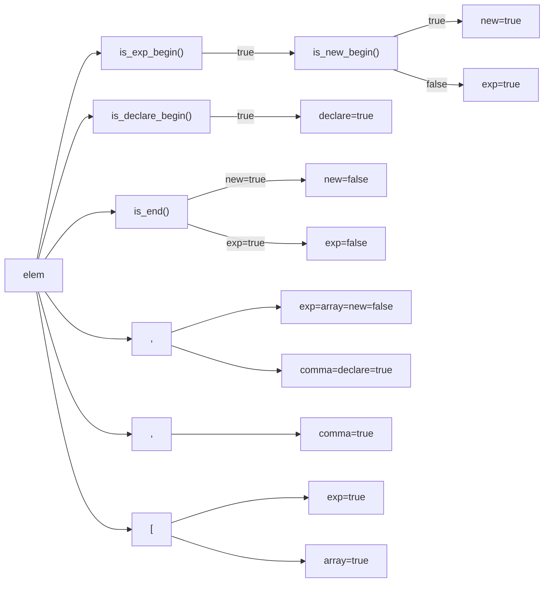

1. 题目：多变量声明解析

```mermaid
graph LR;
A[声明] --> = --> B[值] --> , --> A
B --> C[";"]
```

2. 状态管理

|变量|`declare`|`exp`|`new`|`array`|`comma`|
|:---:|:---:|:---:|:---:|:---:|:---:|
|含义|声明|表达式|NEW|数组|逗号|

