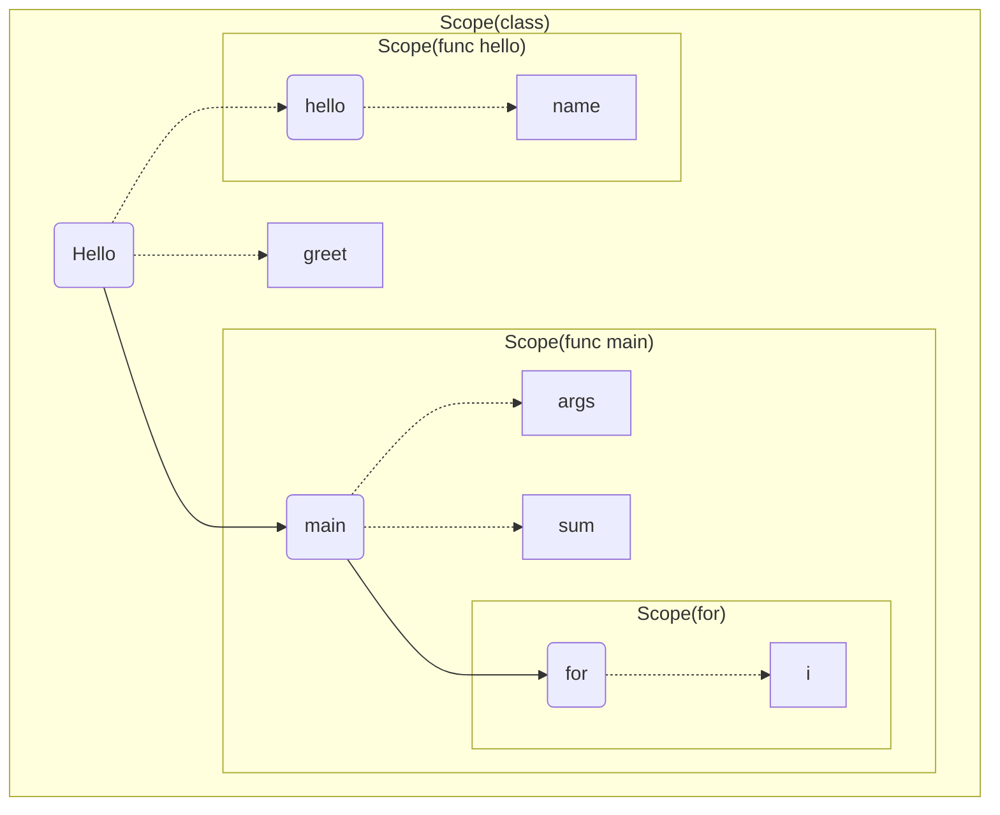

1. 题目：编译原理之域（Scope）

2. 域（Scope）的理解

```java
public class Hello {

    private String greet = "Hello";

    public static void main (String[] args) {
        int sum = 0;
        for (int i = 1; i <= 100; i++) {
            sum += i;
        }
    }

    public void hello (String name) {
        System.out.println(greet + "," + name);
    }
}
```



+ 相邻的Scope没有访问权限
+ 子Scope可以逐级向上访问所有父Scope

3. 实战：模拟解析Scope
    + 实现Scope树结构的生成: parse
    + 实现变量查找算法: find

```txt
scope ScopeA {
    data a
    scope ScopeB {
        data b
        data c
        scope ScopeE {
            data e
            scope ScopeF {
                data f
            }
        }
    }
    scope ScopeD {
        data d
    }
}
```

+ 代码实现

```java
import java.io.BufferedReader;
import java.io.FileReader;
import java.io.IOException;
import java.nio.charset.Charset;
import java.util.LinkedList;
import java.util.List;
import java.util.Optional;
import java.util.Stack;
import java.util.regex.Matcher;
import java.util.regex.Pattern;

class Scope {

    String name;
    List<String> variables;
    Scope parent;

    public Scope(String name) {
        this.name = name;
        variables = new LinkedList<>();
    }

    @Override
    public String toString() {
        return "Scope [name=" + name + ", variables=" + variables + ", parent=" + parent + "]";
    }
}

public class ScopeStack {

    public static void main(String[] args) throws IOException {
        
        FileReader reader = new FileReader("scope.txt", Charset.forName("UTF-8"));
        BufferedReader bufferedReader = new BufferedReader(reader);
        String line;
        while ((line = bufferedReader.readLine()) != null) {
            parse(line);
        }
        bufferedReader.close();
        reader.close();

        find("ScopeF", "b");
    }

    static Pattern scopepPattern = Pattern.compile("\\s*scope\\s+(\\w+)\\s*\\{");
    static Pattern dataPattern = Pattern.compile("\\s*data\\s+(\\w+)\\s*");
    static Pattern scopeEndPattern = Pattern.compile("\\s*\\}");

    static Stack<Scope> stack = new Stack<>();
    static List<Scope> scopes = new LinkedList<>();

    public static void parse(String line) {

        Matcher scopMatcher = scopepPattern.matcher(line);
        Matcher dataMatcher = dataPattern.matcher(line);
        Matcher scopeEndMatcher = scopeEndPattern.matcher(line);
        if (scopMatcher.matches()) {
            String name = scopMatcher.group(1);
            Scope scope = new Scope(name);
            if (!stack.empty()) {
                scope.parent = stack.peek();
            }
            stack.push(scope);
            scopes.add(scope);
            return;
        } else if (dataMatcher.matches()) {
            String name = dataMatcher.group(1);
            stack.peek().variables.add(name);
            return;
         } else if (scopeEndMatcher.matches()) {
            stack.pop();
         }
    }

    public static void find(String scope, String name) {

        Optional<Scope> os = scopes.stream().filter(e -> e.name.equals(scope)).findFirst();
        if (!os.isPresent())
            return;
        Scope s = os.get();
        do {
            if (s.variables.contains(name)) {
                System.out.println(s + ", index = " + s.variables.indexOf(name));
                return;
            }
            s = s.parent;
        } while (s != null);

        if (s == null) {
            throw new RuntimeException(
                String.format("scope(%s)无法访问符号:%s", scope, name));
        }
    }
}
```