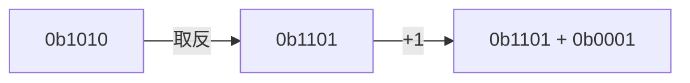
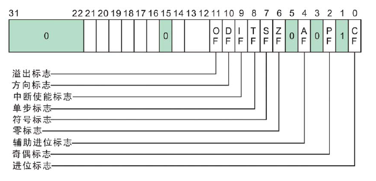

1. 题目：变量计算原理

2. 如何使用加法器实现减法运算

```shell
实现 2 - 2 = 0
0b0010 - 0b0010 = 0

2 + (-2) = 0
0b0010 + 0b1010 = 0
```

```
+---+---+---+---+
| 1 | 1 | 1 | 1 | + 1 = 0b0000 
+---+---+---+---+
```

```shell
实现 2 - 2 = 0
0b0010 - 0b0010 = 0

2 + (-2) = 0
0b0010 + 0b1101 + 0b0001 = 0
2 + 13 + 1 = 0(16)
```



```shell
实现 2 - 1 = 1

2 + (-1) = 1

0b1001 -> 0b1110 + 0b0001

0b0010 + 0b1110 + 0b0001 = 0b0001_0001
```


3. 原码、反码和补码：

    + 模：导致溢出的数值单位
    + 原码：最高位表示符号位，其余为表示数值位
      + 正数和负数的原码都是本身
    + 反码：
      + 正数的反码就是本身
      + 负数的反码为符号位不变，其余位取反
    + 补码：
      + 正数的补码就是本身
      + 负数的补码为反码+1

| 十进制数字 | 原码 | 反码 | 补码 |
|:---:|:---:|:---:|:---:|
| 13 | 0000_1101(13) | 0000_1101(13) | 0000_1101(13) |
| -13 | 1000_1101(13) | 1111_0010(242) | 1111_0011(243) |

4. 寄存器

  + 通用寄存器
    + `x86`: EAX, EBX, ECX, EDX, ...
    + `x64`: RAX, RBX, RCX, RDX, ...
  + 标志寄存器：EFLAGS
  + 功能性寄存器：...

