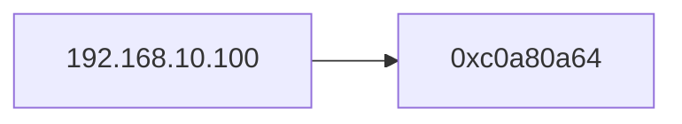

1. 题目：变量的运算实战
---
2. RGBA颜色转换

```shell
0               31              63
+---+---+---+---+---+---+---+---+
|   R   |   G   |   B   |   A   |
+---+---+---+---+---+---+---+---+
```

+ C语言

```c
int get_color(long color, RGBA *rgba)
{
    if (rgba == NULL) return CVT_ERROR;

    rgba->r = (char)(color & 0xFF000000 >> 24);
    rgba->g = (char)(color & 0x00FF0000 >> 16);
    rgba->b = (char)(color & 0x0000FF00 >> 8);
    rgba->a = (char)(color & 0x000000FF >> 0);

    return CVT_OK;
}
```

+ Java

```java
class RGBA {
    byte r;
    byte g;
    byte b;
    byte a;
}

public RGBA getRGBA(int color) {

    RGBA value = new RGBA();
    value.r = (byte) (color >> 24);
    value.g = (byte) (color & 0x00FF0000 >> 16);
    value.b = (byte) (color & 0x0000FF00 >> 8);
    value.a = (byte) (color & 0x000000FF);
    return value;
}
```

3. IPv4地址转换



+ C语言

```c
int get_ipv4(int *ip, char *ipstr)
{
    if (ipstr == NULL) return CVT_ERROR;
    
    int value = 0, index = 24, v = 0;
    char *str = strtok(ipstr, ".");
    while (str != NULL)
    {
        v = (int)strtol(str, NULL, 10);
        value |= v << index;
        index -= 8;
        str = strtok(NULL, ".");
    }
    *ip = value;
    return CVT_OK;
}
```

+ Java

```java
public int getIPv4(String ip) {

    String[] ipValues = ip.split("\\.");
    int ipInt = 0, index = 24;
    for (String ipValue : ipValues) {
        ipInt |= Integer.parseInt(ipValue) << index;
        index -= 8;
    }
    return ipInt;
}
```