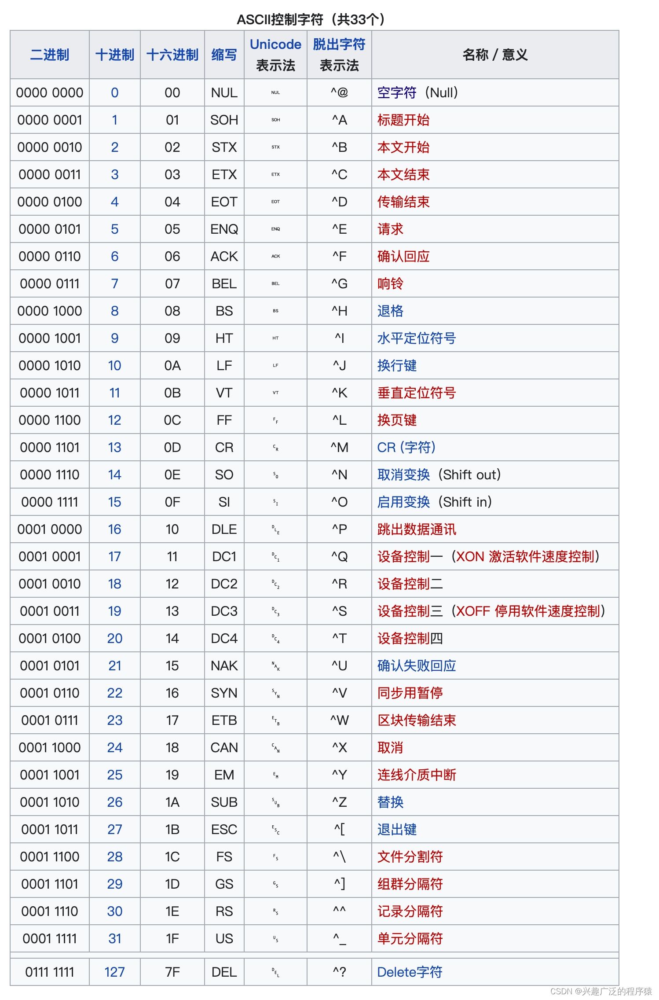

### 基础显卡控制

#### 早期显卡的显示模式

1. `CGA（Color Graphics Adapter）`: 
    1. 文本模式
        1. 40x25
        2. 80x25
    2. 图形模式
        1. 320x200
        > 最多支持16种颜色，但在实际显示中，最多可以同时显示4种颜色（4色模式）
        2. 640x200

2. `VGA（Video Graphics Array）`:
    1. 640x480（256色）
    2. 320x200（256色）

3. `EGA（Enhanced Graphics Adapter）`：
    1. 640x350（16色）
    2. 320x200（64色）

#### 显卡控制寄存器

CRTC(Cathode Ray Tube Controller)

> CGA使用的是`MC6845`芯片

+ `CRT`地址寄存器: `0x3D4`
+ `CRT`数据寄存器: `0x3D5`
+ `CRT`光标位置: 高位`0xE`;低位`0xF`
+ `CRT`显示起始位置: 高位`0XC`;低位`0xD`

[CRTC寄存器参考](http://www.osdever.net/FreeVGA/vga/crtcreg.htm)

#### ASCII码表
