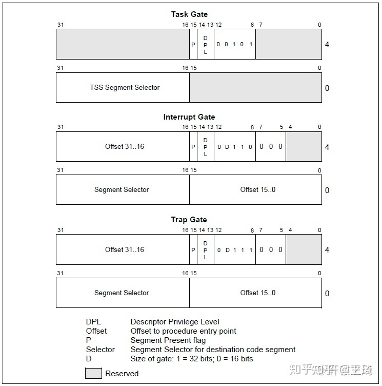

### 中断向量表

#### 中断分类

+ 硬件中断
    + 外部设备产生的中断（如键盘、鼠标输入）
    + I/O设备中断
    + 时钟中断
+ 软件中断
    + 由指令产生的中断（如INT指令）
        + **系统调用**
    + 程序异常（如除零错误、非法指令等）

#### 中断函数

+ 调用中断: `int [number]`
+ 中断返回 `iret`

#### 中断调用&函数调用

##### 中断调用压栈
+ `EFLAGS`
+ `CS`
+ `EIP`
+ 如果发生特权级切换
    + `SS`
    + `ESP`

##### 函数调用压栈

+ `EIP`

**注：INT指令的系统开销比CALL要大得多**

#### 中断向量表

实模式下`0x0000 ~ 0x03FF`之间每4个字节表示一个中断向量（两个字节存储段地址，两个字节存储偏移地址）

| 编号                | 名称        | 类型    | 助记符     | 错误码      |
|-------------------|-----------|-------|---------|----------|
| 0 (0x0)           | 除零错误      | 故障    | #DE     | 无        |
| 1 (0x1)           | 调试        | 故障/陷阱 | #DB     | 无        |
| 2 (0x2)           | 不可屏蔽中断    | 中断    | -       | 无        |
| 3 (0x3)           | 断点        | 陷阱    | #BP     | 无        |
| 4 (0x4)           | 溢出        | 陷阱    | #OF     | 无        |
| 5 (0x5)           | 越界        | 故障    | #BR     | 无        |
| 6 (0x6)           | 指令无效      | 故障    | #UD     | 无        |
| 7 (0x7)           | 设备不可用     | 故障    | #NM     | 无        |
| 8 (0x8)           | 双重错误      | 终止    | #DF     | 有 (Zero) |
| 9 (0x9)           | 协处理器段超限   | 故障    | -       | 无        |
| 10 (0xA)          | 无效任务状态段   | 故障    | #TS     | 有        |
| 11 (0xB)          | 段无效       | 故障    | #NP     | 有        |
| 12 (0xC)          | 栈段错误      | 故障    | #SS     | 有        |
| 13 (0xD)          | 一般性保护异常   | 故障    | #GP     | 有        |
| 14 (0xE)          | 缺页错误      | 故障    | #PF     | 有        |
| 15 (0xF)          | 保留        | -     | -       | 无        |
| 16 (0x10)         | 浮点异常      | 故障    | #MF     | 无        |
| 17 (0x11)         | 对齐检测      | 故障    | #AC     | 有        |
| 18 (0x12)         | 机器检测      | 终止    | #MC     | 无        |
| 19 (0x13)         | SIMD 浮点异常 | 故障    | #XM/#XF | 无        |
| 20 (0x14)         | 虚拟化异常     | 故障    | #VE     | 无        |
| 21 (0x15)         | 控制保护异常    | 故障    | #CP     | 有        |
| 22-31 (0x16-0x1f) | 保留        | -     | -       | 无        |

#### 中断描述符

