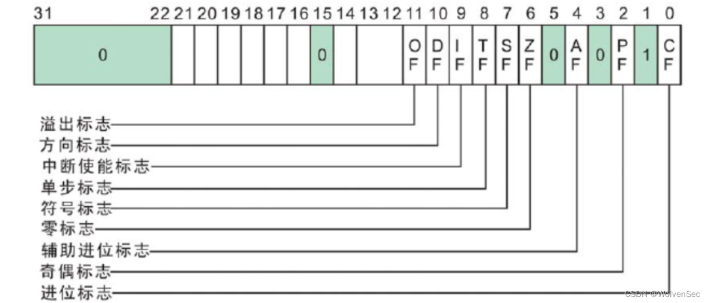

### 中断


#### 中断控制器

> The 8259 Programmable Interrupt Controller (PIC) is one of the most important chips making up the x86 architecture. Without it, the x86 architecture would not be an interrupt driven architecture. The function of the 8259A is to manage hardware interrupts and send them to the appropriate system interrupt. This allows the system to respond to devices needs without loss of time (from polling the device, for instance).

**It is important to note that APIC has replaced the 8259 PIC in more modern systems, especially those with multiple cores/processors.**

##### 端口映射

| Chip - Purpose | I/O port |
|:---:|:---:|
| Master PIC - Command | 0x0020 |
| Master PIC - Data | 0x0021 |
| Slave PIC - Command | 0x00A0 |
| Slave PIC - Data | 0x00A1 |

##### 中断引脚

| 8259A Input pin | Interrupt Number | Description |
|:---:|:---:|:---:|
| IRQ0 | 0x08 | Timer |
| IRQ1 | 0x09 | Keyboard |
| IRQ2 | 0x0A | Cascade for 8259A Slave controller |
| IRQ3 | 0x0B | Serial port 2 |
| IRQ4 | 0x0C | Serial port 1 |
| IRQ5 | 0x0D | AT systems: Parallel Port 2. PS/2 systems: reserved |
| IRQ6 | 0x0E | Diskette drive |
| IRQ7 | 0x0F | Parallel Port 1 |
| IRQ8/IRQ0 | 0x70 | CMOS Real time clock |
| IRQ9/IRQ1 | 0x71 | CGA vertical retrace |
| IRQ10/IRQ2 | 0x72 | Reserved |
| IRQ11/IRQ3 | 0x73 | Reserved |
| IRQ12/IRQ4 | 0x74 | AT systems: reserved. PS/2: auxiliary device |
| IRQ13/IRQ5 | 0x75 | FPU |
| IRQ14/IRQ6 | 0x76 | Hard disk controller |
| IRQ15/IRQ7 | 0x77 | Reserved |

##### 初始化

```asm
;************************************************************************
; Map the 8259A PIC to use interrupts 32-47 within our interrupt table
;************************************************************************
 
%define ICW_1 0x11				; 00010001 binary. Enables initialization mode and we are sending ICW 4
 
%define PIC_1_CTRL 0x20				; Primary PIC control register
%define PIC_2_CTRL 0xA0				; Secondary PIC control register
 
%define PIC_1_DATA 0x21				; Primary PIC data register
%define PIC_2_DATA 0xA1				; Secondary PIC data register
 
; IRQs 0-7 mapped to use interrupts 0x20-0x27
%define IRQ_0	0x20				
; IRQs 8-15 mapped to use interrupts 0x28-0x36
%define IRQ_8	0x28				
 
MapPIC:
 
; Send ICW 1 - Begin initialization
	; Setup to initialize the primary PIC. Send ICW 1
	mov	al, ICW_1
	out	PIC_1_CTRL, al
 
; Send ICW 2 - Map IRQ base interrupt numbers
 
	; Remember that we have 2 PICs. 
    ; Because we are cascading with this second PIC
    ; send ICW 1 to second PIC command register
	out	PIC_2_CTRL, al
	; send ICW 2 to primary PIC
	mov	al, IRQ_0
	out	PIC_1_DATA, al
	; send ICW 2 to secondary controller
	mov	al, IRQ_8
	out	PIC_2_DATA, al
 
; Send ICW 3 - Set the IR line to connect both PICs
 
	; Send ICW 3 to primary PIC
    ; 0x04 => 0100, second bit (IR line 2)
	mov	al, 0x4			
    ; write to data register of primary PIC
	out	PIC_1_DATA, al		
 
	; Send ICW 3 to secondary PIC
    ; 010=> IR line 2
	mov	al, 0x2			
    ; write to data register of secondary PIC
	out	PIC_2_DATA, al		
 
; Send ICW 4 - Set x86 mode
    ; bit 0 enables 80x86 mode
	mov	al, 1			
	; send ICW 4 to both primary and secondary PICs
	out	PIC_1_DATA, al
	out	PIC_2_DATA, al
 
; All done. Null out the data registers
 
	mov	al, 0
	out	PIC_1_DATA, al
	out	PIC_2_DATA, al
```

#### EOI

> End of Interrupt

向 PIC 芯片发出的最常见命令可能是中断结束 (EOI) 命令（代码 0x20）。这是在基于 IRQ 的中断例程结束时向 PIC 芯片发出的。如果 IRQ 来自主 PIC，则只需向主 PIC 发出此命令即可；但是，如果 IRQ 来自从 PIC，则需要向两个 PIC 芯片发出命令。

### 中断屏蔽字



### 参考链接
[OSDEV - PIC](https://wiki.osdev.org/8259_PIC)