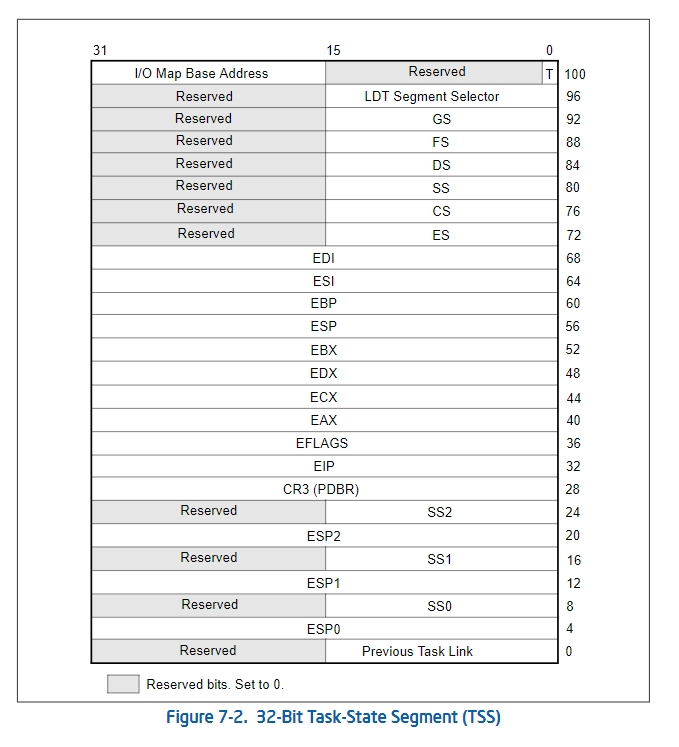
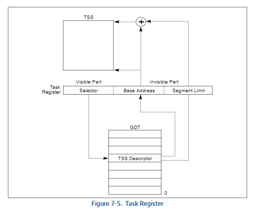

### **TSS（Task State Segment）——任务状态段**

#### **定义**
TSS（Task State Segment）是x86架构处理器中一种特殊的数据结构，用于保存任务（Task）运行时的状态信息。它是Intel处理器在硬件层面支持任务切换的核心机制，通过记录任务上下文（如寄存器状态、段选择子等），实现从一个任务切换到另一个任务的快速操作。

---

#### **TSS的作用**
1. **任务切换**  
   - 在任务切换过程中，TSS保存当前任务的状态（如CPU寄存器的内容），并加载新任务的状态，从而完成上下文切换。
   
2. **硬件支持的上下文保存**  
   - TSS提供了硬件级别的任务上下文保存和恢复能力，减轻了软件切换的负担。

3. **特权级切换**  
   - 当从用户态（低特权级）切换到内核态（高特权级）时，TSS提供了内核栈指针等关键信息，确保系统的安全性。

---

#### **TSS的结构**

TSS是一个由CPU管理的段，它是x86架构中段描述符的一种。它存储了任务的完整状态，典型的TSS结构包括以下内容：

| 字段               | 描述                                           |
|-------------------|----------------------------------------------|
| **旧任务链接**       | 保存前一个任务的TSS选择子，用于任务嵌套。                   |
| **ESP0、SS0**       | 用于特权级切换时的栈指针和栈段选择子（从低特权级切换到高特权级）。 |
| **ESP1、SS1**       | 可选的特权级1的栈指针和栈段选择子。                    |
| **ESP2、SS2**       | 可选的特权级2的栈指针和栈段选择子。                    |
| **CR3**           | 保存任务的页目录基地址，用于任务的地址空间切换。           |
| **EIP**           | 保存任务的指令指针（程序计数器）。                      |
| **EFLAGS**        | 保存任务的标志寄存器。                               |
| **通用寄存器**        | 包括EAX、ECX、EDX等寄存器的值。                   |
| **段选择子**         | 保存任务的段寄存器内容（CS、DS、ES等）。              |
| **I/O许可位图基址**   | 指向任务的I/O许可位图，用于控制任务的I/O访问权限。        |

---

#### **TSS的使用场景**
1. **特权级切换（主要用途）**  
   - TSS中的`ESP0`和`SS0`字段用于从用户态切换到内核态时加载内核栈。

2. **任务切换（较少使用）**  
   - 早期操作系统（如MS-DOS）使用TSS进行任务切换，但现代操作系统更倾向于使用软件实现任务切换。

3. **安全管理**  
   - TSS的I/O许可位图用于限制用户程序对I/O端口的访问。

---

#### **TSS在现代操作系统中的作用**
1. **有限使用**  
   - 虽然TSS提供了硬件支持的任务切换，但现代操作系统（如Linux、Windows）更倾向于使用软件调度和切换，以获得更大的灵活性和性能。
   
2. **专注于特权级切换**  
   - 在现代系统中，TSS主要用于切换到内核栈，以支持从用户态到内核态的安全切换。

3. **I/O访问控制**  
   - TSS中的I/O许可位图仍然被使用，用于限制任务对硬件资源的访问。

#### TR(Task Register)

任务寄存器保存了16位段选择子和当前任务TSS的整个段描述符。在处理器上电或复位时，段选择符和基地址被设置为默认值0；限长被设置为FFFFH。

+ `LTR`: 指令将一个段选择符（源操作数）加载到任务寄存器中，该段选择符指向GDT中的TSS描述符。然后，它将任务寄存器的不可见部分加载为来自TSS描述符的信息（LTR是一个特权指令，只能在CPL为0时执行）。

+ `STR`: 指令将任务寄存器的可见部分存储在通用寄存器或内存中。这个指令可以由任何特权级别的运行代码执行，以标识当前运行的任务。

