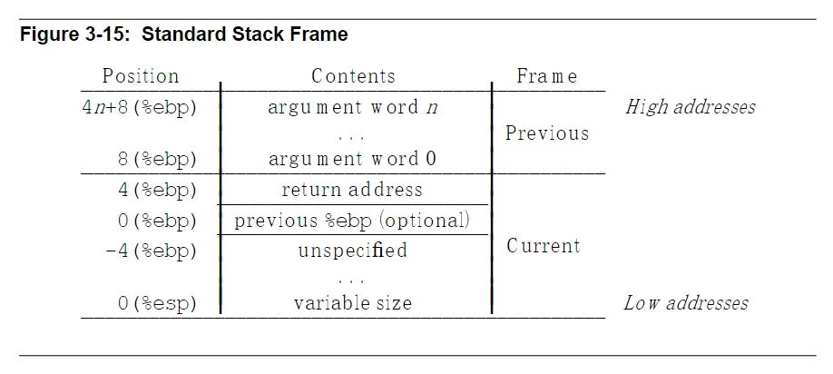
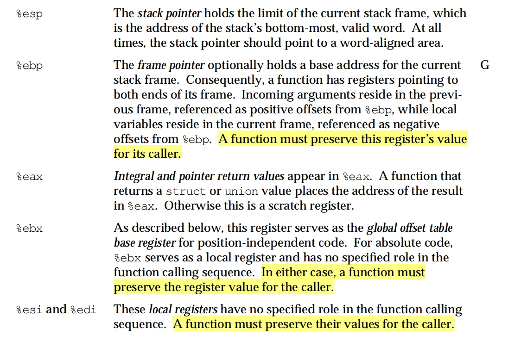

### 手动切换线程

#### i386标准栈帧结构



#### ABI

ABI（Application Binary Interface，应用二进制接口） 是软件开发中的一个重要概念，它定义了应用程序在二进制级别与操作系统或其他程序之间的交互规则。

ABI的作用
ABI的主要目标是确保一个程序编译后生成的二进制文件可以在某个平台上正确运行，并与其他二进制文件或操作系统库无缝协作。
它是程序运行时的协议，与程序源代码无关。

> Some registers have assigned roles in the standard calling sequence



#### 切换线程需要做什么

> 通俗来讲就是手动构造一个栈帧，手动完成栈空间的跳转

1. 为新的线程创建一个栈空间
2. 在新的栈空间中按照ABI标准保存当前函数执行所必要的信息（寄存器值）
3. 替换`ESP`指向新线程的栈帧

#### 实现过程

```asm
simple_switch:
    // from task stack
    mov 4(%esp), %eax
    // to task stack
    mov 8(%esp), %edx
    // 保存原栈帧必要的寄存器值
    push %ebp
    push %ebx
    push %esi
    push %edi
    // 设置新的栈空间
    mov %esp, (%eax)
    mov %edx, %esp
    // 恢复寄存器的值
    pop %edi
    pop %esi
    pop %ebx
    pop %ebp
    ret
```