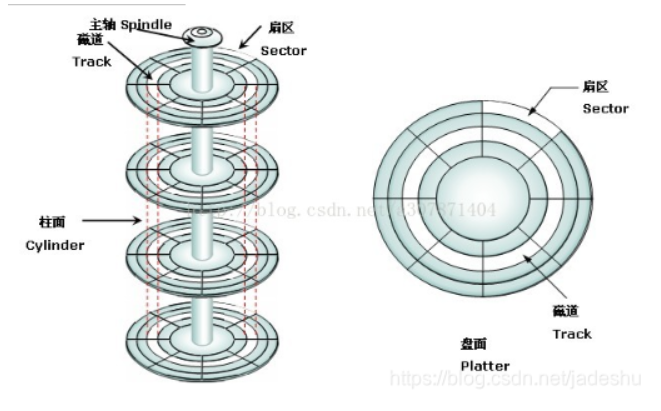

### 读取扇区

### CHS模式
> CHS寻址模式将硬盘划分为磁头（Heads）、柱面（Cylinder）、扇区（Sector），每个磁头对应一个盘面，每个柱面由一组磁头组成，每个扇区由一个磁道组成。

#### CHS寻址方式的容量由CHS三个参数决定：
+ 柱面数（C）最大为1023 (用 10 个二进制位存储)。从0开始编号。
> 硬盘被分为多个柱面，每个柱面由多个磁道组成。柱面是指同一位置的所有磁道的集合，所有磁道在同一半径上。
+ 磁头数（H）最大为255 (用 8 个二进制位存储)。从0开始编号。
> 每个硬盘都有一个或多个磁头，每个磁头可以读取一个磁道上的数据。
+ 扇区数（S）最大为63 (用 6 个二进制位存储)。从1开始编号。
> 每个磁道被分为多个扇区，每个扇区可以存储一个数据块。

所以CHS寻址方式的最大寻址范围为：
$$255 * 1023 * 63 * 512 / 1048576 = 7.837 GB ( 1M =1048576 Bytes )$$

### LBA模式
> LBA是非常单纯的一种定址模式，它将硬盘的柱面号、磁头号、扇区号全部转换为线性地址，然后直接使用。
由于INT13的限制，三维地址C/H/S的最大值只能为1024/16/63，其次，在系统管理文件时记录繁琐的C/H/S也很吃力，效率较低，使用逻辑扇区后，可在硬盘读写操作时脱离柱面，磁头等硬件参数的制约。

IO操作读取硬盘的三种方式：
+ CHS：最大寻址范围为1024/16/63，最大容量为7.837 GB
+ LBA28：最大寻址范围为28位，最大容量为128 GB
    + `0x1F1`写一次
    + `0x1F2`写一次
+ LBA48：最大寻址范围为48位，最大容量为256 TB
    + `0x1F1`写两次：0
    + `0x1F2`写两次: 第一次要读的扇区数的高8位,第二次低8位

| 端口 | 功能 |
| :----: | :----: |
| 0x1F0 | 16位数据端口 |
| 0x1F1 | 状态和错误寄存器 |
| 0x1F2 | 要读取的扇区数 |
| 0x1F3 | LBA地址的低8位 |
| 0x1F4 | LBA地址的中间8位 |
| 0x1F5 | LBA地址的高8位 |
| 0x1F6 | 驱动器和磁头选择 0-3：LBA地址高4位； 4：0表示选择主驱动器，1表示选择从驱动器； 5：必须为1； 6：必须为1表示LBA，0表示CHS； 7：必须为1； |
| 0x1F7 | 读取扇区:0x20 写入扇区:0x30 |