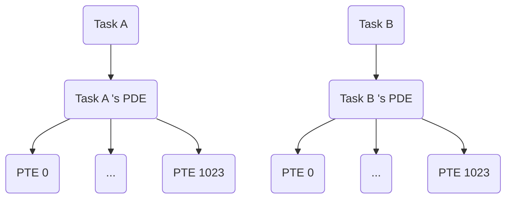

## 为任务分配页

由于采用了分页机制管理内存空间，因此所有任务不能再使用原理的物理地址，需要通过申请页来为自己开辟内存空间（即便内核页的物理地址和虚拟地址一样）。



*每个`PDE`管理 $2^{10}个$ `PTE`, 每个`PTE`管理$2^{10}个Page$,每个 $Page$ 映射 $4K$ 物理内存，因此每个任务都认为自己拥有 $4G$ 物理内存空间。*

+ `simple_task_t`
```c
typedef struct simple_task_t
{
    ...
    // pde
    uint32_t pde;
    // entry
    uint32_t entry;
    ...
} simple_task_t;
```

+ `tss_task_t`
```c
typedef struct tss_t
{
    ...
    uint32_t cr3;
    ...
} tss_t;

typedef struct tss_task_t
{
    ...
    // pde
    tss_t tss;
    ...
} tss_task_t;
```

---

在现代操作系统中，任务切换时需要修改 `CR3` 寄存器的值，主要是因为 `CR3` 是指向当前任务页目录的寄存器，控制了当前任务的虚拟地址空间映射。以下是详细原因：

---

### 1. **`CR3` 寄存器的作用**
- `CR3` 寄存器保存当前任务的页目录物理地址。
- 页目录是内存管理单元（MMU）用来将虚拟地址翻译成物理地址的核心数据结构。
- 每个任务通常有独立的虚拟地址空间，因此不同任务的页目录表通常是不同的。

---

### 2. **任务切换和虚拟地址空间**
- 不同的任务可能需要访问完全不同的地址空间，例如：
  - 任务 A 可能有自己的代码段、数据段。
  - 任务 B 则有完全独立的代码段、数据段。
- 当切换到一个新任务时，必须切换到它对应的页目录表，这样虚拟地址才能正确地映射到任务自身的数据。

修改 `CR3` 寄存器的值，可以告诉处理器从新的页目录开始翻译虚拟地址，确保新任务运行在自己的虚拟地址空间中。

---

### 3. **保护和隔离**
- 使用独立的页表（通过修改 `CR3`）是实现任务地址空间隔离的关键。
- 这种隔离可以：
  - 防止任务 A 访问任务 B 的内存，保护任务间的数据安全。
  - 防止用户态程序访问内核态内存，确保系统安全。

---

### 4. **上下文切换中的 `CR3` 修改**
- 任务切换通常包括：
  1. 保存当前任务的 CPU 寄存器状态。
  2. 加载新任务的寄存器状态。
  3. 切换到新任务的虚拟地址空间（修改 `CR3`）。
- 修改 `CR3` 是必要的一步，因为它告诉硬件切换到新任务的页表。

---

### 5. **避免 TLB 污染**
- `CR3` 修改会导致处理器刷新 TLB（翻译后备缓冲区），因为 TLB 缓存的是虚拟地址到物理地址的映射。
- 切换任务时，旧任务的 TLB 映射不再有效，刷新可以避免错误的地址翻译。

---

### 总结
修改 `CR3` 寄存器是为了切换页表，使得每个任务能够运行在独立的虚拟地址空间中，确保系统的安全性和稳定性。这种机制是现代操作系统内存管理和任务调度的核心之一。