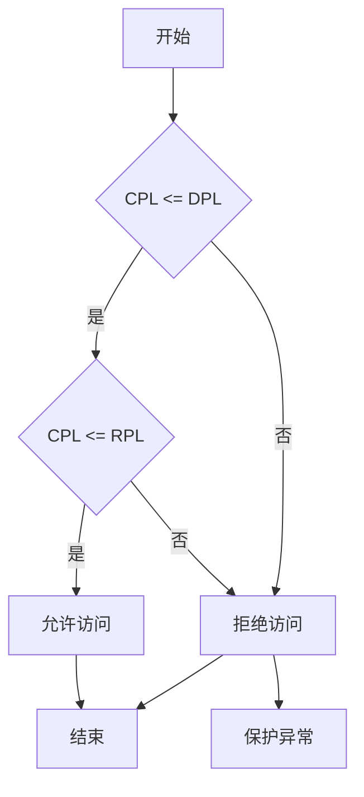

## 线程特权级

处理器使用特权级别来阻止以较低特权级别运行的程序或任务访问具有较高特权的段，除非在受控情况下。当处理器检测到特权级别违规时，它会生成一般保护异常 **(#GP)**。

### 特权级控制

**CPL**、**RPL** 和 **DPL** 是计算机系统中与 **保护模式**（Protection Mode）相关的概念，主要用于描述在 **x86** 体系结构中的特权级别（Privilege Level）和内存段保护。这些概念与 CPU 的特权级别、段描述符以及内存访问控制密切相关。

### 1. **CPL（Current Privilege Level）**
**CPL**（当前特权级）指的是正在执行的代码段的特权级别。它是 CPU 当前执行任务的权限级别，决定了当前代码是否可以访问某些受保护的资源。

- **CPL 的值**取决于程序或任务的特权级别（在 x86 中通常为 0 到 3）。CPL 可以有以下四个等级：
  - **CPL 0**：最高特权级，通常由操作系统内核代码执行（内核模式）。
  - **CPL 1**：通常用于设备驱动程序等较低特权级的代码。
  - **CPL 2**：在某些操作系统中，用于特定的系统服务。
  - **CPL 3**：最低特权级，通常由用户程序执行（用户模式）。
  
CPL 的值通常由当前正在执行的代码段（通常是堆栈段）的特权级决定，CPL 的值会影响对其他段（如代码段、数据段等）的访问权限。

### 2. **RPL（Requested Privilege Level）**
**RPL**（请求特权级）指的是**段选择子**（Segment Selector）中的 **请求特权级**。段选择子用于指示在访问某个段时所请求的特权级。

- **RPL 的值**通常由程序在选择段时指定。段选择子中包含三个部分：
  - **RPL（Requested Privilege Level）**：请求特权级，表示程序希望以哪个特权级别访问段。
  - **索引**：段选择子的索引值，用于索引全局描述符表（GDT）或局部描述符表（LDT）中的段描述符。
  - **TI（Table Indicator）**：指示选择的是 GDT 还是 LDT。
  
- **RPL 的作用**：RPL 并不是直接执行的特权级，而是**请求**的特权级。它由程序指定，表示该段所要求的访问级别。如果程序试图以较低的权限访问一个特权级更高的段，就会发生异常或错误。

> **注：由于我们使用的是平坦模型，整个内存都是用一个段来管理，因此无法通过`RPL`来进行访问权限的控制。**

### 3. **DPL（Descriptor Privilege Level）**
**DPL**（描述符特权级）指的是段描述符中定义的**特权级别**。每个段描述符（在 GDT 或 LDT 中）都可以包含一个 **DPL** 值，用来指定该段允许的访问级别。

- **DPL 的值**也可以是 0 到 3 的特权级值，表示段的访问权限。
  - **DPL 0**：最高权限，通常是内核代码和操作系统。
  - **DPL 3**：最低权限，通常是用户程序。

- **DPL 的作用**：描述符特权级（DPL）决定了代码段、数据段等在 GDT 或 LDT 中描述符的访问权限。程序只能在其 **CPL**（当前特权级）不高于段的 **DPL** 时访问该段。如果当前特权级 **CPL** 高于描述符的 **DPL**，访问该段将被拒绝并导致异常。

### 4. **三者之间的关系**

+ Data Segment

+ Code Segment

这三者的关系可以通过以下几个方面来理解：

1. **CPL**：表示正在执行的代码段的特权级，指示当前任务或程序的权限级别。
2. **RPL**：表示在段选择子中请求的特权级。它是程序请求访问的特权级，表示代码希望以哪个权限级别访问某个段。
3. **DPL**：表示段描述符中的特权级，定义了该段允许的访问权限。

访问控制的规则是：
- 如果**CPL**（当前特权级）**低于或等于**段的**DPL**（描述符特权级），且 **CPL** **低于或等于** 段选择子中的**RPL**（请求特权级），那么程序可以访问该段。
- 如果**CPL**高于**DPL**，或者**RPL**要求较低的权限来访问高权限的段，就会导致**保护异常**。

### 5. **总结**

- **CPL（Current Privilege Level）**：表示当前执行代码的特权级别，影响代码的访问权限。
- **RPL（Requested Privilege Level）**：表示段选择子请求的特权级，程序可以指定希望以哪个特权级访问某个段。
- **DPL（Descriptor Privilege Level）**：表示段描述符定义的特权级，决定段的访问级别。

通过这三者的配合，计算机系统可以有效地控制不同特权级别的代码对内存和硬件的访问，确保内核和用户代码的分离，并提供保护机制，防止恶意代码或错误操作对系统造成损害。