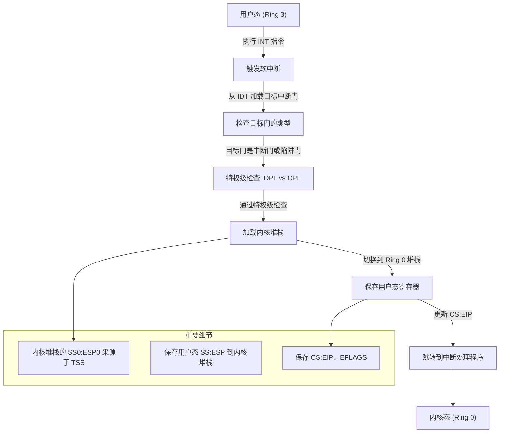
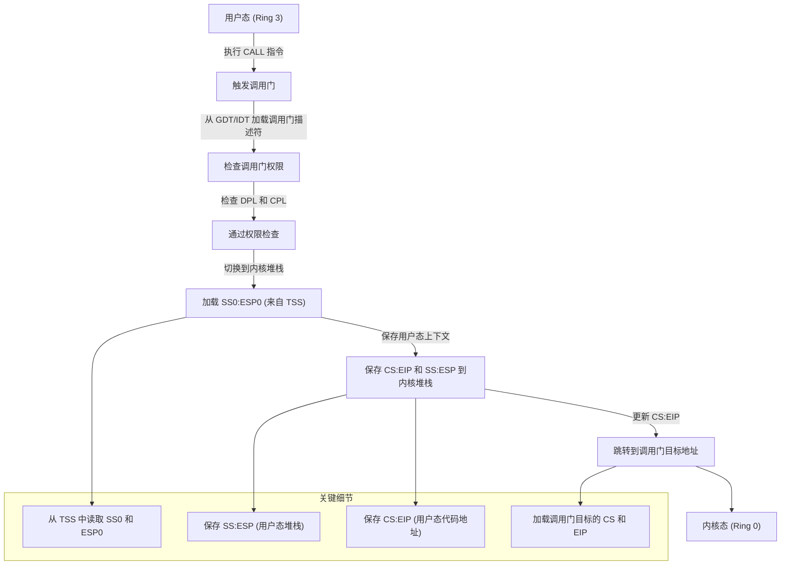

## 绕过TSS切换特权级

在 x86 系统中，任务状态段（TSS）主要用于切换特权级（CPL, Current Privilege Level），尤其是在从用户模式（Ring 3）切换到内核模式（Ring 0）时，用于提供内核堆栈的地址。然而，TSS 并不是唯一的方法，可以通过手动管理堆栈和段寄存器，避免依赖 TSS 实现特权级切换。

以下是如何不通过 TSS 切换特权级的方法，以及它的具体实现：

---

### **原理分析**
特权级切换的关键在于：
1. **堆栈切换**：
   - 从低特权级（Ring 3）的栈切换到高特权级（Ring 0）的栈。
2. **控制转移**：
   - 跳转到高特权级的代码。

操作系统可以通过以下方法避免依赖 TSS，而是直接使用控制流和段寄存器切换特权级。


---

### ***<u>1.通过手动设置堆栈和特权切换</u>***



如果不想依赖 TSS 的堆栈切换功能，可以手动完成以下步骤：

#### 实现步骤
1. **在用户模式分配内核堆栈**：
   - 在进程创建时，为每个进程分配内核模式的栈，并记录栈地址。

2. **触发软中断或陷阱**：
   - 使用 `int` 指令触发从用户模式到内核模式的切换。
   - IDT 表中定义对应的中断或陷阱，指定高特权级的代码段。

3. **在中断处理程序中切换堆栈**：
   - 在中断处理程序中，手动切换到预分配的内核堆栈：
     ```asm
     push eax
     mov eax, kernel_stack  ; 加载内核栈地址
     mov esp, eax           ; 切换到内核栈
     pop eax
     ```

4. **恢复上下文**：
   - 从用户栈保存必要的上下文，切换到内核模式后继续执行。

---

### **2.通过调用门切换特权级**



#### 调用门（Call Gate）
调用门是一种 GDT 或 LDT 中的特殊描述符，可以用于跨特权级的函数调用。在触发调用门时，处理器会自动进行特权级切换，包括堆栈切换。

#### 实现步骤
1. **配置 GDT 和调用门**：
   - 在 GDT 中定义一个调用门描述符，指向目标的高特权级代码段入口地址。
   - 调用门描述符格式：
     - 段选择子指向目标代码段。
     - 偏移量指定代码段的入口地址。
     - 类型为 `0xC`（32 位调用门）。
   
   示例：
   ```asm
   ; 定义调用门描述符
   call_gate:
       .word   offset_low     ; 偏移量低 16 位
       .word   code_selector  ; 目标代码段选择子
       .byte   0              ; 保留
       .byte   0x8C           ; 类型: 调用门, DPL=3
       .word   offset_high    ; 偏移量高 16 位
   ```

2. **加载调用门**：
   - 在 IDT 或直接使用 `lcall` 指令触发调用门。

   ```asm
   lcall $call_gate_selector, $0  ; 触发调用门
   ```

3. **堆栈和特权切换**：
   - 处理器自动将高特权级的栈基址和偏移（如内核栈）切换到当前栈指针（SS:ESP）。

---

### **避免直接使用 TSS 的注意事项**

- **内核堆栈管理**：
  - 如果不通过 TSS 进行堆栈切换，需要操作系统显式管理每个进程的内核栈。例如，在任务切换时，手动保存和加载每个进程的内核栈指针。

- **特权级安全性**：
  - 手动切换特权级时，需要格外小心，以确保处理器正确更新相关寄存器（如 `SS` 和 `CS`）。

---

### **总结**
在 x86 系统中，可以通过调用门或手动管理堆栈来切换特权级，避免依赖 TSS。虽然这种方法可能稍显复杂，但它在某些场景下（如简化上下文切换逻辑或自定义内核设计）非常实用。关键点在于：
1. 使用调用门自动完成切换。
2. 手动管理堆栈和上下文。
3. 确保特权级切换的安全性和一致性。