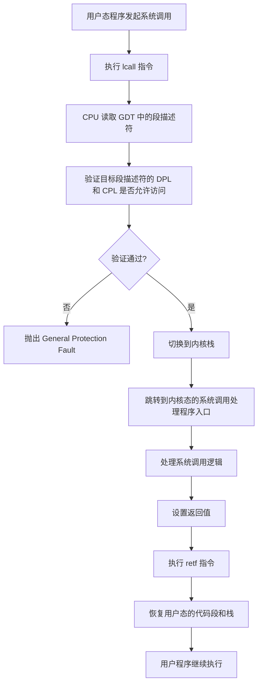
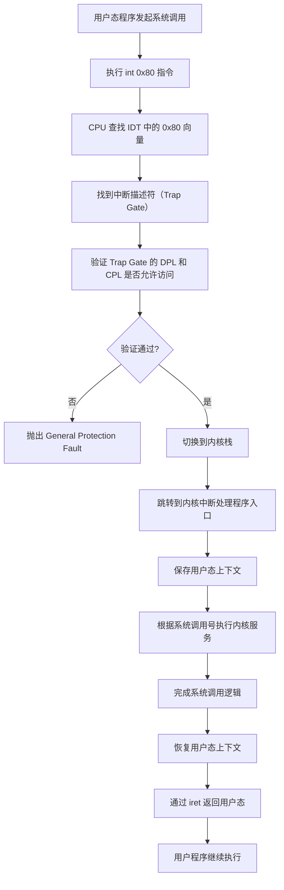

## 系统调用

**系统调用（System Call）** 是用户程序请求操作系统内核提供服务的接口。由于用户态程序不能直接访问硬件资源或内核态的关键功能，系统调用通过一种受控的方式实现用户态与内核态之间的切换。

在 x86 架构中，系统调用通常通过**软件中断**或**特殊指令**（如 `syscall` 和 `sysenter`）实现。这种机制需要依赖 GDT 和 Trap Gate 等关键结构来完成权限切换和代码段跳转。

---

### 系统调用的实现方式

#### 1. 远眺转: `lcall`和`retf`
#### 2. 软中断: `int 0x80`

> **注: 实现系统调用的方式并非只有以上两种，比如现代操作系统中使用的快速系统调用`sysenter / sysexit`和`syscall / sysret`**
---

### 从 GDT 和 Trap Gate 的角度看系统调用

系统调用的核心是用户程序从**用户态（低特权级，CPL=3）**切换到**内核态（高特权级，CPL=0）**，并由内核完成具体的操作。GDT 和 Trap Gate 在这一过程中扮演了重要角色。

---

#### 1. **GDT 的作用**
GDT 定义了所有段的描述符，包括：
- **代码段**：用户态代码段和内核态代码段。
- **数据段**：用户态数据段和内核态数据段。
- **系统描述符**：如任务状态段（TSS）或门描述符（如 Trap Gate）。

GDT 中的段描述符包含了段的基址、界限和特权级（DPL），它用于控制段访问权限，并支持从用户态到内核态的安全切换。

系统调用依赖 GDT 中的代码段描述符来切换到内核态代码段执行内核功能。

---

#### 2. **Trap Gate 的作用**
Trap Gate 是一种特殊的系统描述符，用于处理`软中断`。它的特点是：
- **定义了跳转的目标地址**：指向内核中的系统调用处理函数。
- **设置了权限控制**：Trap Gate 的特权级（DPL）通常设置为 3，允许用户态代码访问。
- **不会关闭中断**：与中断门不同，Trap Gate 保持中断状态不变，适合处理系统调用。

> **注:  `Interrupt Gate` 用于处理由外部硬件（如定时器、I/O 设备等）或处理器内部事件（如除零错误、段错误等）触发的中断，而 `Trap Gate` 通常用于处理由软件触发的中断，像系统调用。它也会导致 CPU 从用户态切换到内核态，但与硬件中断不同，Trap Gate 是由软件（例如 int 指令）显式触发的。**

### 远跳转实现系统调用

### **流程解释**

1. **用户态程序发起调用**：
   用户程序通过执行 `lcall` 指令，向内核发起系统调用。

2. **CPU 验证段权限**：
   CPU 根据 `lcall` 指定的段选择子，从 GDT 中读取目标段描述符，并检查 CPL 是否符合段描述符的 DPL。

3. **切换到内核态**：
   如果权限验证通过，CPU 自动切换到内核栈（`TSS:SS0` 和 `TSS:ESP0`）并跳转到内核态系统调用处理程序。

4. **处理系统调用**：
   内核根据系统调用号和参数执行相应逻辑。

5. **返回用户态**：
   内核通过执行 `retf` 指令，恢复用户态的代码段和栈，将控制权交回用户程序。

6. **用户程序继续执行**：
   系统调用完成，用户程序接着执行后续代码。

### 软中断实现系统调用

### **流程解释**

1. **用户态程序发起调用**：
   用户程序通过执行 `int 0x80` 指令，向内核发起系统调用。

2. **CPU 查找中断向量表（IDT）**：
   CPU 根据中断号 `0x80` 在 IDT 中查找对应的中断描述符。

3. **验证权限**：
   CPU 验证 Trap Gate 的 DPL 是否允许当前 CPL 调用（通常要求 DPL ≤ CPL）。

4. **切换到内核态**：
   如果验证通过，CPU 自动切换到内核栈（通过 TSS 中的 `SS0:ESP0` 指定）并跳转到内核中断处理程序入口。

5. **保存上下文**：
   内核中断处理程序保存用户态的寄存器和栈信息，以便系统调用完成后能够正确返回。

6. **执行系统调用**：
   内核根据传入的系统调用号和参数执行对应的服务逻辑。

7. **完成系统调用**：
   系统调用完成后，设置返回值，并准备恢复用户态上下文。

8. **返回用户态**：
   使用 `iret` 指令返回用户态，恢复用户程序的执行。

9. **继续用户程序**：
   用户程序获得系统调用结果，并继续执行后续代码。
