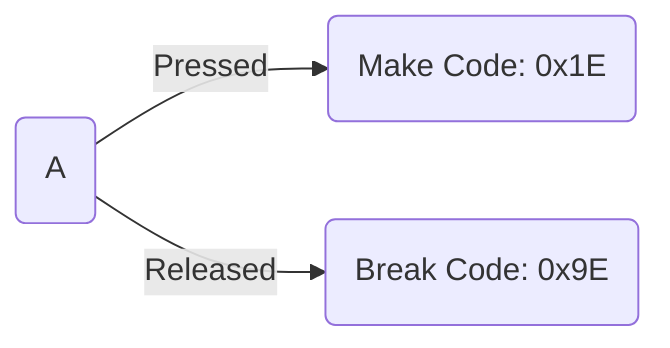

## 键盘驱动

### PS/2 Controller IO Ports

| IO Port | Access Type | Purpose |
|:---:|:---:|:---:|
| 0x60 | Read/Write | Data Port |
| 0x64 | Read | Status Register |
| 0x64 | Write | Command Register |

#### Data Port
The Data Port (IO Port 0x60) is used for reading data that was received from a PS/2 device or from the PS/2 controller itself and writing data to a PS/2 device or to the PS/2 controller itself.

#### Status Register
The Status Register contains various flags that show the state of the PS/2 controller. The meanings for each bit are:

| Bit | Meaning |
|:---:|:---|
| 0 | Output buffer status (0 = empty, 1 = full)  (must be set before attempting to read data from IO port 0x60) |
| 1 | Input buffer status (0 = empty, 1 = full)  (must be clear before attempting to write data to IO port 0x60 or IO port 0x64) |
| 2 | System Flag  Meant to be cleared on reset and set by firmware (via. PS/2 Controller Configuration Byte) if the system passes self tests (POST) |
| 3 | Command/data (0 = data written to input buffer is data for PS/2 device, 1 = data written to input buffer is data for PS/2 controller command) |
| 4 | Unknown (chipset specific) May be "keyboard lock" (more likely unused on modern systems) |
| 5 | Unknown (chipset specific) May be "receive time-out" or "second PS/2 port output buffer full" |
| 6 | Time-out error (0 = no error, 1 = time-out error) |
| 7 | Parity error (0 = no error, 1 = parity error) |

#### Command Register

| Command Byte | Meaning | Response Byte |
|:---:|:---:|:---|
| 0x20 | Read "byte 0" from internal RAM | Controller Configuration Byte (see below) |
| 0x21 to 0x3F | Read "byte N" from internal RAM (where 'N' is the command byte & 0x1F) | Unknown (only the first byte of internal RAM has a standard purpose) |
| 0x60 | Write next byte to "byte 0" of internal RAM (Controller Configuration Byte, see below) | None |
| 0x61 to 0x7F | Write next byte to "byte N" of internal RAM (where 'N' is the command byte & 0x1F) | None |
| 0xA7 | Disable second PS/2 port (only if 2 PS/2 ports supported) | None |
| 0xA8 | Enable second PS/2 port (only if 2 PS/2 ports supported) | None |
| 0xA9 | Test second PS/2 port (only if 2 PS/2 ports supported)	 | 0x00 test passed 0x01 clock line stuck low 0x02 clock line stuck high 0x03 data line stuck low 0x04 data line stuck high |
| 0xAA | Test PS/2 Controller | 0x55 test passed 0xFC test failed |
| 0xAB | Test first PS/2 port | 0x00 test passed 0x01 clock line stuck low 0x02 clock line stuck high 0x03 data line stuck low 0x04 data line stuck high |
| 0xAC | Diagnostic dump (read all bytes of internal RAM) | Unknown |
| 0xAD | Disable first PS/2 port | None |
| 0xAE | Enable first PS/2 port | None |
| 0xC0 | Read controller input port | Unknown (none of these bits have a standard/defined purpose) |
| 0xC1 | Copy bits 0 to 3 of input port to status bits 4 to 7 | None |
| 0xC2 | Copy bits 4 to 7 of input port to status bits 4 to 7 | None |
| 0xD0 | Read Controller Output Port | Controller Output Port (see below) |
| 0xD1 | Write next byte to Controller Output Port (see below) Note: Check if output buffer is empty first | None |
| 0xD2 | Write next byte to first PS/2 port output buffer (only if 2 PS/2 ports supported) (makes it look like the byte written was received from the first PS/2 port) | None |
| 0xD3 | Write next byte to second PS/2 port output buffer (only if 2 PS/2 ports supported) (makes it look like the byte written was received from the second PS/2 port) | None |
| 0xD4 | Write next byte to second PS/2 port input buffer (only if 2 PS/2 ports supported) (sends next byte to the second PS/2 port) | None |
| 0xF0 to 0xFF | Pulse output line low for 6 ms. Bits 0 to 3 are used as a mask (0 = pulse line, 1 = don't pulse line) and correspond to 4 different output lines. Note: Bit 0 corresponds to the "reset" line. The other output lines don't have a standard/defined purpose. | None |

### 按键扫描码

当按下和释放时都会产生中断

区别在于`Code`的第`7`位是否为`1`
+ `bit(7) = 0 : Make Code`: 表示按键按下
+ `bit(7) = 1 : Break Code`: 表示按键释放

### Scan Code Set

[Keyboard Scancodes](https://sharktastica.co.uk/topics/scancodes)

### 参考链接

[OSDEV - Keyboard](https://wiki.osdev.org/PS/2_Keyboard)

[OSDEV - Keyboard Controller](https://wiki.osdev.org/%228042%22_PS/2_Controller)