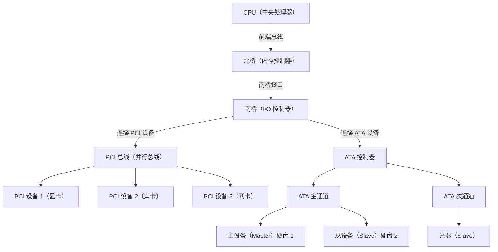

## 磁盘识别

### 相关概念

#### ATA磁盘

ATA是Advanced Technology Attachment的缩写，也可以称为IDE或PATA。它是一种磁盘驱动器（drive），将驱动器控制器（drive controller）直接集成到驱动器（drive）本身上。计算机可以通过总线直接访问 ATA 硬盘驱动器。

ATA磁盘规范是建立在旧规范ST506之上的。在ST506中，每个磁盘驱动器都通过两根电缆连接到控制器板——一根数据电缆和一根命令电缆。控制器板插入主板总线。CPU通过CPU的I/O端口与控制器板通信，这些端口直接连接到主板总线。

#### ATA PIO Mode

ATA PIO (Programmed Input/Output) Mode 是 ATA (Advanced Technology Attachment) 接口的一种数据传输模式。它是一种早期的硬盘数据传输方式，由 CPU 直接控制数据的读写，而不使用 DMA（Direct Memory Access）等高级技术。

#### PCI总线

PCI（Peripheral Component Interconnect，总线标准） 是 Intel 在 1992 年推出的一种计算机内部高速总线，用于连接主板与各种扩展设备（如显卡、声卡、网卡、存储控制器等）。它是一种 并行总线，最初广泛用于 PC 和服务器，后来被更快的 PCIe（PCI Express）取代。

#### Primary / Secondary Bus

当前的磁盘控制器芯片几乎总是支持每个芯片两个 ATA 总线。存在一组标准化的 I/O 端口用于控制总线上的磁盘。前两条总线称为主 ATA 总线和从 ATA 总线，几乎总是分别由 I/O 端口 `0x1F0` 到 `0x1F7` 和 `0x170` 到 `0x177` 控制（除非您更改）。相关的设备控制寄存器/备用状态端口分别是 I/O 端口 `0x3F6` 和 `0x376`。主总线的标准 IRQ 为 `IRQ14`，从总线的标准 IRQ 为 `IRQ15`。

如果存在接下来的两条总线，它们通常分别由 I/O 端口 `0x1E8` 到 `0x1EF` 和 `0x168` 到 `0x16F` 控制。相关的设备控制寄存器/备用状态端口分别是 I/O 端口 `0x3E6` 和 `0x366`。

实际的控制寄存器和每条总线的 IRQ 通常可以通过枚举 PCI 总线，找到所有磁盘控制器，并读取每个控制器的 PCI 配置空间中的信息来确定。因此，从技术上讲，应该在 ATA 设备检测之前进行 PCI 枚举。但是，这种方法并不完全可靠。

系统启动时，根据规格，PCI 磁盘控制器应该处于“旧式/兼容性”模式。这意味着它应该使用标准化的 I/O 端口设置。您可能别无选择，只能依赖这一事实。

### 磁盘检测

使用IDENTIFY命令，请通过向"驱动器选择"I/O端口发送`0xA0`（用于主驱动器）或`0xB0`（用于从驱动器）来选择目标驱动器。在主总线上，这将是端口`0x1F6`。

1. 将`Sectorcount`、`LBAlo`、`LBAmid`和`LBAhi` I/O端口设置为`0`（端口`0x1F2`到`0x1F5`）。

2. 将IDENTIFY命令（`0xEC`）发送到命令I/O端口（`0x1F7`）。

3. 再次读取状态端口（`0x1F7`）。如果读取的值为`0`，则驱动器不存在。对于任何其他值：轮询状态端口（`0x1F7`），直到位7（`BSY`，值为`0x80`）清除。

由于某些ATAPI驱动器不遵循规范，此时您需要检查LBAmid和LBAhi端口（0x1F4和0x1F5）是否为非零。如果是，则驱动器不是ATA，您应该停止轮询。否则，继续轮询其中一个状态端口，直到位3（DRQ，值为8）设置，或直到位0（ERR，值为1）设置。在这一点上，如果ERR为0，则数据已准备好从数据端口（0x1F0）读取。读取256个16位值，并存储它们。

### 映射端口

#### I/O Base

|Offset from "I/O" base | Direction | Function | Description | Param. size LBA28/LBA48 |
|:---:|:---|:---|:---|:---:|
|0 | R/W | Data Register | Read/Write PIO data bytes | 16-bit / 16-bit |
|1 | R | Error Register | Used to retrieve any error generated by the last ATA command executed. | 8-bit / 16-bit |
|1 | W | Features Register | Used to control command specific interface features. | 8-bit / 16-bit |
|2 | R/W | Sector Count Register | Number of sectors to read/write (0 is a special value). | 8-bit / 16-bit |
|3 | R/W | Sector Number Register (LBAlo) | This is CHS / LBA28 / LBA48 specific. | 8-bit / 16-bit |
|4 | R/W | Cylinder Low Register / (LBAmid) | Partial Disk Sector address. | 8-bit / 16-bit |
|5 | R/W | Cylinder High Register / (LBAhi) | Partial Disk Sector address. | 8-bit / 16-bit |
|6 | R/W | Drive / Head Register | Used to select a drive and/or head. Supports extra address/flag bits. | 8-bit / 8-bit
|7 | R | Status Register | Used to read the current status. | 8-bit / 8-bit |
|7 | W | Command Register | Used to send ATA commands to the device. | 8-bit / 8-bit |

#### Error Register

| Bit | Abbreviation | Function |
|:---:|:---:|:---|
| 0 | AMNF | Address mark not found. |
| 1 | TKZNF | Track zero not found. |
| 2 | ABRT | Aborted command. |
| 3 | MCR | Media change request. |
| 4 | IDNF | ID not found. |
| 5 | MC | Media changed. |
| 6 | UNC | Uncorrectable data error. |
| 7 | BBK | Bad Block detected. |

#### Status Register

| Bit | Abbreviation | Function |
|:---:|:---:|:---|
| 0 | ERR | Indicates an error occurred. Send a new command to clear it (or nuke it with a Software Reset). |
| 1 | IDX | Index. Always set to zero. |
| 2 | CORR | Corrected data. Always set to zero. |
| 3 | DRQ | Set when the drive has PIO data to transfer, or is ready to accept PIO data. |
| 4 | SRV | Overlapped Mode Service Request. |
| 5 | DF | Drive Fault Error (does not set ERR). |
| 6 | RDY | Bit is clear when drive is spun down, or after an error. Set otherwise. |
| 7 | BSY | Indicates the drive is preparing to send/receive data (wait for it to clear). In case of 'hang' (it never clears), do a software reset. |

### IRQs

早期，中断请求（IRQ）的唯一意图是通知中断处理程序驱动器已准备好发送或接收数据。预期的结果是，中断处理程序本身会立即执行基于外围设备输入输出（PIO）的下一个数据块的数据传输。

### 参考链接

[OSDEV - ATA_PIO-Mode](https://wiki.osdev.org/ATA_PIO_Mode)