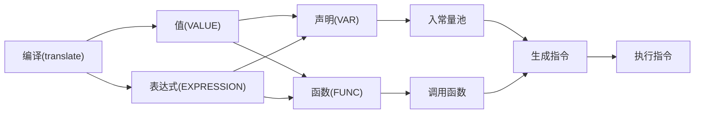

1. 题目：手写脚本解释器2
   1. 中缀表达式计算
   2. 表达式计算框架

[前缀中缀后缀表达式求值](https://blog.csdn.net/chengqiuming/article/details/114441652)

2. 中缀表达式
   + 操作数
     + 直接入栈
   + 符号
     + 栈空时或左括号则直接入栈
     + 右括号直接弹栈直到弹到左括号为止
     + 新符号优先级高则可以入栈，否则出栈计算后再入栈

> 50 - 3 * 10 - ( 3 + 4 ) = 13

```shell
操作数栈        符号栈
+-----+        +-----+
|     |        |     |
+-----+        +-----+
|     |        |     |
+-----+        +-----+
|     |        |     |
+-----+        +-----+
| 13  |        |     |
+-----+        +-----+

1. 3 * 10 = 30
2. 50 - 30 = 20
3. 3 + 4 = 7
4. 20 - 7 = 13
```

+ Java实现

```java
import java.util.HashMap;
import java.util.Map;
import java.util.Stack;

/**
 * 50 - 3 * 10 - ( 3 + 4 )
 * 50 - 30 - ( 3 + 4 )
 * 50 - 30 - 7
 */

public class ExpressionCalc {

    public static void main(String[] args) {

        String expression = "50 - 3 * 10 - ( 3 + 4 )";
        String[] entries = expression.split(" ");

        Stack<Integer> numbers = new Stack<>();
        Stack<String> symbols = new Stack<>();
        for (String entry : entries) {
            switch (entry) {
                case "+":
                case "-":
                case "*":
                case "/":
                case "%":
                case "(":
                case ")":
                    pushSymbol(numbers, symbols, entry);
                    break;
                default:
                    numbers.push(Integer.parseInt(entry));
                    break;
            }
        }
        while (!symbols.isEmpty()) {
            calc(numbers, symbols.pop());
        }
        System.out.println(numbers);
        System.out.println(symbols);
    }

    public static void pushSymbol(Stack<Integer> numbers, Stack<String> symbols, String entry) {
        // 左括号直接入栈
        // 栈为空则直接入栈
        if (symbols.isEmpty() || entry.equals("(")) {
            symbols.push(entry);
            return;
        }
        // 右括号直接弹到左括号
        if (entry.equals(")")) {
            String symbol;
            while (!(symbol = symbols.pop()).equals("(")) {
                calc(numbers, symbol);
            }
            return;
        }
        // 新符号优先级高则可以入栈，否则出栈计算
        if (symbolOrder.get(entry) > symbolOrder.get(symbols.peek())) {
            symbols.push(entry);
        } else {
            String symbol = symbols.pop();
            calc(numbers, symbol);
            pushSymbol(numbers, symbols, entry);
        }
    }

    public static void calc(Stack<Integer> numbers, String symbol) {

        Integer num2 = numbers.pop();
        Integer num1 = numbers.pop();
        switch (symbol) {
            case "+":
                numbers.push(num1 + num2);
                break;
            case "-":
                numbers.push(num1 - num2);
                break;
            case "*":
                numbers.push(num1 * num2);
                break;
            case "/":
                numbers.push(num1 / num2);
                break;
            case "%":
                numbers.push(num1 % num2);
                break;
        }
    }

    private static final Map<String, Integer> symbolOrder = new HashMap<String, Integer>(){{
        put("+", 1); put("-", 1);
        put("*", 2); put("/", 2); put("%", 2);
        put("(", 0); put(")", 3);
    }};
}

```

1. 表达式计算框架

