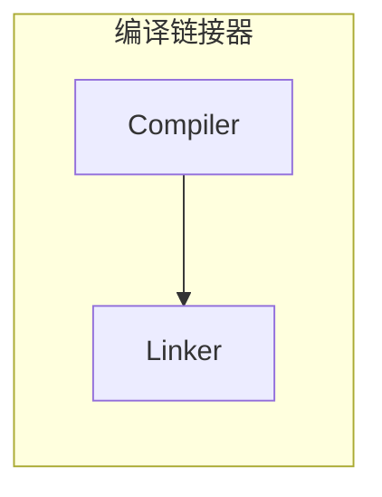
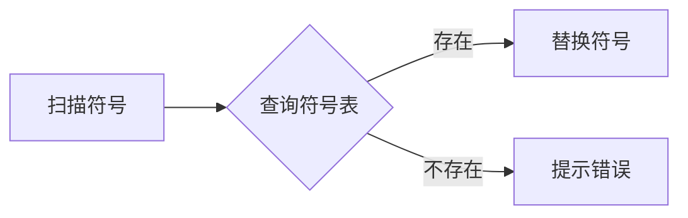
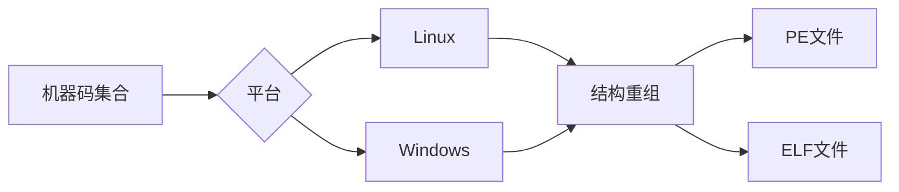

1. 题目：编译原理介绍



2. 什么是编译器

编译器是一种计算机程序，它可以将人类可读的源代码转换为计算机可执行的目标代码。编译器通常由多个阶段组成，每个阶段都执行不同的任务，例如词法分析、语法分析、语义分析、代码生成等。编译器在软件开发中起着重要的作用，它可以将高级语言编写的程序转换为底层机器语言，使得计算机可以理解和执行这些程序。

3. 编译的工作流程


+ 词法分析（状态机）

> 将源代码分解成词法单元，如标识符、关键字、运算符等。

```shell
+---------------+
|int main() {   | 
|    return 0;  |
|}              |
+---------------+
         |
        \|/
+---+----+-+-+-+-+--+--+------+-+-+--+-+
|int|main|(|)| |{|\n|\t|return|0|;|\n|}|
+---+----+-+-+-+-+--+--+------+-+-+--+-+
        |
       \|/
+-------+----------+
| value |   type   |
+-------+----------+
| int   | KEYWORD  |
+-------+----------+
| main  |IDENTIFIER|
+-------+----------+
| (     | SYMBOL   |
+-------+----------+
| {     | SYMBOL   |
+-------+----------+
| ...   |   ...    |
+-------+----------+
| return| KEYWORD  |
+-------+----------+
```

+ 语法分析（抽象语法树）

> 将词法单元转化为语法树，检查语法错误。


+ 语义分析

> 检查语句是否有意义，如变量是否已声明等。

+ 代码生成

> 将语法树转化为目标代码，如汇编语言或机器语言。


4. 什么是链接器

链接器（Linker）是将多个目标文件（Object File）和库文件（Library）组合成一个可执行文件的程序。链接器的主要任务是解决符号引用（Symbol Reference）和符号重定位（Symbol Relocation）问题，使得多个目标文件能够正确地链接在一起。

5. 链接器的工作流程


+ 符号解析

> 对所有目标文件中的符号进行解析，包括函数名、变量名等等。



+ 符号重定位

> 将每个目标文件中的符号地址进行重定位，使得它们能够正确地映射到最终的可执行文件中。


+ 符号合并

> 链接器将所有目标文件中的符号进行合并，消除重复定义的符号。

+ 生成可执行文件

> 链接器将所有目标文件和库文件中的代码和数据组合起来，生成最终的可执行文件。

