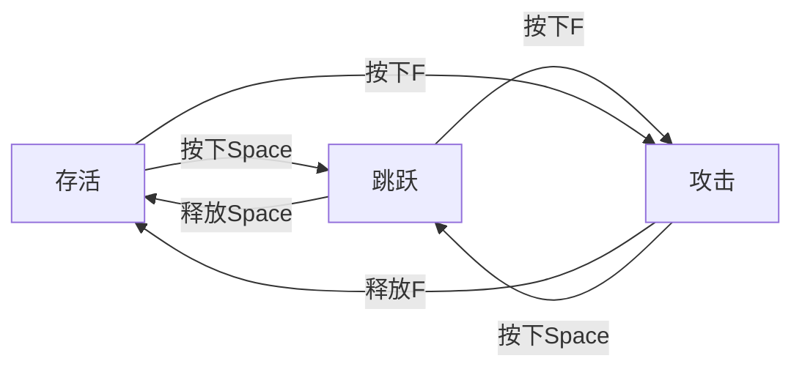
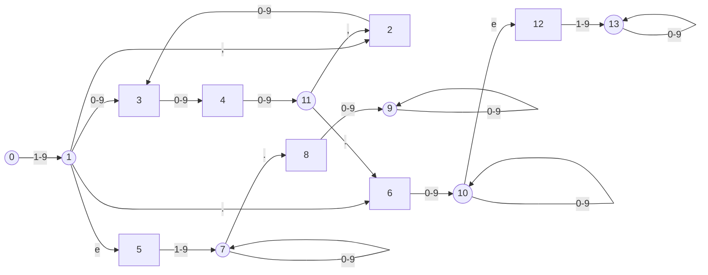
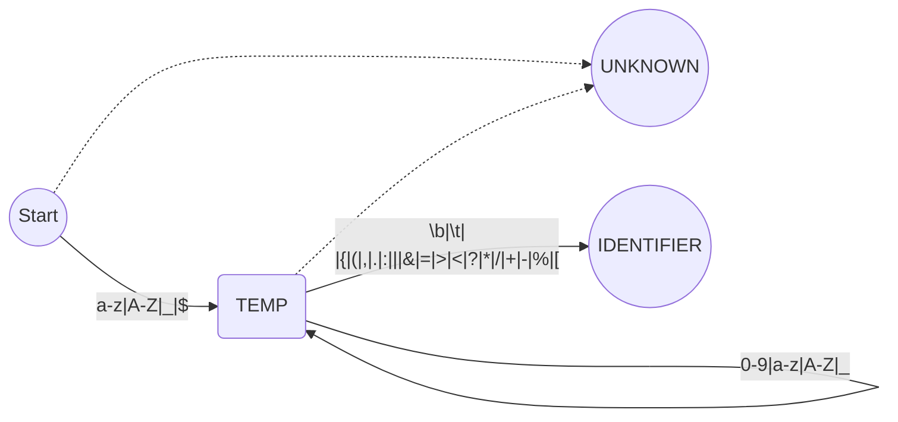
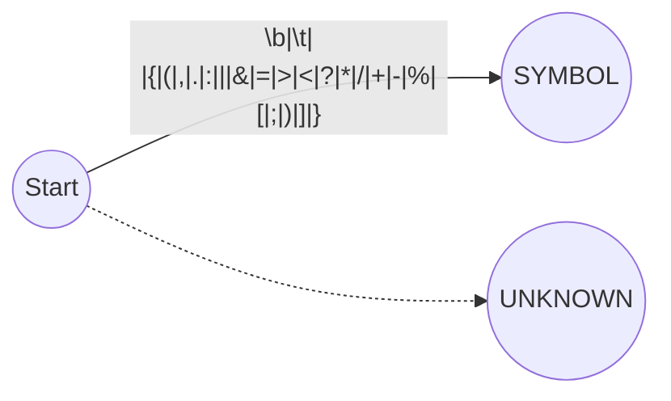

1. 题目：标识符和单符号有限状态机

2. 什么是有限状态机

有限状态机（Finite State Machine，FSM）是一种计算模型，它可以表示为一组状态和在这些状态之间转移的规则。在这个模型中，系统的行为可以被划分为不同的状态，并且在不同的状态之间进行转移。FSM通常用于描述计算机程序、电路和通信协议等系统的行为。

3. 实现方法
   1. switch&if
   2. 二维数组

4. 案例：判断数字
   + 123
   + 123,456
   + 123e2
   + 12.3e4
   + 1,234.5e6

5. 标识符和单符号状态机

+ IDENTIFIER

+ 单个符号
