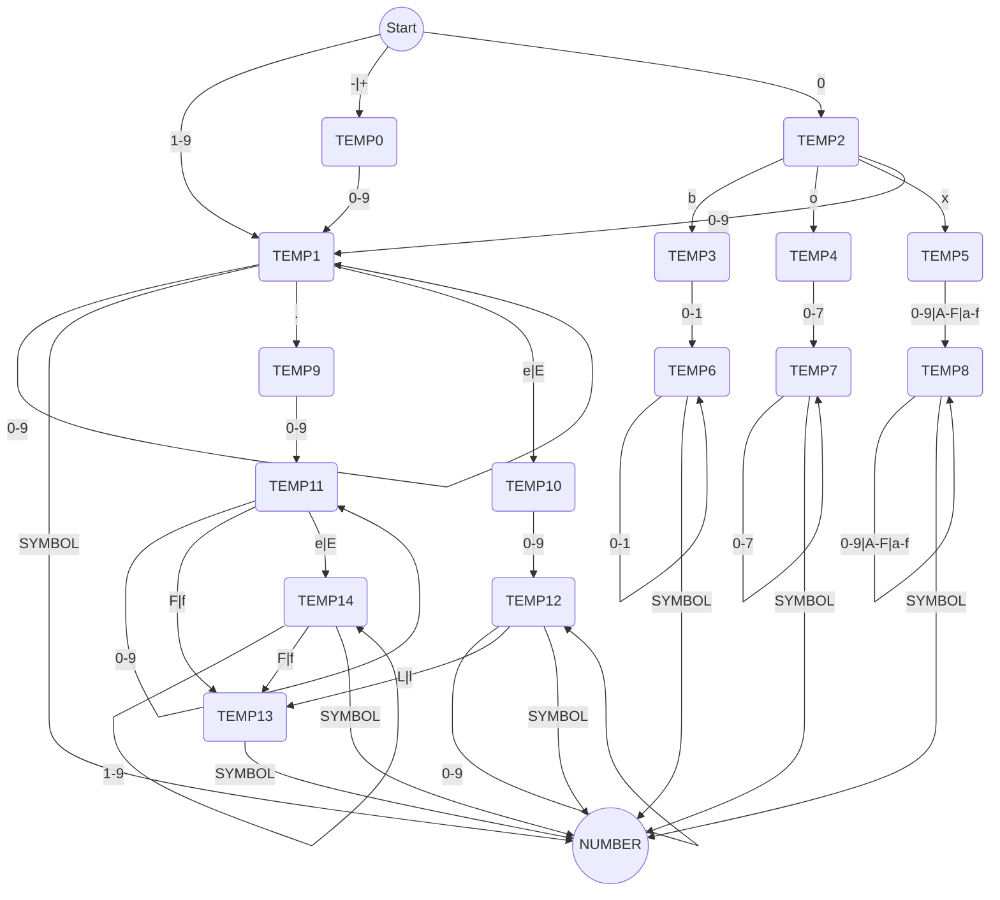
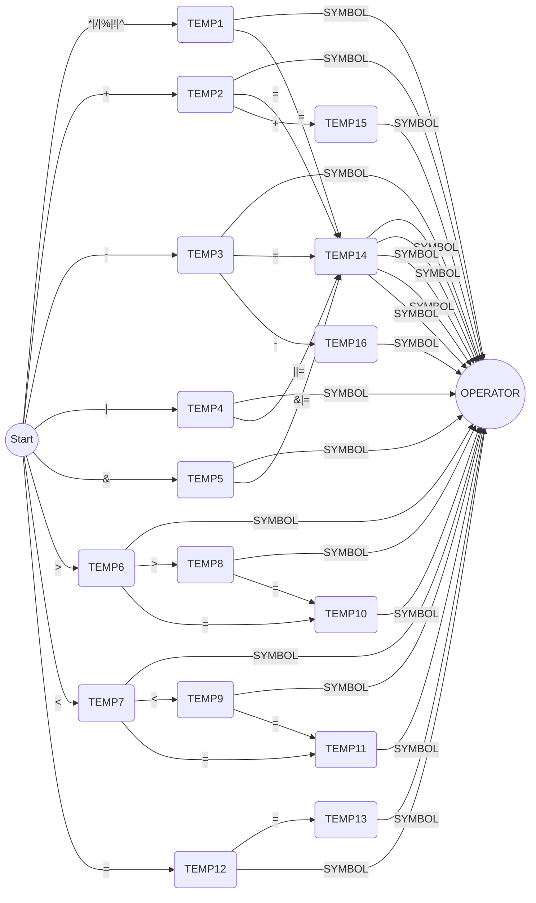
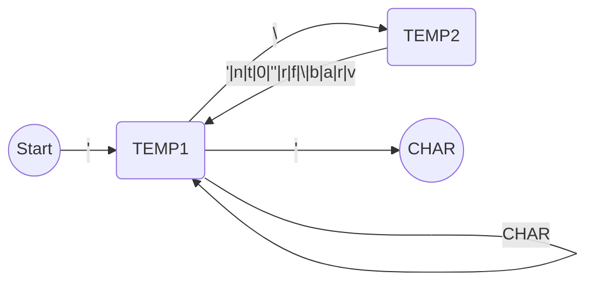
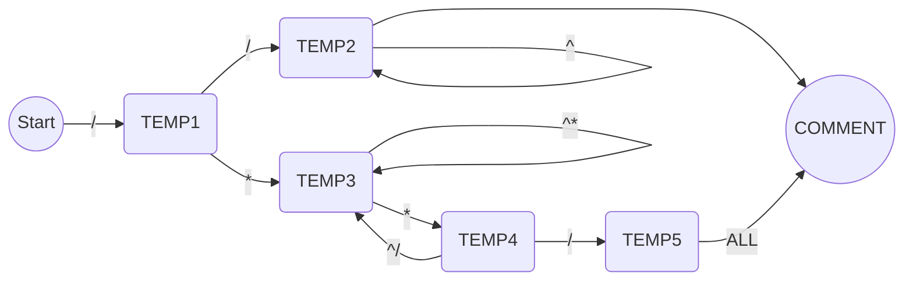

1. 题目：数字、字符、注释和运算符
   1. 更正问题：
      1. 变量和类型：4bit的有符号数范围为`-8~7`
      2. 有限状态机：解决BUG
   2. 数字
   3. 运算符
   4. 字符
   5. 注释

2. 数字



3. 运算符

```shell
单个运算符
+ - * / %
| & ^ ~
> < =

复合运算符
+= -= *= /= %= |= &= >>= <<= ^= >= <= !=
|| &&
++ -- ==
```



4. 字符状态机



5. 注释状态机



6. 编译日志

```c
// 编译警告
void compile_warning(compile_process *process, const char *fmt, ...);

// 编译失败
void compile_error(compile_process *process, const char *fmt, ...);
```